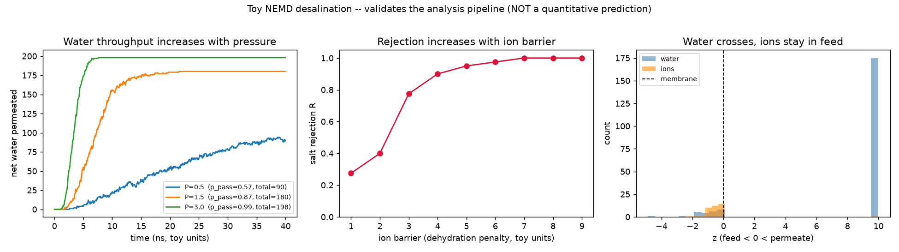

# 2D-Material Desalination: DFT → MLP → NEMD pipeline

An open-source, reproducible scaffold for studying reverse-osmosis (RO)
desalination through **nanoporous 2D membranes** — **graphene first, then
MoS₂** — using the standard multiscale route:

```
  Stage 1            Stage 2                 Stage 3
  DFT / AIMD   ──▶   ML potential (MLP)  ──▶  NEMD (ns, pressure-driven)
  (QE, CP2K)         (DeePMD + DP-GEN)        (LAMMPS + DeePMD)
  gold-standard      DFT accuracy,            water flux &
  energies/barriers  MD speed                 salt rejection
```

Everything here runs on **fully open-source engines** (Quantum ESPRESSO /
CP2K / DeePMD-kit / LAMMPS / ASE / DP-GEN). No commercial code is required.

---

## What actually runs today (validated in this repo)

The geometry building and the **entire analysis + validation pipeline** run
with nothing more than `numpy + ase + matplotlib`:

```bash
pip install -r requirements.txt

# Stage 1 geometry
python 01_build/build_graphene_pore.py --pore-radius 3.5 --out figures/graphene_pore
python 01_build/build_mos2_pore.py     --pore-radius 3.5 --out figures/mos2_pore
python 01_build/build_saltwater_box.py --membrane figures/graphene_pore.xyz \
       --n-water-feed 300 --n-water-perm 300 --n-nacl 10 --out figures/nemd_cell

# Stage 3 analysis self-check
python 04_nemd/analyze_flux_rejection.py --demo

# End-to-end TOY validation (physics trends + analyzer correctness) + figure
python 05_toy_validation/toy_nemd.py --plot figures/toy_nemd.png
```

The toy validation asserts five things and **all pass**:
1. the analyzer's crossing count matches an independent ground truth (0 % error);
2. water throughput increases monotonically with pressure;
3. salt rejection increases monotonically with the ion dehydration barrier;
4. the membrane is selective (water permeates, ions are ~97 % rejected);
5. molecular flux → experimental permeance conversion is finite/sane.



> The toy is a kinetic pore-gate model — it validates the *workflow and the
> analysis code*, **not** a quantitative prediction. Real numbers require
> Stages 1–3 on real compute (below).

---

## What needs real compute (and where to run it)

| Stage | Workload | Bound by | Cloud (Modal) | HPC (Slurm) |
|---|---|---|---|---|
| DFT / AIMD | Quantum ESPRESSO | **CPU** (plane-wave/MPI) | `02_dft/modal_run_dft.py` | `slurm/qe_scf.slurm` |
| MLP training | DeePMD-kit | **GPU** | `03_mlp/modal_train_deepmd.py` | `slurm/deepmd_train.slurm` |
| NEMD production | LAMMPS+DeePMD | **GPU** | (mirror the training launcher) | `slurm/lammps_nemd.slurm` |

### Can I run this on modal.com (GPU cloud)?
**Yes — and it's a good fit.** Two ready templates are included:
- `02_dft/modal_run_dft.py` runs QE on a **CPU** box. Plane-wave DFT is
  CPU/MPI-bound, so a GPU would be wasted here — Modal lets you rent a fat
  16-core box per-second instead.
- `03_mlp/modal_train_deepmd.py` trains the MLP on a **GPU** (A10G/A100), which
  *is* GPU-bound — the right place to spend GPU dollars, along with the LAMMPS
  NEMD inference.

Both are runnable once you `pip install modal && modal token new`. They define
the whole software environment in code (QE / DeePMD images), so runs are
reproducible with no cluster module juggling.

### Is there a ready-made "materials-science / DFT skill" for this?
Not in this environment. The available skills are Claude-Code / bio-oriented,
and the connected data servers (PubMed, ChEMBL, bioRxiv, …) are life-sciences,
**not** materials tools. So there's no push-button DFT skill — but the pipeline
is fully covered by the open-source engines above, and this repo is the
scaffold that wires them together. Literature search for the *materials* side is
best done on arXiv `cond-mat` / Materials Cloud rather than the bio servers here.

---

## MLP vs ReaxFF — recommendation

For **physical** (non-reactive) RO desalination — water and ions passing a pore
without breaking bonds — **use the MLP.** It captures polarization and the
complex charge distribution in the confined pore at near-classical cost.

**ReaxFF is a "sledgehammer" here** (10–100× cost, painful fitting) and is only
worth it if you specifically study *chemistry*: pore-edge protonation/
deprotonation, membrane chemical degradation under strong flow, or fouling.
Recommendation: ship the MLP path first; treat ReaxFF as an optional Stage-2b
only if a chemical question demands it. Don't develop both in parallel.

---

## Repository layout

```
desalination_2d/
├── 01_build/          # ASE geometry builders (graphene, MoS2, saltwater cell)
├── 02_dft/            # QE SCF + NEB templates, Modal CPU runner   (Stage 1)
├── 03_mlp/            # DeePMD + DP-GEN configs, Modal GPU trainer  (Stage 2)
├── 04_nemd/           # LAMMPS NEMD input + flux/rejection analyzer (Stage 3)
├── 05_toy_validation/ # numpy-only end-to-end pipeline validation
├── slurm/             # HPC batch scripts (CPU DFT, GPU train, GPU NEMD)
├── figures/           # generated geometries + validation figure
└── requirements.txt
```

## The 5 milestones — exact commands

Run everything that doesn't need the heavy engines with one driver:
```bash
./run_local_pipeline.sh      # build → DFT/NEB inputs → data plumbing → analysis → toy (all validated)
```
Then the compute-heavy steps on Modal / HPC:

| # | Milestone | Prepare (local, done for you) | Run (your compute) |
|---|---|---|---|
| 1 | Converged QE SCF | `02_dft/make_qe_input.py --xyz figures/graphene_pore.xyz` → `qe/scf_graphene_ready.in` | `modal run 02_dft/modal_run_dft.py --infile qe/scf_graphene_ready.in` |
| 2 | Na⁺ CI-NEB barrier | `02_dft/build_neb_endpoints.py --ion Na` → `qe/neb_na_ready.in` | `neb.x -inp qe/neb_na_ready.in > neb.out` → `02_dft/parse_neb_barrier.py --dat neb_na.dat` |
| 3 | DeePMD + DP-GEN | `03_mlp/prepare_deepmd_data.py --demo` (plumbing check) | `--from-dft <runs>`; `dpgen run dpgen_param.json …`; `modal run 03_mlp/modal_train_deepmd.py` |
| 4 | 1 ns NEMD @100 MPa | `04_nemd/piston_force.py … --pressure-mpa 100` → `fz` | `lmp -in 04_nemd/in.desalination.lammps` → `analyze_flux_rejection.py` |
| 5 | Scans + MoS₂ | loop M1–M4 over pore-radius / pressure | rerun the path for `figures/mos2_pore.xyz` |

Each "prepare" script is locally tested and emits real, filled-in inputs (no
placeholders). The physical *numbers* come out of the "run" column on Modal/HPC.
