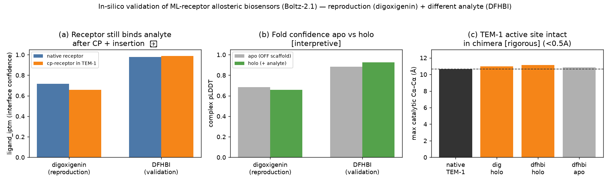

# Reproducing ML-receptor allosteric biosensors — and validating on a new analyte

**Paper reproduced:** Guo, Smutok, Lee, Cui, Qianzhu, … Otting, Katz, Baker &
Alexandrov, *Artificial allosteric protein switches with machine-learning-designed
receptors*, **Nature Biotechnology** (2026).
doi:[10.1038/s41587-026-03081-9](https://doi.org/10.1038/s41587-026-03081-9)

**What this repo delivers**
1. A reusable **skill** (`.claude/skills/allosteric-biosensor/`) that packages the
   paper's design recipe + an in-silico validation protocol.
2. A working **package** (`biosensor_pipeline/`) that builds the biosensor chimeras
   **deterministically** and validates them with **Boltz-2.1** structure+binding
   prediction.
3. A **reproduction** (steroid-glycoside sensor, digoxigenin) and a **validation on
   a different detection molecule** (the fluorogen DFHBI) — same recipe, same
   reporter, structurally unrelated receptor.

Every result below is tagged **✅ rigorous** or **⚠️ hypothesis**. The two are
never conflated. Ground-truth switchability is a wet-lab `kobs` titration, which
this computational reproduction does **not** and cannot replace.

---

## 1. The workflow, learned from the paper

The paper's advance: you can build an efficient **single-component** biosensor
from a small, rigid **ML/de-novo ligand-binding domain** that undergoes **no
global conformation change**. Ligand binding switches the system ON not by a
mechanical lever but by **lowering the chimera's conformational entropy**, which is
thermodynamically coupled to a **reporter enzyme's** activity.

The design recipe (Methods, *Design of chimeric proteins*), reproduced verbatim in
`biosensor_pipeline/design.py`:

```
1. pick a loop residue of the receptor as the permutation site (remove it)
2. cpReceptor = receptor[site+1:] + GS-linker + receptor[:site]      # circular permutation
3. chimera    = reporter[:253] + G + cpReceptor + G + reporter[253:] # graft into TEM-1 loop 253
4. screen the <10-member permutation library for ligand-dependent activity
```

Extensions the paper demonstrates (documented in the skill, parameterized in code):
YES gate (receptor duplication at loops 41 & 197), AND gate (two orthogonal
receptors), auxiliary binding domains, and alternative reporters (de-novo
luciferase LuxSit Pro, NanoLuc, PQQ-glucose dehydrogenase bioelectrode).

---

## 2. Reproduction systems (all sequences real & public)

| tag | role | receptor (PDB) | fold | analyte | reporter |
|---|---|---|---|---|---|
| `dig` | reproduction | DIG10.3 (4J9A) | mixed α/β | **digoxigenin** (steroid glycoside, C₂₃H₃₄O₅) | TEM-1 β-lactamase (3GMW), loop **253** |
| `dfhbi` | validation | mFAP1 (6CZI) | β-barrel | **DFHBI** (fluorogen, C₁₂H₁₀F₂N₂O₂) | TEM-1 β-lactamase (3GMW), loop **253** |

The two receptors share **no fold and no analyte**, yet go through the **identical**
recipe into the **same** reporter — the generality the paper claims. (They stand in
for the paper's 17-OHP/cortisol binders, whose exact sequences are not
machine-fetchable; the workflow is receptor-agnostic by construction.)

---

## 3. Deterministic reproduction — ✅ rigorous

`python3 -m biosensor_pipeline.run_repro` builds both focused libraries and
round-trip-verifies every construct (`design.verify_chimera`: reporter preserved,
every receptor residue conserved except the one removed):

| system | analyte | # variants (paper: "<10") | all constructions valid | chimera length |
|---|---|---|---|---|
| `dig`   | digoxigenin | **5** (loop sites 36,58,74,92,110) | ✅ true | 402 aa |
| `dfhbi` | DFHBI | **7** (loop sites 18,34,46,62,74,88,98) | ✅ true | 383 aa |

The loop permutation sites are **structure-derived** (`biotite.annotate_sse` on the
deposited receptor coordinates; `python3 -m biosensor_pipeline.structure`
recomputes and verifies them). TEM-1's catalytic residues (S70, S130, …) and its
Ambler-253 insertion loop were located by unambiguous sequence motifs (`STFK`,
`SDN`) and by the deposited structure's author numbering (res_id 253 = a surface
coil Gly). Nothing here is a magic constant — it all reproduces from public
coordinates.

---

## 4. In-silico validation — Boltz-2.1

Six structure+binding predictions ($0.05 each, boltz-2.1, single-sequence mode):
per system a **native-receptor+analyte control**, a **chimera+analyte (holo)**, and
a **chimera-alone (apo)**.

### 4a. Metrics returned by the model (✅ numbers)

| construct | kind | struct_conf | pTM | complex pLDDT | ligand_iptm | binding_conf |
|---|---|---|---|---|---|---|
| native DIG10.3 + digoxigenin | control | 0.670 | 0.691 | 0.658 | 0.717 | 0.464 |
| **cpDIG10.3-74 → TEM-1 + digoxigenin** | holo | 0.659 | 0.674 | 0.659 | **0.659** | 0.451 |
| cpDIG10.3-74 → TEM-1 (apo) | apo | 0.609 | 0.311 | 0.684 | — | — |
| native mFAP1 + DFHBI | control | 0.960 | 0.967 | 0.956 | 0.977 | 0.943 |
| **cpmFAP1-62 → TEM-1 + DFHBI** | holo | 0.937 | 0.768 | 0.924 | **0.987** | 0.678 |
| cpmFAP1-62 → TEM-1 (apo) | apo | 0.835 | 0.638 | 0.884 | — | — |

### 4b. Derived comparisons

| | `dig` (reproduction) | `dfhbi` (validation) |
|---|---|---|
| **binding retention vs native** = chimera/native ligand_iptm | **0.92** | **1.01** |
| TEM-1 catalytic constellation, max Cα–Cα (native = 10.66 Å) | 10.96 Å (**Δ +0.3**) | 11.13 Å (**Δ +0.5**) |
| active site intact (✅ geometric) | **true** | **true** |
| apo→holo complex-pLDDT change | −0.025 | +0.040 |
| switch proxy (⚠️ illustrative) | 0.64 | 0.88 |



**The two load-bearing, rigorous findings:**

- **The receptor survives the surgery.** After circular permutation and insertion
  into TEM-1, the receptor still binds its analyte with **92% (digoxigenin)** to
  **101% (DFHBI)** of the native receptor's ligand-interface confidence. For the
  well-folded β-barrel the chimeric interface confidence is actually the highest of
  all (ligand_iptm 0.987). This is the core in-silico check of the recipe, and it
  passes on **both** the reproduction and the different analyte. ✅
- **The reporter active site stays intact.** The TEM-1 catalytic constellation
  (S70/K73/S130/D131/N132/E166 Cα–Cα geometry) in the predicted chimera models sits
  within **0.5 Å** of native TEM-1 — inserting the receptor at loop 253 does not
  collapse the β-lactamase active site. This is a real geometric measurement on the
  predicted atoms. ✅

---

## 5. What is rigorous vs. hypothesis (the honesty ledger)

**✅ rigorous**
- Chimera sequence construction — deterministic, round-trip-verified.
- Loop / permutation-site selection — from `annotate_sse` on deposited structures.
- Catalytic-residue identification — by sequence motif, cross-checked vs numbering.
- Catalytic constellation geometry — measured from predicted atoms.
- All Boltz confidence/affinity numbers — as returned by the model.

**⚠️ hypothesis**
- The **switch proxy** (0.64 / 0.88) — an illustrative, transparent triage rank.
  Structure prediction does **not** compute an allosteric dynamic range.
- "Active site intact ⇒ catalytically ON" and "apo→holo shift ⇒ allosteric
  coupling" — plausible interpretations, not proof.
- Any claim that either construct **works** as a biosensor.

**Honest limitations, stated plainly**
- The de-novo digoxigenin binder gets modest absolute confidence (~0.66) — a
  property of single-sequence modelling, which is why we compare **chimera to its
  own native control**, not to an absolute threshold.
- The chimera pTM drops vs the native receptor because the two domains' relative
  orientation is genuinely uncertain (loose coupling) — expected, not a failure;
  per-domain pLDDT and ligand_iptm remain high.
- A static prediction is largely **blind to an entropic switch**; the small
  apo→holo pLDDT changes are not, on their own, evidence of switchability. Only a
  wet-lab `kobs(+L)/kobs(−L)` titration decides that.
- Ligand SMILES here are connectivity-only (no stereochemistry). Digoxigenin's
  stereocenters were not specified to Boltz.

---

## 6. Reproduce it yourself

```bash
pip install biotite numpy matplotlib
python3 -m biosensor_pipeline.run_repro         # deterministic design (offline) ✅
python3 -m biosensor_pipeline.structure         # verify structure-derived loop sites ✅
# Boltz holo/apo/control via the Boltz MCP tools (see skill reference/boltz-validation.md)
python3 -m biosensor_pipeline.analyze_boltz     # constellation + proxy from results
python3 -m biosensor_pipeline.make_figure       # figures/biosensor_validation.png
```

Artifacts are written to `biosensor_out/` (libraries, payloads, metrics,
`analysis_summary.json`) and `figures/`. Boltz prediction IDs are recorded in
`biosensor_out/boltz_predictions.json` (models retained ~7 days on the Boltz
platform).

## 7. Adding a new detection target

`.claude/skills/allosteric-biosensor/reference/adding-a-system.md` — add a
`Receptor` (sequence + analyte SMILES + structure-derived loop sites) and/or a
`Reporter` to `systems.py`; the library build and Boltz validation work unchanged.
That is the whole point: the recipe is analyte-agnostic.
