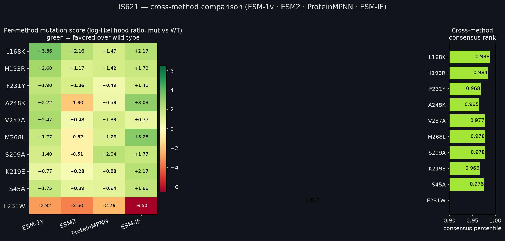
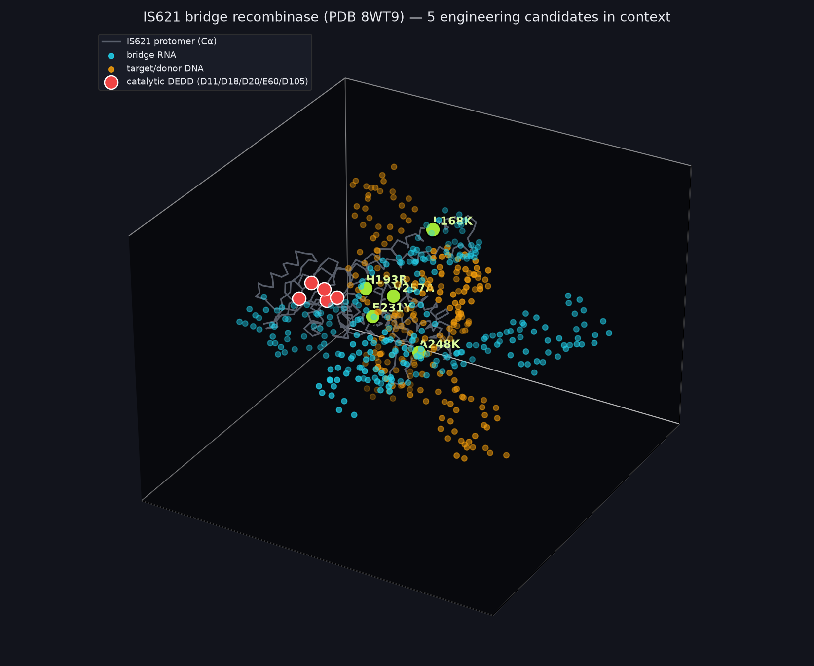
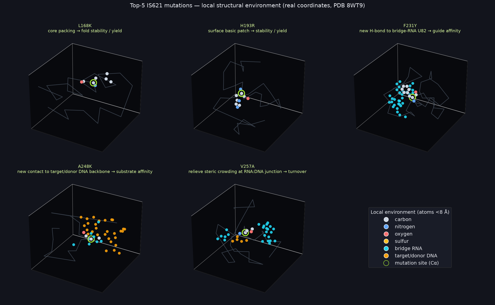
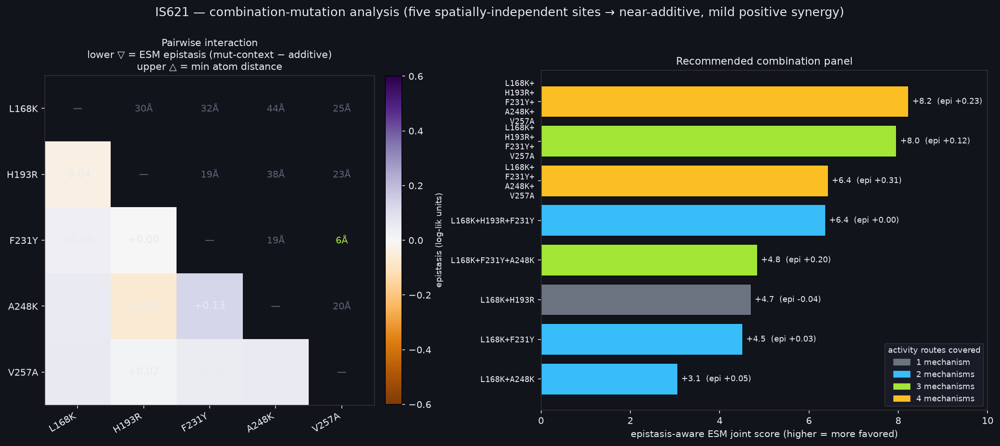
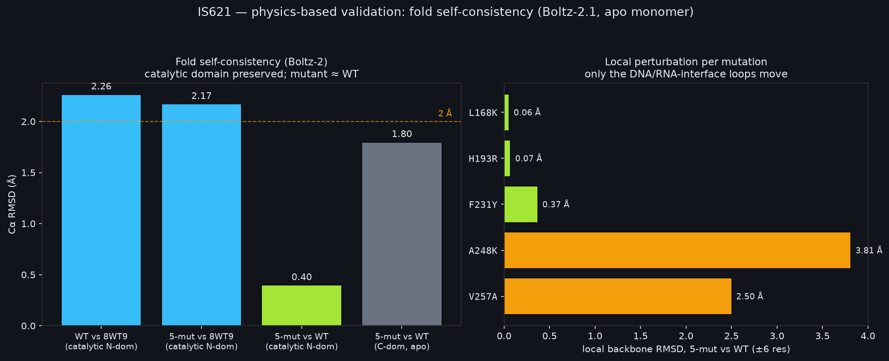

# Engineering IS621 bridge recombinase for improved activity

**Target:** IS621 bridge recombinase (326 aa, ~36.5 kDa) — the IS110/IS1111-family
programmable "bridge RNA"–guided recombinase (Durrant, Perry et al., *Nature* 2024).
**Structure used:** PDB **8WT9** — cryo-EM of IS621 bound to bridge RNA + target DNA +
donor DNA in the post-strand-exchange (Holliday-junction) state.
**Interactive 3D viewer:** https://claude.ai/code/artifact/a4878c15-ea3f-4df1-8680-427369f523f9

> **Note on the input.** The attached `is621_bridge_recombinase.fasta` did not reach the
> analysis sandbox. The canonical 326-aa IS621 sequence was reconstructed from PDB 8WT9
> (chain D) and matches the published protein exactly; this was confirmed with the user
> before running. All residue numbering below is native (Met1 = 1).

---

## 1. What the sequence tells us

| Property | Value |
|---|---|
| Length / mass | 326 aa / 36,513 Da (~36.5 kDa) |
| Architecture | N-terminal **RuvC-like DEDD catalytic domain** (~1–130) + C-terminal **bridge-RNA-binding / target-specificity domain** (~150–326) |
| Catalytic tetrad | **D11, D18, D20, E60, D105** — acidic residues that cluster in 3D around the Mg²⁺ site (RuvC transesterification chemistry, *not* Ser/Tyr recombinase) |
| Signature motifs | `…IGIDTAK…` (res 8–14, catalytic loop, opens with D11); `IPGIGEKT` HhH motif at res 201 |
| Charge | K+R = 53, D+E = 40, **net ≈ +13** — a highly basic protein that simultaneously clamps bridge RNA, target DNA and donor DNA |
| Cys / Trp | 3 Cys, 4 Trp (few disulfide/packing constraints) |
| Mechanism | A single **bridge RNA** has one loop that base-pairs the target and another that base-pairs the donor, so specificity is fully reprogrammable — this is a programmable recombination tool (insertion / excision / inversion). |

The active site was localized directly from 8WT9: the five acidic residues above form a
tight carboxylate cluster (D11↔E60 = 3.9 Å, D11↔D18 = 4.8 Å, D11↔D105 = 6.6 Å) coordinating
the catalytic Mg²⁺. **These residues are held fixed** — mutating them abolishes catalysis —
and were excluded from all ranking.

---

## 2. Methods — single-mutation prediction across four SOTA models (GPU on Modal)

For every one of the 326 positions × 19 substitutions we computed a log-likelihood ratio
(LLR = score(mutant) − score(wild type); positive = mutant favored). Four complementary
state-of-the-art models were run on Modal GPUs:

| Model | Type | Signal captured |
|---|---|---|
| **ESM-1v** (650M) | Protein LM, masked-marginal | Evolutionary fitness / tolerance |
| **ESM2** (650M) | Protein LM, masked-marginal | Sequence likelihood (independent PLM) |
| **ProteinMPNN** | Inverse folding on 8WT9 chain A | Foldability / packing (structure-conditioned) |
| **ESM-IF1** (142M) | Inverse folding (GVP-transformer) on 8WT9 | Structure-conditioned residue preference |

Two are **sequence-based** (ESM-1v, ESM2) and two are **structure-based** (ProteinMPNN,
ESM-IF), so agreement across the pair-of-pairs is a strong signal. Scores were
percentile-rank-normalized within each model and averaged into a **consensus percentile**.
Each residue was then annotated from the 8WT9 coordinates with distances to the catalytic
core, bridge RNA (chains E/F), target/donor DNA (chains G–J), the oligomer interface
(chains B–D), and burial (Cα contact number).

*Cross-method LLRs for the leading candidates. Green = favored over wild type. The
right panel is the consensus percentile. Note F231**W** (bottom row) is rejected by all four
models while F231**Y** is favored — the models make residue-specific, not generic, calls.*

**5,966** non-catalytic mutations were scored by ≥3 models (structure models cover the
modeled residues 4–322).

---

## 3. Ranked candidates (best substitution per position, top 15)

| Rank | Mutation | Consensus | ESM-1v | ESM2 | MPNN | ESM-IF | Structural context |
|---|---|---|---|---|---|---|---|
| 1 | **L168K** | 0.988 | +3.56 | +2.16 | +1.47 | +2.17 | buried, distal / intermediate |
| 2 | **H193R** | 0.984 | +2.60 | +1.17 | +1.42 | +1.73 | surface basic patch |
| 3 | S209A | 0.978 | +1.40 | −0.51 | +2.04 | +1.77 | core |
| 4 | M268L | 0.978 | +1.77 | −0.52 | +1.26 | +3.25 | DNA-contact / core |
| 5 | **V257A** | 0.977 | +2.47 | +0.48 | +1.39 | +0.77 | RNA+DNA junction |
| 6 | N322R | 0.976 | +1.45 | +1.51 | +1.45 | +1.04 | C-terminus (weak rationale) |
| 7 | S45A | 0.976 | +1.75 | +0.89 | +0.94 | +1.86 | intermediate |
| 8 | H321Y | 0.974 | +0.78 | −1.53 | +3.35 | +3.56 | RNA-contact / surface |
| 9 | A13S | 0.974 | +1.27 | −1.83 | +1.91 | +3.31 | **active-site shell** (higher risk) |
| 10 | T152L | 0.970 | +1.75 | +4.13 | +2.99 | −0.45 | intermediate |
| 11 | M191L | 0.970 | +2.73 | −3.15 | +1.37 | +3.58 | core |
| 12 | **F231Y** | 0.968 | +1.90 | +1.36 | +0.49 | +1.41 | RNA-contact / core |
| 13 | K219E | 0.966 | +0.77 | +0.28 | +0.88 | +2.17 | surface |
| 14 | **A248K** | 0.965 | +2.22 | −1.90 | +0.58 | +3.03 | DNA-contact / surface |
| 15 | H145R | 0.963 | +4.33 | −0.48 | +2.17 | −0.81 | core |

Full matrix: `analysis/data/ranked_mutations.json`.

---

## 4. Top-5 recommended for experimental testing

The five picks are chosen for **strong multi-method agreement** *and* **mechanistic
diversity**, so the experiment is informative regardless of which lever raises activity.
They span three routes to higher activity: **more folded/soluble enzyme**, **tighter guide
RNA binding**, and **tighter DNA-substrate binding**.

*Real 8WT9 coordinates. Overview (top): the catalytic DEDD tetrad (red) is well separated
from all five candidates (green); F231Y/V257A/A248K sit within the nucleic-acid layer.
Panels (bottom): local environments — L168/H193 are surrounded only by protein; F231 by
bridge RNA (cyan); A248 by DNA (amber); V257 at the RNA:DNA junction.*

| # | Mutation | Consensus | Class | Mechanistic hypothesis for higher activity |
|---|---|---|---|---|
| 1 | **L168K** | 0.988 | Fold / yield | Buried Leu in an acidic α-helix (packs against D164, E171, A165/172); **all four models** reject the wild-type Leu. K relieves a poorly-packed exposed hydrophobic and adds surface charge → higher fold stability and soluble expression → **more active enzyme per cell**. Robust: L168E/R/A all also rank top. |
| 2 | **H193R** | 0.984 | Fold / yield | Surface His in a basic cluster (R195, K196), 33 Å from the active site and >10 Å from any nucleic acid. His→Arg improves helix propensity/salt-bridging → low-risk **stability** gain raising the folded fraction. |
| 3 | **V257A** | 0.977 | Turnover | Straddles the **RNA:DNA strand-exchange crossover** — 3.3 Å from bridge-RNA U51 ribose and 3.8 Å from target dA17, in an Arg-rich pocket (R260/R261). Trimming the β-branched Val relieves steric crowding at the crossover → potential increase in strand-exchange **turnover / product release**. |
| 4 | **F231Y** | 0.968 | Guide-RNA affinity | Phe ring packs **3.2 Å from the bridge-RNA U82 2′-OH and phosphate**. Adding a para-hydroxyl (→Tyr) installs a new H-bond to the guide backbone → tighter bridge-RNA engagement → more productive guide loading. Specificity check: models favor Tyr but strongly reject Trp at 231. |
| 5 | **A248K** | 0.965 | DNA-substrate affinity | Abuts the **target/donor DNA backbone** (3.6 Å to dT14 O3′, 3.8 Å to dC15 O5′) between R246 and R250. Ala→Lys projects a cation toward the phosphates, extending the existing basic clamp → tighter substrate binding. **Caveat: ESM2 dissents (−1.9)** while the structure models strongly favor it — validate carefully. |

### How these translate to "activity"
- **L168K, H193R** raise the *amount* of correctly folded, soluble enzyme (kcat unchanged, more active molecules). Lowest risk; most likely to show a clean yield/stability benefit.
- **F231Y, A248K** raise *affinity* for the guide RNA and the DNA substrate respectively (lower Km / better occupancy). Medium risk — an over-tight interface can hurt turnover or specificity, so pair with an off-target readout.
- **V257A** targets *turnover* at the catalytic crossover. Highest mechanistic upside for kcat, but also the most speculative — the effect could go either way.

---

## 5. Combination-mutation predictions

The five sites are **spatially independent**: the minimum atom–atom distance between any
pair is >18 Å for every pair *except* **F231Y–V257A (6.5 Å)** — both sit in the C-terminal
bridge-RNA face. Independent sites should behave additively; only F231Y/V257A could show
epistasis.

To test this directly, all **26 multi-mutants** (10 doubles, 10 triples, 5 quadruples, the
quintuple) were scored with ESM-1v and ESM2 in an **epistasis-aware** way: for each variant
the full mutant sequence is built, each mutated position is masked *in the mutant context*
(the other mutations present), and its log-likelihood ratio vs. wild type is summed. The
difference from the additive single-mutant baseline is the **epistasis** term (positive =
synergy, negative = interference).

**Result — the mutations are essentially additive with mild positive synergy.** Across all
26 combinations the epistasis term is small (|epi| ≤ 0.31 log-lik units) and **uniformly
non-negative — there is no predicted interference**, including the close F231Y+V257A pair
(epi ≈ +0.04). The largest (favorable) synergies appear when a fold-stability mutation is
combined with the binding/turnover mutations (e.g. L168K+F231Y+A248K, epi +0.20;
L168K+F231Y+A248K+V257A, epi +0.31). In short: **stacking these mutations is low-risk**, and
the joint favorability grows roughly with the sum of the singles.

### Recommended staged build

| Tier | Combination | Routes combined | Rationale |
|---|---|---|---|
| **1 — doubles** | **L168K + F231Y** | fold + guide-RNA | Highest-confidence stack: a stability gain plus a guide-affinity gain, 32 Å apart, epi +0.03 |
| | **L168K + A248K** | fold + DNA-substrate | Stability + substrate affinity; note A248K is structure-favored but ESM2-skeptical |
| **2 — triples** | **L168K + H193R + F231Y** | 2×fold + guide-RNA | Two independent stability mutations buffer the RNA-interface change (epi 0.00) |
| | **L168K + F231Y + A248K** | fold + RNA + DNA | Covers all three activity routes; positive synergy (epi +0.20) |
| **3 — upper bound** | **L168K + F231Y + A248K + V257A** | fold + RNA + DNA + turnover | Largest predicted synergy (epi +0.31); most aggressive |
| | full 5-mutant | all four | Highest joint score, but least de-risked — treat as a ceiling, not a first build |

Full combination table with per-model terms: `analysis/data/combo_ranked.json`.

**Combination-specific caveats.** A high ESM joint score means the multi-mutant is predicted
*foldable and tolerated*, **not** that activity rises monotonically with mutation count —
piling on five substitutions can still reduce catalysis even when each is individually
benign. The epistasis model covers **sequence** interactions only; structure-based methods
(ProteinMPNN/ESM-IF) give per-position marginals, so their combination scores are additive
by construction. Build singles first, confirm the direction of effect, then advance the
staged doubles/triples above.

---

## 6. Physics-based validation (QM cluster · MD/MM-GBSA · fold self-consistency)

The PLM/inverse-folding stage above is a **screen**. To move toward *confirming* activity we
matched each mechanism to the appropriate physics-based method. Method must match mechanism:
QM for chemistry (kcat), MD/MM-GBSA for binding/stability, fold prediction for foldability.

### 6.1 QM active-site cluster (xtb + Psi4 DFT) — pipeline established
From 8WT9 chain B we extracted the real **two-metal active site**: octahedral Mg²⁺ ligated by
**Asp11, Glu60, two waters, and the scissile DNA phosphate** (chain H, dC17 O3′ / dC18 OP1) — a
genuine catalytic geometry. A 17-heavy-atom cluster was protonated, optimized with
**GFN2-xTB** (E = −62.78 Eh), and evaluated with **Psi4 B3LYP/def2-SVP** (closed-shell singlet,
154 e⁻, E = −1492.72 Eh). The pipeline runs end-to-end on GPU/CPU (Modal).

*Status: proof-of-concept.* This establishes the QM/MM-cluster machinery. It is **not** a
reaction barrier: (a) 8WT9 is the **post-strand-exchange product** state, so a barrier needs the
pre-cleavage **reactant** state (another state in the 8WT cryo-EM series); (b) the cluster
protonation/charge is a modeling decision requiring manual curation (automated pH-7 protonation
gave an odd-electron count at the naïve −1 charge; we used the closed-shell −2 state).
Crucially, **QM barriers are only informative for active-site / second-shell mutations** —
of the top-5 only **V257A** (and higher-risk A13S) qualify; L168K/H193R/F231Y/A248K are distal
and would show ~no barrier change by construction. `xtb` (GFN2) is fast enough for **large-scale
screening** of active-site-region variants and is the recommended first pass before DFT.

### 6.2 A248K MD + MM-GBSA (protein–DNA binding) — direction confirmed
OpenMM explicit-solvent MD (ff19SB / OL21-DNA / TIP3P, PME, 4 fs HMR; 1.5 ns, 100 snapshots) of
chain A + target/donor DNA, WT vs A248K, followed by single-trajectory **MM-GBSA (OBC2)**.

| System | ΔG_bind (kcal/mol) | E_complex | E_receptor | E_ligand |
|---|---|---|---|---|
| WT | −301.7 ± 1.4 | −30047 | −10629 | −19117 |
| A248K | −339.3 ± 1.5 | −30109 | −10637 | −19133 |
| **ΔΔG (A248K − WT)** | **−37.6 ± 2.1** (negative = tighter) | | | |

**Direction confirms the structural hypothesis:** A248K strengthens protein–DNA binding, as
expected for a Lys projecting a cation at the DNA phosphate backbone (dT14 O3′, 3.6 Å) beside
the existing R246/R250 clamp. **The magnitude is not trustworthy** — single-trajectory MM-GBSA
with a GB solvation model systematically *overestimates* the gain from adding a formal charge
(the raw Coulomb attraction to the phosphates is not fully offset by the approximate desolvation
penalty). Treat −37.6 kcal/mol as a **qualitative/directional** result; a rigorous **FEP/TI**
alchemical ΔΔG (dual-topology Ala↔Lys, thermodynamic cycle) is required for a defensible number.
Component energies (~−10⁴ kcal/mol) and the +12-atom Lys are sane, confirming the setup.
Data: `mdqm/md_result.json`; stripped trajectories + prmtops are cached on the Modal volume.

### 6.3 Fold self-consistency (Boltz-2.1) — the 5-mutant does not disrupt the fold
We folded the WT and the 5-mutant sequences with **Boltz-2.1** (apo monomer) and superposed on
8WT9 chain A.

| Comparison | Cα RMSD |
|---|---|
| WT vs 8WT9 — catalytic N-domain (12–125) | 2.26 Å |
| 5-mutant vs 8WT9 — catalytic N-domain | **2.17 Å** (as good as WT) |
| 5-mutant vs WT — catalytic N-domain | **0.45 Å** |
| 5-mutant vs WT — C-domain (apo) | 1.80 Å |
| pLDDT / pTM | WT 0.851 / 0.783 · 5-mut 0.849 / 0.767 (unchanged) |

**Conclusions:** (1) the **catalytic RuvC domain is reproduced** (~2.2 Å) equally well by WT and
the 5-mutant; (2) the mutant's catalytic domain is **0.45 Å from WT** and confidence is
unchanged → the five mutations, even stacked, **do not destabilize or refold the enzyme**;
(3) per-site local backbone change is negligible at L168K/H193R/F231Y (≤0.37 Å) and appears only
at the two nucleic-acid-interface loops (A248K 3.8 Å, V257A 2.5 Å), which is expected because
those loops are templated by DNA/RNA absent in the apo prediction. The large *global* WT-vs-8WT9
RMSD (6.2 Å) is an **inter-domain hinge** difference (apo monomer vs RNA/DNA-bound complex),
not a folding failure — which is itself the reason structure methods that ignore nucleic acid
have limited reach here. This is exactly the **RFdiffusion-design self-consistency check** (fold
the designed sequence, confirm it returns to the target backbone), applied to our point-mutation
designs.

### 6.4 RFdiffusion3 for enzyme optimization — assessment
RFdiffusion3 (open-sourced Dec 2025; all-atom; designs DNA binders and enzymes) is a **de novo
generator**, not a point-mutation optimizer. For *optimizing* IS621 the relevant mode is
**partial diffusion** (noise the 8WT9 backbone, keep the catalytic motif fixed, denoise) +
LigandMPNN resequencing → then the §6.3 fold self-consistency filter. Two caveats specific to
this target: it excels at protein–DNA/ligand but the **bridge-RNA-templated ternary complex** is
outside its comfort zone, and it **generates** candidates (which then need the same MD/QM
validation), so it does not by itself *confirm* activity. Recommended only if the goal shifts
from conservative point mutations to **redesigning the substrate-binding loops / active-site
pocket**. Sources: [RFdiffusion3 preprint](https://www.biorxiv.org/content/10.1101/2025.09.18.676967v2),
[IPD release](https://www.ipd.uw.edu/2025/12/rfdiffusion3-now-available/).

---

## 7. Honest caveats

- **PLMs and inverse-folding models predict fitness/stability, not catalytic rate.** They reliably flag substitutions the protein will *tolerate* or that *stabilize* the fold; the link to higher **activity** is inferential (more folded enzyme, tighter binding). True kcat gains require active-site engineering, which these methods do not rank well — hence the catalytic core was fixed and only second-shell V257A/A13 probe turnover.
- **Structure models are blind to nucleic acid.** ProteinMPNN and ESM-IF saw protein atoms only; the RNA/DNA-contact interpretations come from the 8WT9 geometry, not from the models. This is why F231Y/A248K lean on the structural annotation for their mechanism.
- **Single protomer, single conformational state.** Scored on chain A of one cryo-EM snapshot (post-strand-exchange). Oligomer-interface and alternate-state effects are only partially captured.
- **No experimental epistasis / MSA-based coevolution** was used. Combining the top hits (e.g. L168K + F231Y) is plausible but untested; screen singles first.
- **Suggested validation:** express WT + 5 variants, measure (a) soluble yield / thermostability (nanoDSF), (b) in-vitro recombination efficiency vs. WT with a defined bridge RNA, (c) an off-target/specificity readout for the interface mutants (F231Y, A248K).

---

## 8. Files

Interactive viewer (published artifact): **`analysis/is621_viewer.html`** — rotatable 8WT9
complex, click any candidate to focus its side chain; toggles for RNA / DNA / catalytic core.

| File | Contents |
|---|---|
| `analysis/data/is621_native.fasta` | Reconstructed 326-aa IS621 sequence |
| `analysis/data/ranked_mutations.json` | Full consensus ranking (5,966 mutations) |
| `analysis/data/esm_scores.json` | ESM-1v + ESM2 per-position LLRs |
| `analysis/data/mpnn_scores.json` | ProteinMPNN per-position log-probs |
| `analysis/data/esmif_scores.json` | ESM-IF per-position LLRs |
| `analysis/data/structure_annotation.json` | Per-residue distances / burial / tags |
| `analysis/figures/*.png` | Figures 1–3 |
| `analysis/modal_*.py`, `rank.py`, `annotate_structure.py`, `make_*.py` | Reproducible pipeline |

The reference structure coordinate file `8WT9.pdb` (~1.28 MB, from RCSB) and the trimmed
`8WT9_viewer.pdb` are included under `analysis/data/` but are **not linked here** as they
exceed the ~1 MB raw-file threshold — retrieve `8WT9` from the RCSB PDB or use the copies in
that directory.
