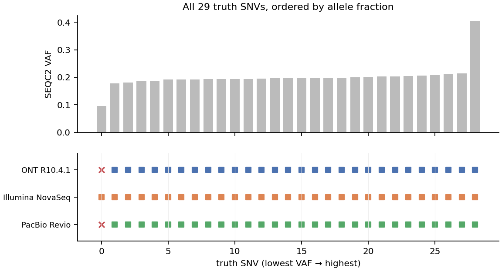
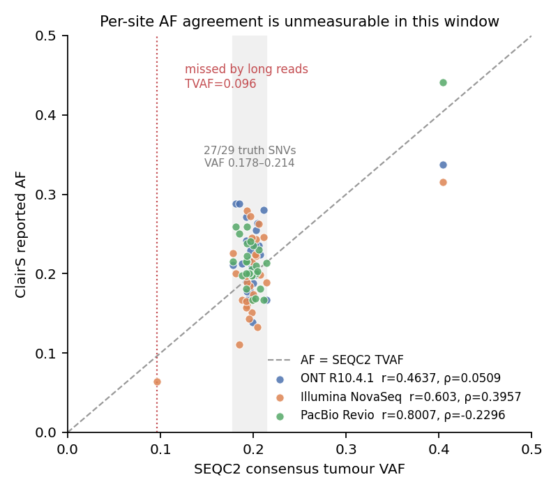
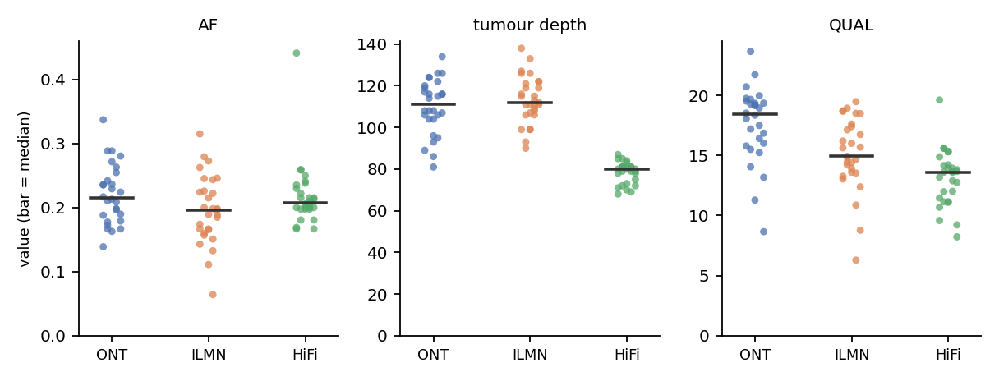
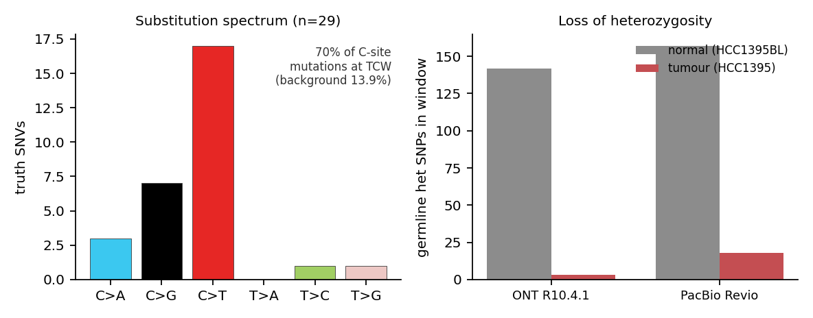

# What the ClairS demo calls actually say

Analysis of the 29 somatic SNVs called by ClairS in `chr17:80,000,000-80,100,000`
of the HCC1395 / HCC1395BL tumour-normal pair, across ONT R10.4.1, Illumina
NovaSeq and PacBio Revio — the three demo datasets in [`results/`](results/).

Reproduce with `python3 clairs_demo/analyze.py`; every number below comes from
[`analysis.json`](analysis.json), and the ones needing a live run directory from
[`collect_run_stats.py`](collect_run_stats.py) → [`data/run_derived.json`](data/run_derived.json).

---

## Summary

| | |
|---|---|
| **Accuracy** | 3/3 platforms match ClairS's published expected output. Zero false positives anywhere: 85 PASS calls, 85 true. |
| **Concordance** | 28 of 29 truth SNVs called by all three platforms. The 29th is called by Illumina only. |
| **AF agreement** | Aggregate bias is negligible (median ratio 0.96–1.10). **Per-site** agreement is *not measurable here* — see §3, this is the one place the obvious statistic misleads. |
| **Biology** | The window is APOBEC-mutated (70 % of C-site mutations at TCW, 5.1× enriched, p=3.7×10⁻¹¹) and has undergone loss of heterozygosity in the tumour (142 → 3 het SNPs). |
| **Caveat** | One 100 kb window, n=29. Nothing here generalises to genome-wide performance. |

---

## 1. Detection: one variant separates the platforms



| Platform | Called | TP | FP | FN | Precision | Recall |
|---|---|---|---|---|---|---|
| ONT R10.4.1 | 28 | 28 | 0 | 1 | 1.000 | 0.9655 |
| Illumina NovaSeq | 29 | 29 | 0 | 0 | 1.000 | 1.0000 |
| PacBio Revio | 28 | 28 | 0 | 1 | 1.000 | 0.9655 |

**Not a single false positive across 85 calls.** In a tumour-normal design that
is the metric that matters most — a somatic FP is an artefact the normal sample
was supposed to veto — and the matched normal is doing its job: `NAF = 0.0000`
at every one of the 85 calls, with zero alt-supporting reads in the normal.

Both long-read platforms miss the **same** site, and it is the lowest-VAF truth
variant in the window:

```
chr17:80,094,483  T>C   SEQC2 TVAF = 0.096  (95 % CI 0.085–0.110), NVAF = 0.002
  ONT      not emitted at all — not even LowQual
  PacBio   not emitted at all
  Illumina PASS, AF = 0.0642, AD = 102,7   NAF = 0.0000, NAD = 68,0   QUAL 10.86
```

It never reaches the neural networks on the long-read runs: with ~7 alt reads at
~100× the site falls below the default `--snv_min_af 0.05` candidate threshold,
so it is filtered before calling rather than called and rejected. Illumina's
higher per-base accuracy at this depth is what lets it hold a 6 % AF call. The
practical read: **the knob for this class of miss is `--snv_min_af`, not the
model.**

## 2. The window is one clonal population, not a VAF spectrum

The truth VAFs are nearly a point mass:

```
min 0.096 | Q1 0.192 | median 0.197 | Q3 0.203 | max 0.404      IQR = 0.011
```

27 of 29 sites lie between 0.178 and 0.214 — a single clonal population at
VAF ≈ 0.20. The two exceptions are the 0.096 site above and one at
`chr17:80,062,263` (C>G, TVAF 0.404), called by all three.

That shape is why this window is an easy benchmark: it is essentially 27 copies
of the same easy question plus one hard one. It is also why the next section
matters.

## 3. Per-site AF agreement cannot be assessed here — and Pearson *r* hides that



| Platform | Pearson *r* | Spearman *ρ* | median AF ÷ SEQC2 | mean abs. error |
|---|---|---|---|---|
| ONT R10.4.1 | 0.464 | **0.051** | 1.097 | 0.038 |
| Illumina NovaSeq | 0.603 | **0.396** | 0.957 | 0.037 |
| PacBio Revio | 0.801 | **−0.230** | 1.040 | 0.025 |

Reporting only Pearson *r* would say "PacBio tracks the consensus VAF best,
r = 0.80". The rank correlation says the opposite — ρ = −0.23. Both are computed
from the same 28 points; the difference is that *r* is being carried almost
entirely by the single leverage point at VAF 0.404 sitting far from the cluster.
Strip that point and there is no relationship left to measure.

There is a clean reason, and it is arithmetic rather than a property of ClairS.
At AF ≈ 0.2 and ~100× depth, the binomial sampling standard error on a single
site's AF is

```
sqrt(0.2 × 0.8 / 111) = 0.039        (ONT; ILMN 0.038, HiFi 0.045)
```

The **spread being measured** — the IQR of the truth VAFs — is **0.011**. The
noise is 3.5–4× the signal. No caller could rank these 27 sites correctly from
~100× data; the ordering is sampling noise by construction.

What *can* be said, and is worth saying: the **aggregate** AF is unbiased.
Median ClairS AF ÷ SEQC2 VAF is 0.96–1.10 and the mean absolute error
(0.025–0.038) matches the binomial SE almost exactly — i.e. the residual is
fully explained by read sampling, leaving no room for a systematic AF bias on
any of the three platforms.

> Methodological note: the SEQC2 `TVAF` is itself a consensus over ~60 short-read
> replicate call sets, so it is an orthogonal reference, not ground truth to the
> third decimal. Treating it as exact is a second reason not to over-read *r*.

## 4. Depth, quality and strand balance



| Platform | median tumour DP | median normal DP | QUAL range | alt-read forward fraction (median, range) |
|---|---|---|---|---|
| ONT | 111 | 35 | 8.7 – 23.6 | 0.44 (0.37–0.67) |
| Illumina | 112 | 53 | 6.3 – 19.5 | 0.52 (0.19–0.73) |
| PacBio | 80 | 36 | 8.2 – 19.6 | 0.39 (0.23–0.80) |

Nothing pathological. Alt reads sit near a 50/50 strand split on all three; the
long-read runs lean slightly to the reverse strand (median 0.39–0.44) but no
individual call is one-sided enough to look like a strand artefact — consistent
with zero false positives. QUAL is low in absolute terms on every platform
(6–24) because these are all ~20 % VAF somatic calls; that is the expected
operating point, not a warning sign, and the model-specific `PASS` threshold is
calibrated for it.

## 5. The mutational spectrum is APOBEC



| C>A | C>G | C>T | T>A | T>C | T>G |
|---|---|---|---|---|---|
| 3 | 7 | **17** | 0 | 1 | 1 |

27 of 29 mutations are at C:G base pairs, dominated by C>T with a substantial
C>G component — the joint C>T + C>G elevation that is the hallmark of APOBEC
(COSMIC SBS2 + SBS13) rather than of clock-like ageing (SBS1/5), which produces
C>T without the C>G shoulder.

Trinucleotide context makes it quantitative. APOBEC3 deaminates cytosine in a
**TCW** (TCA/TCT) context:

```
observed   19 / 27 C-site mutations at TCW  = 70.4 %
background  7,184 / 51,688 C·G sites in the window = 13.9 %
            → 5.1× enrichment, one-sided binomial p = 3.7 × 10⁻¹¹
```

This is consistent with HCC1395 being an APOBEC-high breast line. Two honest
limits: n = 29 in a single 100 kb window is far too small for signature
*fitting* (you would want thousands of mutations genome-wide), and the truth set
is itself the product of short-read consensus calling, so any platform-specific
detection bias in SEQC2 propagates here. The enrichment is strong enough to
survive both caveats as a qualitative call; the 5.1× figure is not a signature
exposure estimate.

## 6. The tumour has lost heterozygosity across the whole window

Germline calls that Clair3 makes inside ClairS, in the same 100 kb:

| | normal (HCC1395BL) | tumour (HCC1395) | het retained |
|---|---|---|---|
| ONT — het / hom | 142 / 81 | **3** / 196 | 2.1 % |
| PacBio — het / hom | 157 / 84 | **18** / 205 | 11.5 % |

The normal is an ordinary heterozygous genome. In the tumour, essentially every
heterozygous site has become homozygous while the homozygous count rises by a
matching amount — textbook **loss of heterozygosity**, independently reproduced
by two platforms. HCC1395 is a highly aneuploid line, so this is expected
biology rather than a calling failure, and it explains a downstream oddity:

**Why the `H` flag appears on ONT and not on PacBio.** ONT tags 24 of 28 calls
with `H` ("variant on a single haplotype"); PacBio tags 0 of 28. It is not a
tagging-quality problem — PacBio haplotags *more* reads than ONT (97.4 % vs
86.3 %) at comparable read length (14.8 kb vs 15.9 kb median). ClairS sets `H`
only when **both** haplotypes carry reads at the site
(`all_hp1 * all_hp2 > 0`, `src/haplotype_filtering.py`). With almost no
heterozygous sites left to phase against, the PacBio run assigned every read
overlapping a call site to HP=1 and left HP=2 empty (2,190 vs 0 read-bases
across the 28 sites), so the precondition fails; the ONT run kept a small HP=1
population (37) alongside the HP=2 bulk (3,637) and passes it.
Measured directly from the haplotagged BAMs, alt reads are confined to one
haplotype at **28/28 sites on both platforms** — the underlying phasing evidence
is identical, only the flag's precondition differs.

Practical consequence: in LOH regions the `H` flag is unreliable as a
confidence signal, and its absence should not be read as evidence against a
call. Illumina never sets it at all — the `ilmn` platform skips the Clair3
germline and phasing stages entirely, which is also why it finished in 25 s
against ~100 s for the long-read runs.

A caveat on interpretation: somatic VAF ≈ 0.20 against a background of LOH is
not self-consistent with a pure, clonal, copy-neutral tumour — it implies
subclonality, altered copy number, or normal admixture in this sample. Resolving
which needs the copy-number and purity estimate from ClairS's `--enable_verdict`
module, which was not run here.

---

## Method and limits

- ClairS 0.4.5 (commit `a87db4a`), Clair3 1.2.0, CPU-only, 4 threads,
  installed from source per the [`clairs-install-demo`](../.claude/skills/clairs-install-demo/) skill.
- Truth: SEQC2 high-confidence somatic SNV v1.2, restricted to the SEQC2
  high-confidence BED. Comparison via `clairs.py compare_vcf --input_filter_tag PASS`.
- Background trinucleotide frequencies computed from the GRCh38_no_alt chr17
  reference over the same 100 kb window.
- **n = 29 truth SNVs in one 100 kb window.** Precision of 1.000 here says
  nothing about genome-wide precision; published whole-genome figures for ONT
  R10.4.1 at 50×/25× are 86.9 % recall / 93.0 % precision at VAF ≥ 0.05. Nothing
  in this report should be read as a platform ranking.
