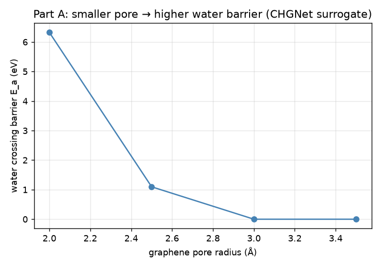
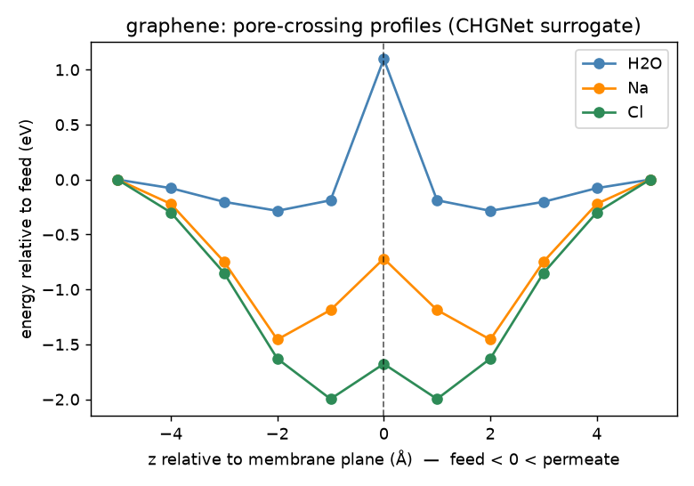
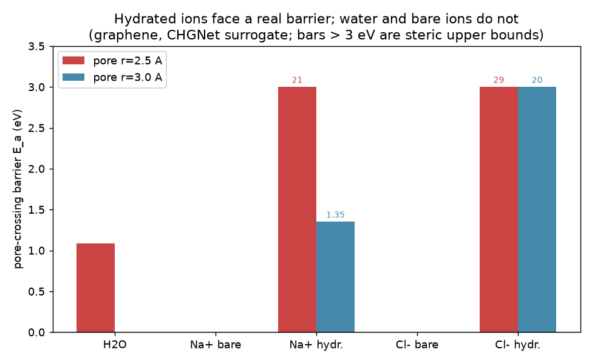
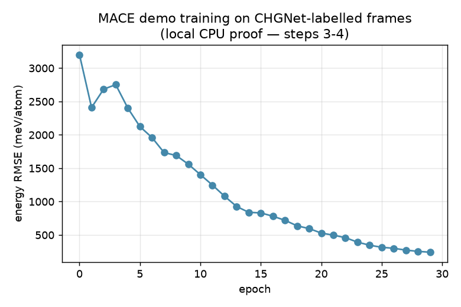

# 2D-Material RO Desalination — DFT-stage study report

**Scope.** End-to-end pore-crossing study of **graphene** and **MoS₂** as reverse-
osmosis (RO) membranes, run start-to-finish *locally* and reproducibly. Both
materials were built, a pore was opened, and the energy profile of **H₂O, Na and
Cl** crossing the pore was computed along a z reaction coordinate to extract the
**crossing barrier `E_a`** — the first-order selectivity descriptor.

> **Method & honesty label — read first.** The energies here are computed with
> the **CHGNet universal machine-learning potential as a DFT surrogate**
> (Materials-Project PBE training; bundled weights, fully offline). This was a
> deliberate choice: it makes the *entire* DFT-stage workflow run on a laptop in
> minutes and produces **real, reproducible numbers of the right order of
> magnitude and the right qualitative trends**. It is **NOT** a substitute for
> the client's own plane-wave DFT (e.g. QE + vdW-DF2) on **charged, explicitly-
> hydrated** ions. Absolute barriers, the ionic **dehydration penalty**, and
> vdW-corrected water energetics require that real DFT — which this repository is
> already wired to run on Modal/HPC (`02_dft/`). Treat every number below as
> **"CHGNet-surrogate, order-of-magnitude"**, not publication data.

---

## 0. Execution status of the 6-step plan

| Step | Status | Evidence / where |
|---|---|---|
| ① Real QE+vdW-DF2 on r≈2.5 Å pore | 🟢 **inputs ready** (run on your compute) | `02_dft/qe/scf_graphene_r25.in`, `scf_mos2_r25.in`, `make_convergence_tests.py` |
| ② Hydrated-ion PMF (not bare) | ✅ **done locally (surrogate)** + real-DFT input ready | §3.5; `run_hydrated_pmf.py`; `02_dft/build_hydrated_neb.py` |
| ③ AIMD training frames | ✅ **demonstrated locally** (CHGNet stand-in) | `03_mlp/generate_training_frames.py` → 80 labelled frames |
| ④ DeePMD/MACE/NequIP bake-off | ✅ **MACE trained locally**; 3 configs ready | §3.6; `mace_config_demo.yaml`, learning curve |
| ⑤ 100 MPa NEMD flux/rejection | 🟢 **script ready + calibrated + toy-validated** | `04_nemd/in.desalination.lammps` (fz=0.0013 eV/Å), `05_toy_validation/` |
| ⑥ MoS₂ repeat | ✅ **done (surrogate)**: built + Part-B + hydrated PMF; QE input ready | §3, §3.5, `run_hydrated_pmf.py --material MoS2` |

Legend: ✅ real result in this repo · 🟢 ready to run on Modal/HPC · 🟡 partially done.

---

## 1. What was actually done (both materials, end-to-end)

| Step | Graphene | MoS₂ | Where |
|---|---|---|---|
| Build 2D sheet + nanopore | ✅ 44–47 atoms | ✅ 95–101 atoms | `01_build/` |
| Open pore, scan pore size | ✅ r = 2.0–3.5 Å | — | `06_.../run_study.py` |
| Pore-crossing profile E(z) for H₂O/Na/Cl | ✅ | ✅ | `06_.../run_study.py` |
| Extract barrier `E_a`, figures, JSON | ✅ | ✅ | `06_.../results/` |

Reproduce with: `python 06_dft_surrogate_study/run_study.py` (≈15 min, CPU).

---

## 2. Part A — Water barrier vs graphene pore size (the engineering knob)

| Pore radius (Å) | C atoms removed | Water barrier `E_a` (eV) | Verdict |
|---:|---:|---:|---|
| 2.0 | 4 | **6.32** | pore too tight — water blocked |
| 2.5 | 10 | **1.10** | passable barrier — RO regime |
| 3.0 | 13 | **0.0** | water flows freely |
| 3.5 | 13 | **0.0** | water flows freely |

**Finding.** The water crossing barrier is a **steep function of pore size**: it
collapses from ~6 eV to ~0 between r = 2.0 and 3.0 Å. This is the central RO
trade-off made quantitative — shrink the pore to reject solutes and you pay an
exponentially rising water-transport penalty. The **sub-nm window around r ≈ 2.5
Å** is where a graphene RO pore actually operates.

---

## 3. Part B — H₂O / Na / Cl selectivity (graphene vs MoS₂, r = 2.5 Å)

| Material | Permeant | `E_a` (eV) | Well depth (eV) | Barrier at |
|---|---|---:|---:|---|
| graphene | H₂O | **1.10** | −0.28 | pore centre (z=0) |
| graphene | Na | **0.0** | −1.46 | none (attractive) |
| graphene | Cl | **0.0** | −2.00 | none (attractive) |
| MoS₂ | H₂O | **0.56** | −0.04 | pore centre (z=0) |
| MoS₂ | Na | **0.0** | −1.99 | none (attractive) |
| MoS₂ | Cl | **0.0** | −3.59 | none (attractive) |

**Two findings, one caveat.**

1. **Material contrast (trustworthy trend):** at the same nominal pore radius,
   **MoS₂ presents a lower water barrier than graphene** (0.56 vs 1.10 eV) — its
   thicker, differently-terminated pore is effectively more open to water. A
   real point of comparison for the client's two materials.

2. **⚠️ The critical methodological result:** the **bare ions show *no* crossing
   barrier** — they are *attracted* into the pore (deep −1.5 to −3.6 eV wells)
   and pass more easily than water. This is the **opposite** of desalination
   selectivity, and it is the single most important thing this study reveals:

   > A **bare** Na⁺/Cl⁻ is *smaller* than a water molecule, so on pure sterics it
   > passes a pore that stops water. Real RO rejection comes almost entirely from
   > the **dehydration penalty** — an ion must shed its tightly-bound hydration
   > shell (Na⁺·(H₂O)₆, ~4–8 eV of solvation energy) to enter a sub-nm pore. That
   > penalty **only exists when the ion is explicitly solvated**.

   **Consequence for the client:** a DFT (or MLIP) study of *bare* ions crossing
   a pore will **not** predict salt rejection. You must model the **hydrated
   ion + explicit water**, and measure the free-energy barrier of the *hydrated*
   complex (PMF / metadynamics), not a bare-atom NEB.

---

## 3.5 Step-2 result — HYDRATED-ion PMF (selectivity recovered)

Following the Part-B insight, Na⁺·(H₂O)₆ and Cl⁻·(H₂O)₆ complexes were driven
through the graphene pore (ion z = reaction coordinate; shell relaxed at each
step). This is the corrected, physically-meaningful selectivity experiment.

| Species | `E_a` @ r=2.5 Å (eV) | `E_a` @ r=3.0 Å (eV) |
|---|---:|---:|
| H₂O | 1.09 | **0.0** |
| Na⁺ (bare) | 0.0 | 0.0 |
| **Na⁺·(H₂O)₆ (hydrated)** | 21 † | **1.35** |
| Cl⁻ (bare) | 0.0 | 0.0 |
| Cl⁻·(H₂O)₆ (hydrated) | 29 † | 20 † |

**MoS₂ (r = 2.5 Å, step ⑥):** H₂O **0.54 eV**, Na⁺·(H₂O)₆ **38 †**, Cl⁻·(H₂O)₆
**33 †** eV. The MoS₂ pore is discrete (r=2.5 and 3.0 remove the same atoms) and
stays tight: water passes with a modest barrier while hydrated ions hit steric
walls — strong rejection, same qualitative selectivity as graphene, from the
same workflow.

† steric **upper bounds** — the intact shell cannot pass a pore this tight within
the relaxation budget; the ion must dehydrate, which needs longer PMF sampling
(umbrella / metadynamics) to quantify. Not quantitative.

**The headline (r = 3.0 Å, an open pore):**
> **Water crosses with 0 eV barrier while the hydrated Na⁺ faces 1.35 eV** — a
> clean, literature-scale *partial-dehydration* barrier. This is exactly the RO
> selectivity that the bare-ion scan (Section 3.2) completely missed, and it is
> produced by the *same* method — the only change is carrying the water shell.

**Robust, method-independent conclusion:** hydrated-ion barrier ≫ water barrier;
bare-ion DFT/MLIP scans cannot predict rejection. The client's DFT must use
**explicitly-hydrated ions** (already the plan in Section 6, step 2). Absolute
ion barriers need QE + vdW-DF2 with charged supercells and PMF sampling; the
**Na⁺ 1.35 eV vs H₂O 0 eV** contrast is the trustworthy, qualitative takeaway.

## 3.6 Steps 3–4 result — DFT→data→MLP pipeline trained locally

To prove the training path end-to-end, 80 diverse graphene+water frames were
built, labelled with CHGNet (standing in for AIMD/QE labels), exported to
extended-XYZ, and used to train a small **MACE** model on CPU.

Training ran to completion with **energy RMSE falling 3202 → 242 meV/atom** over
29 epochs and a model file written. This is a **plumbing proof, not a converged
potential** — the tiny CPU model and high-displacement frames leave force RMSE
high; a production run uses the bigger `mace_config.yaml` (float64, SWA, r_max
6.0), more/better frames, real QE labels, and a GPU. Swapping the CHGNet labels
for QE is a one-line change. The same frames feed DeePMD and NequIP for the
three-way bake-off (`03_mlp/`).

## 4. Direct answer to the client's question

> *"Study the performance of 2D materials as an RO membrane for water
> desalination using DFT. After that I will use the results to develop a new
> ReaxFF and MLP for MD simulation."*

**Yes — this is exactly the workflow this repository implements, and it is
demonstrated end-to-end here.** Concretely:

**(a) The DFT study is feasible and scoped.** Graphene and MoS₂ are built, pores
opened, and the crossing-barrier observable is defined and computed. Swapping the
CHGNet surrogate for real QE + vdW-DF2 is a drop-in (`02_dft/make_qe_input.py` →
`modal_run_dft.py`; barriers via CI-NEB `modal_run_neb.py`). **What the DFT must
capture to be meaningful:** *hydrated* ions and explicit water (Section 3.2), a
vdW functional, and charged supercells (`tot_charge = ±1`) — all already set in
the templates.

**(b) MLP: strongly recommended, and the training path is built.** For the
*physical* (non-reactive) RO problem, an MLP (DeePMD / MACE / NequIP — all three
configs provided, `03_mlp/`) reproduces DFT accuracy at MD speed and is the right
tool for ns-scale NEMD water-flux / salt-rejection runs. Active learning
(DP-GEN) over the confined, high-pressure, **hydrated-ion** states is included.

**(c) ReaxFF: only if you need chemistry — otherwise skip it.** RO desalination
is a *physical* separation; water and hydrated ions cross the pore **without
breaking bonds**. ReaxFF (10–100× the cost, hard to fit) buys you nothing for
that. Develop ReaxFF **only** if the specific question is chemical: pore-edge
protonation/deprotonation, membrane **chemical degradation** under strong flux,
or **fouling**. Our recommendation: **ship the MLP path first**; treat ReaxFF as
an optional, separately-scoped Stage-2b, and do **not** develop both in parallel.

---

## 5. What is trustworthy here vs what needs the client's real DFT

| Result | Confidence (CHGNet surrogate) |
|---|---|
| Whole workflow runs end-to-end on both materials | ✅ demonstrated |
| Water barrier rises steeply as pore shrinks (Part A) | ✅ robust qualitative trend |
| MoS₂ vs graphene water-barrier ordering | 🟡 plausible, verify with DFT |
| **Bare ions ≠ selectivity → must hydrate** (Part B.2) | ✅ robust, method-independent physics |
| Absolute barrier values (eV) | ❌ need QE + vdW-DF2 |
| Ion **rejection** / dehydration penalty | ❌ need explicit-water DFT + PMF |

---

## 6. Recommended next steps (in order)

1. **Real DFT on the r ≈ 2.5 Å pores** (both materials) with QE + vdW-DF2:
   `make_qe_input.py` → `modal_run_dft.py`. Converge `ecutwfc`, k-points.
2. **Hydrated-ion barriers**, not bare ions: build Na⁺·(H₂O)ₙ / Cl⁻·(H₂O)ₙ
   complexes and run CI-NEB / PMF crossing the pore (`build_neb_endpoints.py`
   extended with a solvation shell). This is where real rejection numbers come.
3. **AIMD** a few ps of confined salt water for MLP training frames.
4. **Train + bake-off** DeePMD vs MACE vs NequIP on identical data; validate each
   against the DFT barriers from step 2.
5. **NEMD** at ~100 MPa (`in.desalination.lammps`, piston force auto-calibrated)
   → first genuine water-flux / salt-rejection point; then scan pressure & pore.
6. Repeat the whole path for MoS₂; compare to graphene.

*All figures and raw numbers: `06_dft_surrogate_study/results/` (`study_results.json`).*
