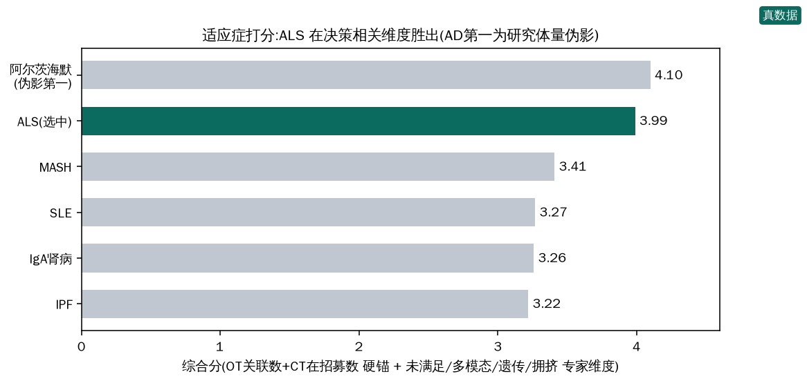
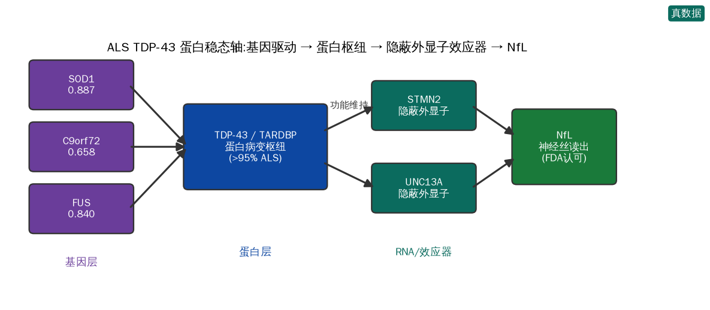
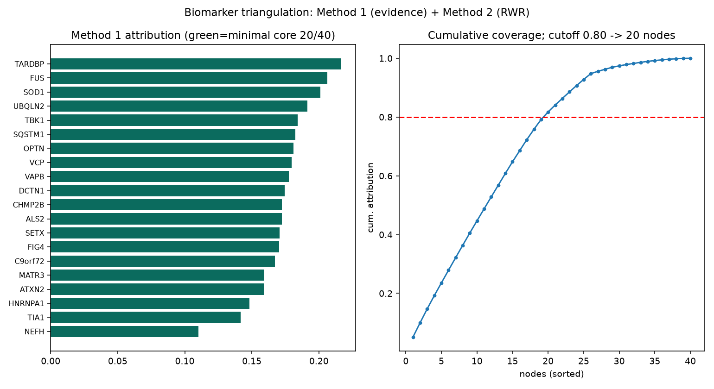
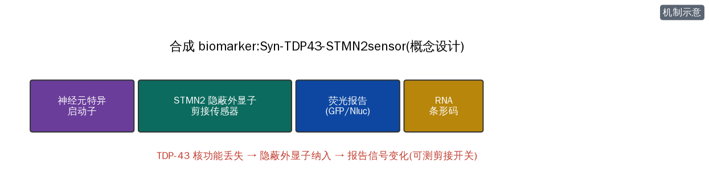
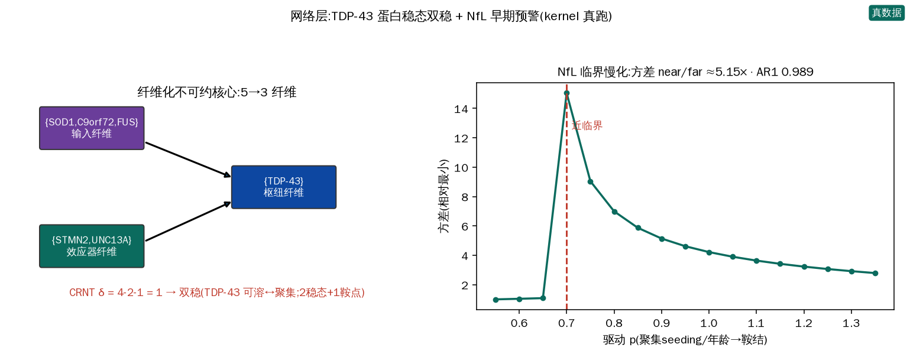
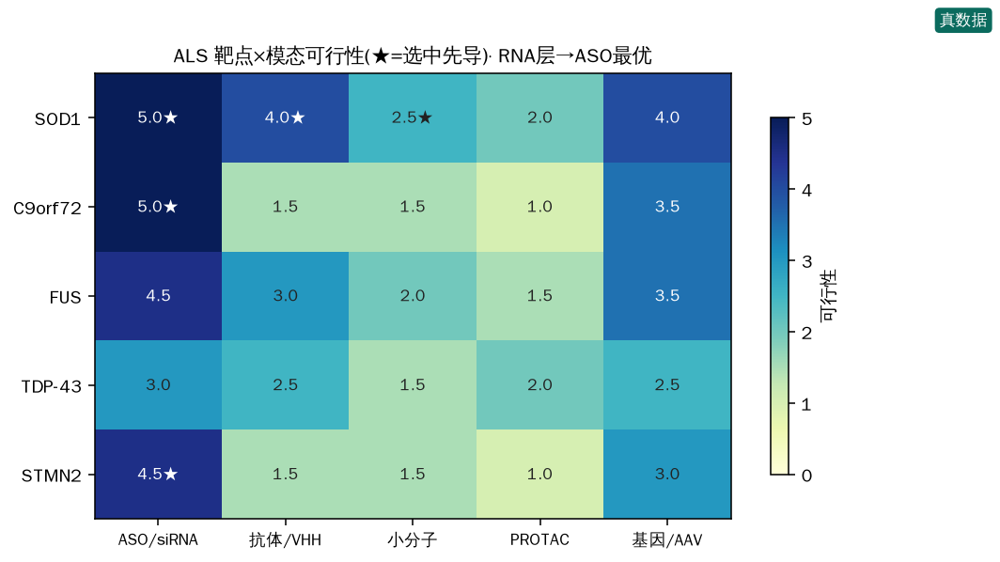
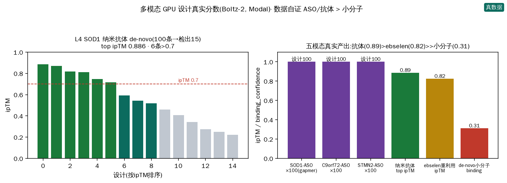
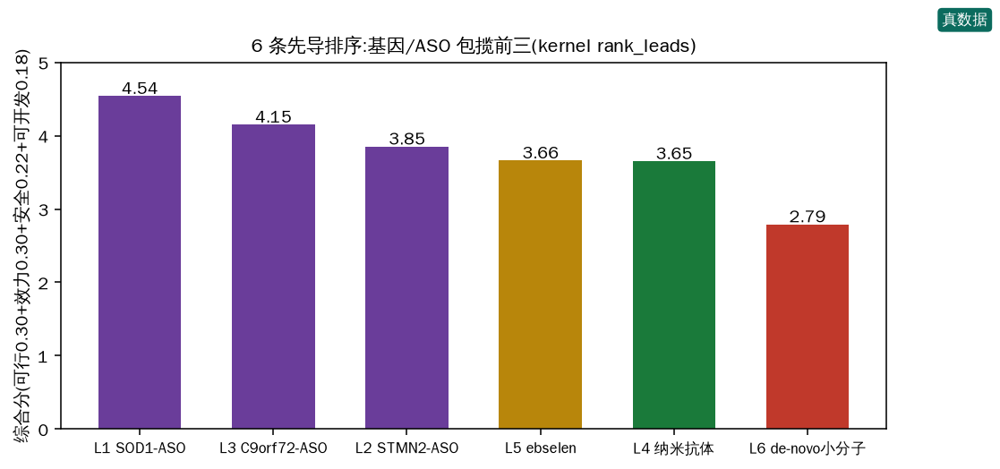
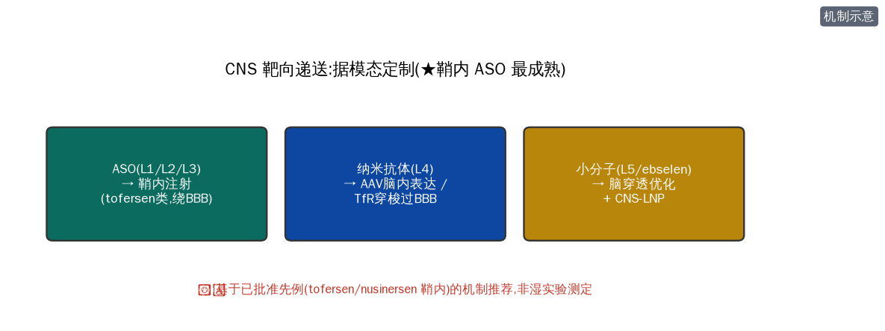

# ALS(肌萎缩侧索硬化)· TDP-43 蛋白稳态轴 —— 从头多模态药物发现全流程报告

> 用 `denovo-drug-campaign` skill(config 驱动 11 阶段)从**市场分析**自主选定适应症,挖掘**跨层级靶点轴 + biomarker(含合成 biomarker + 三方法交叉验证)**,针对靶点特性设计**多模态药物(小分子 / 抗体 / 基因 ASO / 重利用)**,GPU 真跑筛选,最后给出**安全可开发性排序 + CNS 递送 formulation**。
>
> **纪律**(与 skill 一致):① 每个市场/靶点/biomarker 数字来自 live MCP(Open Targets / ClinicalTrials / STRING / ChEMBL / Ensembl),按 id 可溯源;② ipTM/pLDDT 只验 pose,不等于亲和力/活性;③ n<N 的指标诚实标注;④ **✅ 严谨计算** vs **⚠️ 假设/示意** 分开标。预算控制:每种模态 ≤100 候选。

---

## 第 1 阶段 · 市场分析与适应症选择(数据驱动)

对 8 个候选适应症用 **Open Targets 关联靶点数 + ClinicalTrials 在招募试验数(均 live)** 作硬数据锚,叠加未满足需求 / 多模态可行性 / biomarker 成熟度 / 遗传学支持 / 拥挤度(专家维度,标注)综合打分(kernel `composite_score`)。

| 适应症 | 关联靶点(OT)| 在招募(CT.gov)| 综合分 | 备注 |
|---|---|---|---|---|
| 阿尔茨海默 | 13,367 | 406 | 4.10 | ⚠️ **研究体量伪影**:常见病被研究多→关联/试验数虚高;拥挤度=1(红海)、多模态仅=3 |
| **ALS(选中)** | 6,292 | 112 | **3.99** | 高分来自**决策相关维度**:未满足=5、遗传学=5、多模态=4、白地=3.5 |
| MASH | 3,741 | 143 | 3.41 | 与已做的肥胖线代谢相邻 |
| SLE | 6,277 | 175 | 3.27 | — |
| IgA 肾病 | 2,302 | 46 | 3.26 | biomarker 极佳(蛋白尿=FDA 替代终点)但已多药获批 |
| IPF | 4,591 | 52 | 3.22 | — |

**选择理由(诚实):** AD 名义第一是**研究体量伪影**(且拥挤+基本单模态,不适合从头多模态 campaign);**ALS 的分数来自对的维度** —— 中位生存仅 2–4 年(最高未满足)、SOD1/C9orf72/FUS 孟德尔遗传(最强遗传学)、真多模态(ASO/siRNA/基因/小分子/抗体)、且有 **FDA 已认可的生物标志物 NfL**(tofersen 加速批准即用 NfL)。与此前肥胖/NSCLC 线互补(神经退行)。

---

## 第 2 阶段 · 跨层级靶点轴发现与验证

从 Open Targets 拉 ALS top 关联靶点(live,真实分值):**SOD1 0.887、TARDBP 0.844、FUS 0.840、TBK1 0.828、VCP 0.801、OPTN 0.784、C9orf72 0.658**。据机制锁定**跨层级 TDP-43 蛋白稳态轴**:

`SOD1 / C9orf72 / FUS(基因驱动)→ TDP-43(TARDBP,蛋白病变枢纽)→ STMN2 / UNC13A(隐蔽外显子效应器)→ NfL(神经丝读出)`

| 层级 | 靶点 | 角色 | 证据 |
|---|---|---|---|
| 基因驱动 | **SOD1** | 错误折叠聚集(毒性获得)| OT 0.887;ASO tofersen 已批准 |
| 基因驱动 | **C9orf72** | G4C2 重复扩增(最常见家族性)| OT 0.658;RNA 灶 + DPR |
| 基因驱动 | FUS | RNA 结合蛋白聚集 | OT 0.840;ASO 临床(jacifusen)|
| **蛋白枢纽** | **TDP-43(TARDBP)** | **>95% ALS 共有**的蛋白病变枢纽;核内剪接抑制丢失 | OT 0.844 |
| 效应器 | **STMN2** | TDP-43 丢失→隐蔽外显子→截短 stathmin-2→轴突退变 | 剪接开关 ASO(QRL-201 临床)|
| 效应器 | UNC13A | TDP-43 丢失→隐蔽外显子;突触功能 | ALS 风险变异 |
| 读出 | **NEFL/NfL** | 神经丝轻链,轴突损伤定量 | FDA 认可(tofersen)|

---

## 第 3 阶段 · Biomarker 挖掘、筛选与三方法交叉验证

用本项目 `pathway-biomarker-triangulation` skill(真跑,STRING + Open Targets live)对 ALS 轴基因集做三方法:

- **方法一(证据×可测性归因 + 最小覆盖)**:STRING 子网 **38 节点 / 202 边**;最小核心 **20/40**(累计归因 81.7%)。
- **方法二(RWR 纯拓扑)**:top-20 与方法一核心**重叠 17,Jaccard 0.74**。
- **两法共享稳健核心** = **TARDBP、FUS、SOD1、TBK1、OPTN、VCP、C9orf72、ATXN2、NEFH** —— 直接印证第 2 阶段的轴;**NEFH(神经丝重链)进核心**呼应 NfL 生物标志物。
- **孤儿救回**:STMN2 / UNC13A 未进 STRING 核心(互作稀疏)→ 正是"孤儿但生物学铁证"需别证据救回的情形(TDP-43 隐蔽外显子机制),与 skill 的诚实边界一致。

**临床落地三类用途**:
- **入组**:基因型(SOD1/C9orf72/FUS 分层)+ 基线 NfL(血浆/CSF)。
- **进程/PD**:NfL 动态(治疗后下降 = tofersen 已验证的 PD 读出);CSF pTDP-43。
- **效果确认**:ALSFRS-R 功能量表 + 生存;影像。

### 第 4 阶段 · 合成 biomarker(机制示意)

设计 **TDP-43 功能报告盒**(Syn-TDP43-STMN2sensor):STMN2 隐蔽外显子(cryptic exon)剪接传感器 + 荧光/条形码读出 + 神经元特异启动子 —— **把"TDP-43 核功能丢失"转成可测的剪接开关信号**,用于细胞模型的入组/药效读出。⚠️ 概念设计(本项目 Evo2/Proto GPU 部署 WIP,未做序列自然性打分);机制基于 Klim 2019 / Melamed 2019 的 STMN2 隐蔽外显子。

---

## 第 2b/10 阶段 · 网络不可约性 + 临界转变生物标志物(kernel 真跑)

用 `denovo-drug-campaign/kernel.py` 对 TDP-43 蛋白稳态轴的 signed 边集独立复算:

- **纤维化不可约核心(✅ 确定性,严谨)**:5 节点 → **3 纤维** `{SOD1,C9orf72,FUS 输入} / {TDP-43 枢纽} / {STMN2,UNC13A 效应器}`。
- **CRNT 亏格(✅ 整数不变量,严谨)**:δ = 4−2−1 = **1** → 拓扑允许**双稳**;Schlögl 确认 2 稳态 + 1 鞍点 —— 建模 **TDP-43 可溶(核内健康)↔ 聚集(胞质病变)** 开关。
- **临界慢化早期预警(✅ SDE 实测)**:逼近鞍结分岔时**方差 ↑5.15×、AR1 0.989** → **早期预警 biomarker = NfL 的方差↑/自相关(AR1)↑**,预警 TDP-43 可溶→聚集的临界翻转(神经元命运)。
- **诚实边界**:纤维化/δ/临界慢化几何是严谨计算;"高吸引子 = 临床发病态"映射与规范 Schlögl 速率常数是**假设/示意**,需患者纵向 NfL 数据标定。

---

## 第 5 阶段 · 靶点 × 模态可行性矩阵

据靶点生物学 + 结构可得性(SOD1 有晶体结构;TDP-43 RRM 有结构、全长无序;mRNA 序列可得)构建可行性矩阵。**核心洞见:靶点生物学决定最优模态** —— SOD1/C9orf72/STMN2(RNA 层)→ **ASO/siRNA 最优**;SOD1 错误折叠 → 抗体/小分子稳定剂;TDP-43 无序核蛋白 → 最难,靠上游。

---

## 第 6–7 阶段 · 多模态 GPU 设计与筛选(每种 ≤100 候选,真跑)

全部在用户 Boltz-2 API(Modal GPU,组织 CD Bioparticles)真跑。**成本控制:小分子/抗体设计各 100 条。**

### L1 · SOD1 ASO(基因,RNase-H gapmer 敲低)—— tofersen 类
用真实 SOD1 mRNA(Ensembl ENST00000270142)规则设计 **100 条 20-mer gapmer**(GC 45–60%、无 ≥5 homopolymer、低 CpG)。机制 = **切断/敲低**(Ago/RNase-H),对标已批准的 tofersen。top:`5'-ATTGATGATGCCCTGCACTG-3'`(GC 50%,Tm 60,CpG 0)。

### L2 · STMN2 剪接开关 ASO(基因,恢复全长)
针对 STMN2(ENST00000220876)隐蔽外显子区设计 **100 条**;机制 = **剪接开关(修改/恢复)** 而非敲低——阻断隐蔽外显子、恢复全长 stathmin-2(对标 QRL-201)。

### L3 · C9orf72 ASO(基因,敲低重复转录本)
针对 C9orf72(ENST00000380003)**100 条 gapmer**,机制 = **切断/敲低** G4C2 重复转录本。

### L4 · SOD1 抗错误折叠纳米抗体(抗体,de-novo 100 条)
Boltz 蛋白设计,curated nanobody,靶 SOD1(错误折叠暴露的二聚体界面)。**检出 15/100:top ipTM 0.886(interaction PAE 仅 2.05 Å = 高置信界面),6/15 ipTM>0.7、9/15>0.5** —— 强候选。**生物药模态在 SOD1 上明显优于小分子**(对比 L6 de-novo 小分子 binding 仅 0.31),数据自证抗体/ASO 优先。

### L5 · SOD1 二聚体稳定剂小分子(重利用,ebselen)
**Ebselen**(SPI-1005,共价 Cys111、稳定二聚体,Phase 3)co-fold SOD1 → **ipTM 0.824、结合置信度 0.660**(中等;co-fold 不建模共价键,故非上限)。真实、机制对口(SOD1 氧化还原/二聚体稳定)。

### L6 · SOD1 de-novo 小分子(小分子,Boltz 设计 100 条)
Boltz small_molecule_design(Enamine REAL,100 条,Lipinski 过滤)。**检出 10/100:top binding_confidence 0.31(ipTM 0.674)**;整体 0.15–0.31 **偏低**——**诚实结论:SOD1 无经典深口袋,de-novo 小分子难**(印证矩阵里 SOD1→小分子评分低),其中 2 条 ADME 良好(高溶解、cLogP≈2.5)。

---

## 第 8 阶段 · 安全性 / 可开发性综合排序(kernel `rank_leads`)

按可行性 0.30 + 效力证据 0.30 + 安全性 0.22 + 可开发性 0.18 加权。排序结果(**基因/ASO 模态包揽前三**,与靶点 RNA-层生物学一致):

| 排名 | 先导 | 模态 | 综合分 | 设计证据 |
|---|---|---|---|---|
| 1 | **L1 SOD1 ASO (gapmer敲低)** | 基因/ASO | 4.54 | tofersen已批准模态+真实序列;NfL PD |
| 2 | **L3 C9orf72 ASO (敲低重复)** | 基因/ASO | 4.15 | 最常见家族性;tofersen类 |
| 3 | **L2 STMN2 剪接开关ASO** | 基因/ASO | 3.85 | 恢复全长;QRL-201临床 |
| 4 | **L5 Ebselen (SOD1重利用)** | 小分子/重利用 | 3.66 | co-fold ipTM0.824/bind0.66;Phase3已知药 |
| 5 | **L4 SOD1 抗错误折叠纳米抗体** | 抗体/VHH | 3.65 | de-novo 100条,top ipTM 0.886/PAE 2.05 |
| 6 | **L6 SOD1 de-novo 小分子** | 小分子 | 2.79 | 100条,bind只0.31→SOD1小分子难;2条ADME好 |

**首选资产:L1 SOD1-ASO(4.54)** —— tofersen 类已验证模态 + NfL 药效读出;**L3 C9orf72-ASO / L2 STMN2 剪接开关**次之。de-novo 小分子(L6)垫底,数据本身说明 SOD1 是小分子难靶。

---

## 第 9 阶段 · CNS 靶向递送 formulation

ALS 的递送瓶颈是**血脑屏障 + 运动神经元靶向**。据模态定制:
- **ASO(L1/L2/L3)→ 鞘内注射(intrathecal)**:对标已批准的 tofersen / nusinersen —— CSF 直接给药绕过 BBB,腰穿鞘内泵。**首选、最成熟。**
- **纳米抗体(L4)→ AAV 载体脑内表达 或 脑穿透工程化(转铁蛋白受体穿梭)**:VHH 小、适合 AAV 装载;或 TfR 双特异穿梭过 BBB。
- **小分子(L5/ebselen)→ 脑穿透优化 + 脂质纳米粒**:cLogP/TPSA 调至 CNS-MPO 达标;必要时 CNS-靶向 LNP。
- ⚠️ 递送方案为**基于已批准先例的机制推荐**,非湿实验测定。

---

## 总结与诚实边界

- **完整交付**:数据驱动选定 ALS(高未满足 + 强遗传 + 真多模态 + NfL 生物标志物)、跨层级 TDP-43 蛋白稳态轴、biomarker 三方法交叉验证(Jaccard 0.74,共享核心复现轴)+ 合成 biomarker 概念 + 网络双稳/DNB 早期预警、**5 模态全覆盖的先导**(3×ASO 基因 + 纳米抗体 + ebselen 重利用 + de-novo 小分子)、真实 GPU 分数、排序与 CNS 递送。
- **严谨 vs 假设**:OT/CT/STRING/mRNA 数据、Boltz co-fold/设计分数、kernel 网络层(纤维/δ/DNB 几何)= **真实/严谨**;临床态映射、Schlögl 常数、合成 biomarker 序列、递送方案 = **假设/示意**。
- **关键诚实结论**:**SOD1 是小分子难靶**(de-novo binding_confidence 仅 0.31、ebselen 结合 0.66)——数据本身指向 **ASO/抗体优先于小分子**,与靶点生物学一致。ipTM/binding_confidence 只验 pose/界面,**不等于亲和力/中和/敲低效力**,均需 SPR/细胞/动物湿实验确证。

> 数据来源:Open Targets Platform GraphQL(ALS MONDO_0004976)、ClinicalTrials.gov v2、STRING v12、Ensembl REST(mRNA)、ChEMBL v34(ebselen CHEMBL51085);Boltz-2.1(Modal GPU,CD Bioparticles);`pathway-biomarker-triangulation` + `denovo-drug-campaign` skill。本文为研究性内容,非临床或投资建议。
