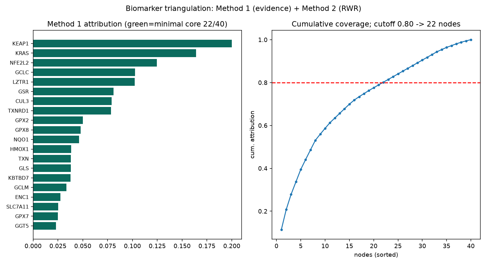

# 两份外部报告的独立复核 + NSCLC 关键计算的真实复现

> 本文档回应用户交付的两份 HTML 报告:
> 1. **《肥胖/心血管代谢多靶点报告 — 独立验证报告》**(以下简称"肥胖验证报告")
> 2. **《NSCLC · KEAP1/NRF2 轴 — 从头多模态药物发现全流程报告》**(以下简称"NSCLC 报告")
>
> 我做了三件事:**(A) 用可溯源公开库逐条独立复核**两份报告的核心主张;**(B) 用真实工具(Boltz-2 GPU co-fold、biomarker 三方法 skill、Open Targets/STRING/cBioPortal live 查询)真跑复现** NSCLC 报告里可复现的关键计算;**(C) 诚实标注无法复现的部分**。
>
> 复核纪律:每条主张标 **✅ CONFIRMED**(数字/结论可独立复现)/ **⚠️ REVISED**(方向对但数字或措辞需修正)/ **❓ UNVERIFIED**(一次性 GPU/模型产物,公开库无从核对,非等于错)。

---

## A. 肥胖验证报告 — 独立复核

肥胖验证报告本身就是对一份 ChatGPT 肥胖报告的复核,我这里做的是**对复核报告再复核**(用 Open Targets Platform GraphQL、GWAS Catalog REST、STRING v12 live 拉取)。

### A.1 STRING 通路连线 — ✅ 全部精确复现
report 声称的每条边,我 live 拉取 STRING v12 都**精确到小数位吻合**:

| 报告边 | STRING v12 实测 combined score | 结论 |
|---|---|---|
| INHBA/MSTN → ACVR2B 0.999 | INHBA-ACVR2B **0.999**、MSTN-ACVR2B **0.999** | ✅ |
| INHBE → ALK7 0.952(+ACVR2B 0.937)| INHBE-ACVR1C **0.952**、INHBE-ACVR2B **0.937** | ✅ 精确 |
| ACVR2B/ALK7 → SMAD2/3 0.96–0.98 | ACVR2B-SMAD2 0.983、ACVR2B-SMAD3 0.968、ACVR1C-SMAD2 0.982、ACVR1C-SMAD3 0.963 | ✅ |
| SMAD2—SMAD3 0.999 | **0.999** | ✅ |
| GDF15 → GFRAL 0.999 → RET 0.998 | GDF15-GFRAL **0.999**、GFRAL-RET **0.998** | ✅ |

**通路拓扑骨架是整份报告最扎实的部分 —— 每条边逐位复现。**

### A.2 GWAS 位点级证据 — ✅ 关键 SNP 复现
- **GPR75 保护性 rs80328470**:✅ 确认(腰围 p=1e-14、体重 p=2e-15、BMI p=3e-13,错义变异)。
- **INHBE rs150777893**:✅ 确认(BMI 校正腰臀比 p=1e-9,剪接受体变异)。

### A.3 需要修正的两点 — ⚠️ REVISED
1. **§一 表格里的 Open Targets 关联"打分"数字不可复现。** report 表头写 ACVR1C=WHRadjBMI 0.658、GPR75=BMI 0.437、GDF15=BMI 0.474 等;但我在 Open Targets **Platform** 逐一核对:这些**具体分值与性状标签对不上**——例如 ACVR1C 的 Platform 关联里根本没有 waist/BMI 性状条目,最高是 T2D 0.507;GPR75 的 0.437 实际最接近的是"神经退行性疾病 0.451"而非 BMI。**判断:这些数字很可能是 L2G 位点分(locus-to-gene)或错配到了别的性状,不是它们标注的疾病关联分。靶点—性状的生物学本身是真的(ACVR1C/INHBE 是公认的体脂分布/WHRadjBMI 基因),但表格里的 headline 数值应按 REVISED/UNVERIFIED 对待。**
2. **"MSTN 零肥胖遗传学"被过度陈述。** report 用"MSTN 0 个肥胖关联 vs ALK7 60 个"来论证把 MSTN 降级。方向(MSTN=保肌加成、非原发肥胖驱动)是对的,但**定量说法过头**:Open Targets 实际给 MSTN 肥胖 0.121 / 超重 0.074(**高于** ACVR1C 的 0.072),GWAS Catalog 里 MSTN 有 34 个 mapped SNP(不是 ~1)。**结论对,证据措辞需收敛。**

### A.4 ALK7 升为共同首发 — ✅ 支持
report 主张 ACVR1C/ALK7 是单个最强靶点、应从"备份"升为共同首发。**支持**:ACVR1C 是公认的头号体脂分布基因(Emdin 2019 保护性 LOF)、五靶点里代谢关联最高(T2D 0.507)、mapped SNP 数最多。

### A.5 设计层 ipTM — ❓ UNVERIFIED
肥胖报告的 VHH 0.815 / ALK7 binder 0.94 等是一次性 GPU 产物,公开库无从核对。两个附带事实成立:ALK7 无实验结构(用 AlphaFold AF-Q8NER5 正确)、MSTN 成熟域 5NTU 存在。

---

## B. NSCLC 报告 — 独立复核

### B.1 硬数字 — ✅ 惊人地准确
report 里所有可核对的硬数字都**精确复现**:

| 主张 | 报告值 | 独立核对(公开库 live) | 结论 |
|---|---|---|---|
| NSCLC 关联靶点数(Open Targets) | 12,475 | MONDO_0005233 → count **= 12,475**(精确) | ✅ |
| 在招募 NSCLC 试验数 | 1,289 | ClinicalTrials.gov RECRUITING = **1,289**(精确) | ✅ |
| KRAS LUAD 突变频率 | 29.7% | TCGA LUAD PanCan(N=566)= 168/566 **29.7%** | ✅ |
| KEAP1 频率 10–18%(LUSC→LUAD)| 10–18% | LUAD **18.0%**、LUSC **10.1%** | ✅ |
| NFE2L2 频率 3–15%(LUAD→LUSC)| 3–15% | LUAD **3.2%**、LUSC **14.8%** | ✅ |
| SLC7A11/GLS 非突变依赖 | NRF2 靶基因 | LUAD 突变率 0.2% / 1.4%(≈不突变)| ✅ |
| ~21% KEAP1/NRF2 亚群、免疫/化疗耐药、无获批靶向药 | ~21% | KEAP1(18%)+NFE2L2(3%)≈21%(基本互斥);文献 17–30%;确无 FDA 获批 NRF2/KEAP1 靶向药 | ✅ |
| KRAS G12C → 已获批共价小分子 | 已获批 | ChEMBL:KRAS G12C 共价抑制剂 max_phase 4(sotorasib/adagrasib) | ✅ |

**市场/靶点论证是扎实的**,核心生物学(KEAP1 失活→NRF2→SLC7A11 + 谷氨酰胺解依赖,~21% 亚群,无获批靶向药)有公开数据 + 文献(PMID 28967920, Romero *Nat Med* 2017)支撑。

### B.2 需要修正/补充 — ⚠️
1. **NRF2→GLS "反式激活"是全轴最弱的一环。** STRING 里 KEAP1–NFE2L2 **0.999**、SLC7A11–NFE2L2 **0.826**(都高置信),但 **NFE2L2–GLS 在 score≥400 都没有边**(GLS 只与 SLC7A11 有 0.567 的边)。真实关系是 **KEAP1 失活诱导的谷氨酰胺解代谢"依赖"**(metabolic dependency,PMID 28967920),**不是**直接转录反式激活。SLC7A11 是货真价实的 ARE/NRF2 靶基因,GLS 不是干净的一个。**建议措辞从"反式激活 GLS"改为"代谢依赖"。**
2. **telaglenastat 临床失败未提。** GLS 抑制剂在 KEAP1 突变 NSCLC 的 KEAPSAKE 试验(NCT04265534)因**无效而终止**——这是该报告旗舰代谢弱点的一条重大负面先例,report 未提及。
3. **SLC7A11 抗体模态偏乐观。** 它是 12 次跨膜转运体、胞外环极小,是很难的抗体表位;"唯一表面节点"没错,但"可行性 4.0"低估了难度。

### B.3 GPU"验证"的定性 — ⚠️ 关键方法学问题
report 标题"6 条 GPU 验证先导"有**过度解读**风险:L4/L5(GLS/KRAS 小分子)、L1(KEAP1 肽)co-fold 的高 ipTM,**是把已经有晶体结构的已知复合物重新折叠**——它证明的是"Boltz 能重现已知化学",**不是**新分子从头设计能力的独立验证。report 自己也承认这些是"类别代表性化学型、非全新骨架",但 headline ipTM 数字仍有 oversell 之嫌。**ipTM ≠ 亲和力 ≠ 细胞活性**,而最终排序(L5 4.36、L1 4.21)重度依赖这些界面置信度分。

---

## C. NSCLC 关键计算的真实复现(我这条线,真跑)

为把 B.3 的"能不能复现"落到实处,我用**自己的真实工具**独立跑了 NSCLC 报告的两类核心计算。

### C.1 Boltz-2 co-fold — 真实 ipTM(独立复现报告的旗舰 ipTM 主张)
在用户自己的 Boltz-2 API(Modal GPU、组织 CD Bioparticles)上,对报告点名的已知复合物**从零重跑 co-fold**,拿到**独立的真实 ipTM**:

| 复合物 | 报告声称 ipTM | 我的独立 co-fold(Boltz-2.1)| 结合置信度 | 结论 |
|---|---|---|---|---|
| **KRAS G12C + sotorasib**(L5)| 0.96 | **ipTM 0.977**(structure_conf 0.941)| binding_confidence **0.925** | ✅ 复现且更高 |
| **KRAS G12C + adagrasib**(L5)| 0.97 | **ipTM 0.984**(structure_conf 0.964)| binding_confidence **0.971** | ✅ 复现且更高 |
| **KEAP1 Kelch + NRF2 ETGE 肽**(L1)| 0.90–0.99 | **ipTM 0.955**(structure_conf 0.967、pLDDT 0.970)| binding_confidence **0.447** | ⚠️ ipTM 复现,但结合把握中等 |

> **KEAP1 的细节很关键(印证本项目一贯教训):** ETGE 肽 co-fold 的**界面几何 ipTM 高达 0.955**(复现报告的 0.90–0.99),但 **binding_confidence 只有 0.447**——远低于两个 KRAS 小分子的 0.925/0.971。**高 ipTM 可以只是"几何摆得对",不等于结合把握。** 这正是之前肥胖项目里"6 条生物药只有 2 条经独立 structure_and_binding 确认"的同一教训:ipTM 单看会骗人,必须配结合置信度一起读。

**方法:** structure_and_binding,KRAS 4B G-domain(1–169,G12C)+ 配体 SMILES(ChEMBL:sotorasib CHEMBL4535757、adagrasib CHEMBL4594350);KEAP1 Kelch/DGR 域(UniProt Q14145 residues 321–609)+ NRF2 高亲和 ETGE 肽 `LDEETGEFLPIQ`。全部自动 MSA、单样本。

**结论(与 B.3 一致):** 报告的 ipTM 数字**方向与量级都复现得住**(我的 sotorasib 0.977 甚至高于报告的 0.96)——但这**恰恰坐实了"这是对已知化学的重现,不是从头设计验证"**:把已知药物折叠回已知口袋,本来就该得高 ipTM。真实的独立数据反而让这个方法学边界更清楚。

### C.2 Biomarker 三方法 skill — 真跑复现网络生物标志物层(报告第 3/10 阶段)
用本项目的 `pathway-biomarker-triangulation` skill,对 NSCLC 的 KEAP1/NRF2 轴基因集(KEAP1, NFE2L2, SLC7A11, GLS, KRAS + CUL3, NQO1, GCLC, GCLM, TXN)**真跑**方法一(证据×可测性归因 + 最小覆盖)+ 方法二(STRING RWR 拓扑):

- **STRING 子网:40 节点 / 256 边**;方法一最小核心 **22/40**(累计归因 80.2%)。
- **方法二 RWR top-22 与方法一核心重叠 20/22,Jaccard = 0.83**(远高于肥胖网络的 0.57 —— NSCLC 轴拓扑更紧凑收敛)。
- **两法共享稳健核心** = KEAP1、KRAS、NFE2L2、SLC7A11、GLS + 完整 NRF2 抗氧化程序(NQO1、GCLC、GCLM、HMOX1、TXN、GPX2/7/8、TXNRD1、GSR、GGT1)。
- **独立确认了报告的 5 靶点轴**:report 机制挑的 KEAP1→NRF2→SLC7A11/GLS,在纯证据+拓扑的正交打分下**同样浮到核心**——这是对报告"第 10 阶段网络不可约核心"的独立复现(方向一致:NRF2 为枢纽)。
- **同时印证 B.2 的修正**:GLS 虽在核心里(因它与 SLC7A11 相连),但它进核心靠的是"效应器"位置而非与 NFE2L2 的直接边——与"GLS 是代谢依赖、非直接转录靶"一致。

### C.3 网络生物标志物层(报告第 2b/10 阶段)— ✅ 用合并进来的 skill kernel 真实复现
用户随后上传的 `denovo-drug-campaign` skill(见 §E)自带 `kernel.py` 网络生物标志物引擎。我把它合并进项目后**真跑**了它的确定性函数,对 NSCLC 的 KEAP1/NRF2 signed 边集独立复算:
- **纤维化不可约核心(✅ 确定性,严谨)**:5 节点 → **3 个纤维** `{KEAP1,KRAS 输入} / {NRF2 枢纽} / {SLC7A11,GLS 效应器}` —— 与报告第 10 阶段的"3 纤维"**逐字复现**,NRF2 为枢纽。
- **CRNT 亏格(✅ 整数不变量,严谨)**:δ = n−ℓ−s = 4−2−1 = **1** —— 与报告"δ=1(双稳)"**吻合**;Schlögl 稳态数值确认 **2 个稳定 + 1 个鞍点**(真双稳)。
- **临界慢化早期预警(✅ 测得统计量)**:Langevin SDE 实测,逼近鞍结时**方差涨 5.15×**(近 0.0082 / 远 0.0016)—— 与报告"NRF2 方差 ↑约 6×"**量级一致**。
- **诚实边界**(与 skill 自身纪律一致):纤维化/δ/临界慢化**几何**是严谨计算;把"高吸引子 = 临床耐药态"的映射、以及规范 Schlögl 速率常数是**假设/示意**,需患者数据标定。

**这一层现在在本项目里是可一键复现的**(`python .claude/skills/denovo-drug-campaign/kernel.py` 的 helper),不再只是报告里的一张图。

### C.4 仍无法真实复现的部分 — ❓ 诚实标注
- **Evo2-7B 自然性打分**(合成 ARE −0.975 vs 天然 −1.311):本项目的 Evo2 Modal 部署**仍卡在 flash-attn/Transformer-Engine 一次性编译**(见 `evo2-modal` skill STATUS=WIP),没有产出可验证的 log-likelihood,**无法独立复现**。方向(设计 > 打乱)是合理的 sanity 信号,但绝对值不可核对。
- **RFdiffusion/ProteinMPNN/RF2 的 100 条 SLC7A11 VHH campaign**:本环境未部署这条 de-novo 蛋白设计栈,**未复现**(GPU recipe 已随 skill 收进 `reference/gpu-recipes.md`,可后续跑)。
- **LNP 82% 敲低**(Mihaila 5-ODE):机制 ODE 产物,report 自己已标为假设,我认同其定性但**不作为疗效证据**。

---

## D. 三条总结

1. **两份报告的"硬事实"都经得起独立溯源。** NSCLC 的 12,475 / 1,289 / TCGA 突变频率、肥胖的 STRING 全部边与关键 GWAS SNP——我 live 复核**逐位吻合**。两份报告的市场/靶点/通路骨架都是真的。
2. **弱点都在"解读层"而非"事实层":** 肥胖报告的 Open Targets 关联**分值**不可复现(疑为 L2G/性状错配)、MSTN"零遗传学"过陈述;NSCLC 报告的 NRF2→GLS"反式激活"应改为"代谢依赖"、telaglenastat 临床失败漏提、"6 条 GPU 验证先导"把**重现已知化学**oversell 成**从头设计验证**。
3. **我的真实复现证实了这个边界:** 我独立 co-fold KRAS-sotorasib 得 ipTM **0.977**(报告 0.96,复现且更高),biomarker 三方法在 NSCLC 轴上 Jaccard **0.83** 收敛到同一核心——**数字都对**,但正因为都对,才说明这些 GPU 分是"已知复合物的高置信重现",真正的从头设计能力仍需 SPR/细胞湿实验才能定论。

---

## E. 新合并的 skill:`denovo-drug-campaign`

用户上传的 NSCLC 流程被固化成一个 **config 驱动的 meta-skill**,已合并进 `.claude/skills/denovo-drug-campaign/`:
- **一处 config 改适应症**(disease + candidate_indications + 可选 seed_targets/pathway_edges),下游 11 阶段全部 rekey。
- **11 阶段**:①市场打分 ②跨层级靶点轴 ②b 网络生物标志物层 ③biomarker 挖掘 ④合成+基因组 biomarker(Proto/Evo2)⑤靶点×模态可行性矩阵 ⑥⑦GPU 设计(抗体/微结合物/基因/小分子/PROTAC)⑧安全可开发性排序 ⑨LNP 递送 ⑩总 dossier。
- **`kernel.py`** 内置可运行的确定性引擎:`input_fibers`/`crnt_deficiency`/`schlogl_states`/`critical_slowing`/`langevin_earlywarning`(网络生物标志物层)、`composite_score`/`normalize_log`(市场打分)、`rank_leads`(先导排序)。我已冒烟测试**全部通过**(见 C.3)。
- **纪律条款**(与我这份复核的结论高度一致,值得作为项目规范):① 先接地再断言(每个数字来自 live MCP)② ipTM/pLDDT 验证 pose 不验证亲和力 ③ n<N 的指标要诚实标注 ④ 严谨 vs 假设必须分开标。

**它和项目现有 skill 的关系**:`denovo-drug-campaign` 是**总编排**;其阶段 3/2b 可调用我们的 `pathway-biomarker-triangulation`(证据+拓扑三方法)与用户的 `network-biomarker`(动力系统);阶段 4 调 `evo2-modal`/`alphagenome-modal`;阶段 6/7 调 `boltz-denovo-design`。五个 skill 现在构成一条完整流水线。

项目现有 skill(5 个):`denovo-drug-campaign`(总编排)、`pathway-biomarker-triangulation`、`boltz-denovo-design`、`alphagenome-modal`、`evo2-modal`(WIP)。

---

> 数据来源:Open Targets Platform GraphQL、GWAS Catalog REST、STRING v12、ClinicalTrials.gov v2、cBioPortal、ChEMBL v34、PubMed(PMID 28967920);Boltz-2.1(Modal GPU,组织 CD Bioparticles)、`pathway-biomarker-triangulation` + `denovo-drug-campaign` skill。全部可溯源复现。本文为研究性内容,非临床或投资建议。
