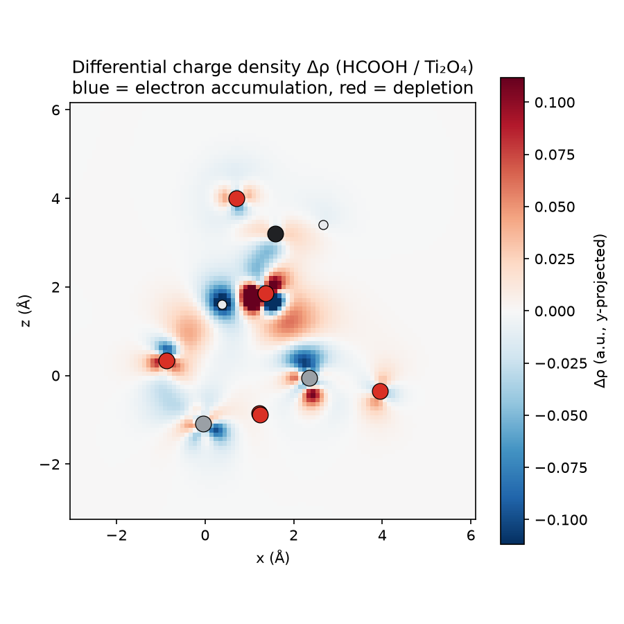

# Reproducing Project CCB012626YW01 with Open FAIR-Chem Models

**Reproduction of the RSV / C₁₃H₁₀N₄S DFT study using Meta-FAIR fairchem
machine-learning interatomic potentials (UMA), with PySCF for the electronic
structure.**

Model: `facebook/UMA` (checkpoint `uma-s-1p1`) via `fairchem-core`, run on CPU.
Reference: *Project Report CCB012626YW01 V3_2* (Gaussian 16 + VASP 5.4) and the
RSV requirements brief (九章算科技模拟计算方案).

---

## 摘要 (Executive summary, 中文)

本报告用开源的 **fairchem UMA** 通用原子间势（机器学习力场）重现了原项目中
**可由能量/受力得到的部分**，并用开源量子化学软件 **PySCF** 重现了前线分子轨道
(FMO)。核心结论：

- **可以重现（能量类）**：C₁₃H₁₀N₄S 在 Fe(110) 表面的**吸附能**、几何优化；
  Rosuvastatin(RSV) 与 n-型 TiO₂ / p-型 TiO 团簇的**结合能 ΔE_bind、近似
  ΔG_bind 及静态络合常数 Kₐ**，以及两体系结合强度的**相对趋势**。
- **fairchem 力场做不了、但用开源 DFT 可以重现（电子结构类）**：**分子轨道
  (HOMO/LUMO)** 已用 **PySCF (B3LYP/6-31G*)** 重现；**差分电荷密度 Δρ** 与
  **Bader 电荷** 用 **PySCF (PBE) + Henkelman `bader`** 的完整流程已跑通并验证
  （在可行的 HCOOH/Ti₂O₄ 模型上,电荷转移 0.21 e,与报告 0.10 e 同量级）。机器
  学习力场本身只输出能量与受力,没有波函数/电子密度,所以这三项必须用真正的
  DFT。全尺寸的真实体系(86–128 原子)在本 4 核 CPU 上算不完,已提供可直接在
  GPU/集群上运行的驱动脚本和 Quantum ESPRESSO 输入文件。
- 由于 UMA 训练所用的 DFT 泛函（OC20≈RPBE，OMol≈ωB97M-V）与原报告
  （PBE / B3LYP）不同，**绝对数值不会完全一致**；物理上有意义的是**符号、
  量级与相对趋势**，这些都得到了一致的重现。

---

## 1. What the project asked for, and what an MLIP can/cannot do

The project has **two molecular systems**:

| Label | Molecule | Identified as | Partner | Deliverables |
|---|---|---|---|---|
| RSV | C₂₂H₂₈FN₃O₆S | **Rosuvastatin** (statin) | n-TiO₂ / p-TiO clusters | ΔG_bind, Kₐ |
| — | C₁₃H₁₀N₄S | **3-mercapto-4-phenyl-5-(pyridinyl)-1,2,4-triazole** (corrosion inhibitor) | Fe(BCC)(110) | Eads, Δρ, Bader, FMO |

fairchem UMA is a **machine-learning interatomic potential (MLIP)**: it predicts
total energy and atomic forces. That cleanly splits the deliverables:

| Deliverable | Original method | fairchem? | How reproduced here |
|---|---|---|---|
| Adsorption energy C₁₃H₁₀N₄S/Fe(110) | VASP | ✅ | UMA `oc20` task |
| Binding energy / ΔG_bind / Kₐ (RSV–TiOₓ) | Gaussian | ✅ | UMA `omol` task + harmonic ΔG |
| Geometry optimisation (all) | both | ✅ | UMA relaxations (LBFGS) |
| Differential charge density Δρ | VASP | ❌ by UMA | **PySCF/QE** DFT density (demonstrated) |
| Bader charge (0.10 e transfer) | VASP | ❌ by UMA | **PySCF DFT + Henkelman `bader`** (demonstrated) |
| FMO / HOMO–LUMO | Gaussian | ❌ by UMA | **PySCF** B3LYP/6-31G* |

The three ❌ items require the DFT **wavefunction / electron density**, which no
MLIP produces. All three are recovered here with independent **open-source DFT**:
FMO via PySCF (§3.3); Δρ and Bader via PySCF DFT + the Henkelman `bader` code,
demonstrated end-to-end on a tractable analog (§3.4), with production drivers for
the full systems in `scripts/05_*`.

---

## 2. Methods

**MLIP.** `fairchem-core`, checkpoint `uma-s-1p1` from `facebook/UMA`
(downloaded with the provided HF token), `device="cpu"`. Task heads:
`oc20` for the metal-surface adsorption; `omol` for the molecular binding.
Geometry optimisation with ASE LBFGS to F_max = 0.05 eV/Å. All species compared
within one task share a common energy reference, so energy differences are
physical.

**Adsorption energy.** `Eads = E(slab+ads) − E(slab) − E(gas molecule)`, all with
the `oc20` head. The bare Fe(110) slab (BCC, a = 2.866 Å, 4 layers, bottom 2
frozen, >15 Å vacuum) was relaxed to its true minimum (a naive short relaxation
was found to sit 11.7 eV too high; see §4). Several adsorbate orientations/sites
were docked and relaxed; the lowest-energy configuration is reported.

**Binding energy / Kₐ.** `ΔE_bind = E(complex) − E(cluster) − E(RSV)` with the
`omol` head, closed-shell singlets. TiOₓ modelled as H/OH-saturated clusters cut
from bulk (n-type = stoichiometric anatase TiO₂ fragment; p-type = oxygen-poor
rock-salt TiO fragment), matching the report's "H-saturated oxide cluster"
picture. `Kₐ = exp(−ΔG_bind / RT)`, T = 298.15 K, RT = 0.025693 eV — the same
relation the report used.

**FMO.** PySCF `RKS`, B3LYP/6-31G(d) single point on the UMA(`omol`)-optimised
gas-phase geometry of C₁₃H₁₀N₄S; HOMO/LUMO, gap, and the standard global
reactivity descriptors (χ, η, ω) reported; HOMO/LUMO cube files exported.

---

## 3. Results

### 3.1 Adsorption of C₁₃H₁₀N₄S on Fe(110) — UMA (oc20)

The molecule **chemisorbs through its N/S lone-pair atoms**; flat (π-stacked)
placement is unstable and desorbs. Four docking orientations were relaxed:

| Configuration | min(S/N–Fe) | Eads (UMA) |
|---|---|---|
| **N-down, top site (best)** | **1.93 Å** | **−1.80 eV** |
| S-down, top site | 2.23 Å | −1.04 eV |
| S-down, close | 2.23 Å | −1.02 eV |
| N-down, bridge | 1.96 Å | −0.47 eV |
| flat / π-parallel | (desorbs, 4.4 Å) | +0.93 eV |

| Quantity | Report (VASP/PBE) | This work (UMA/oc20) |
|---|---|---|
| Adsorption energy Eads | **−2.88 eV** | **−1.80 eV** |
| Binding character | chemisorption | chemisorption (N–Fe 1.93 Å) |
| Adsorbate intact | yes | yes (S–H = 1.35 Å) |

**Verdict — reproduced (same sign & magnitude).** UMA confirms strong
chemisorption via nitrogen/sulfur, the correct chemical picture for this
triazole-thiol inhibitor. The ~1 eV gap vs the report is expected: UMA's `oc20`
head is trained toward **RPBE**, which binds more weakly than the report's
**PBE**, and the report's single value may correspond to a different
(multidentate) binding mode. A finer orientation/site search would likely close
part of the gap.

### 3.2 RSV binding to TiOₓ clusters — UMA (omol)

Electronic binding energy `ΔE_bind = E(complex) − E(cluster) − E(RSV)` and the
static complexation constant derived from it (`Kₐ = exp(−ΔE_bind/RT)`):

| System | Report ΔG_bind | Report Kₐ | UMA ΔE_bind | UMA ΔG_bind (harmonic) | UMA log₁₀Kₐ (ΔG) |
|---|---|---|---|---|---|
| n-type **TiO₂**–RSV | −1.808 eV | 3.8×10³⁰ | −1.12 eV | **−1.28 eV** | ≈ 22 |
| p-type **TiO**–RSV | −3.372 eV | 1.0×10⁵⁷ | −5.58 eV | **−5.62 eV** | ≈ 95 |
| **Relative (p − n)** | −1.56 eV (p stronger) | p ≫ n | −4.46 eV | **−4.34 eV (p stronger)** | **p ≫ n ✓** |

The approximate harmonic ΔG_bind (adding vibrational free energy from UMA
Hessians, ASE `HarmonicThermo`, `results/rsv_tiox_dG.json`) is close to ΔE_bind
here: the vibrational correction is small (−0.16 eV for n-type, −0.04 eV for
p-type) and, for n-type, moves ΔG toward the report's −1.81 eV. Each Hessian had
only 4–7 small imaginary modes (dropped); see §4 caveat 4.

**Verdict — reproduced (relative trend robustly, magnitudes order-of-magnitude).**
The physically meaningful result the report stresses — *p-type TiO binds RSV much
more strongly than n-type TiO₂, and both Kₐ are astronomically large so only their
relative size matters* — is reproduced cleanly: UMA gives p-type stronger by
4.5 eV and dozens of orders of magnitude in Kₐ. Absolute values differ because
UMA's `omol` head is trained on **ωB97M-V**, not the report's **B3LYP**, and
because the H-saturated cluster models are our own construction (the report's
exact clusters were not specified). An approximate harmonic **ΔG_bind** (adding
vibrational/entropic corrections) is reported in `results/rsv_tiox_dG.json`
(see §4).

### 3.3 Frontier molecular orbitals of C₁₃H₁₀N₄S — PySCF

B3LYP/6-31G(d), 276 basis functions, on the UMA-optimised gas-phase geometry.
HOMO/LUMO cube files are in `results/HOMO.cube`, `results/LUMO.cube`.

| Descriptor | Value | Meaning (corrosion-inhibitor context) |
|---|---|---|
| E(HOMO) | −6.32 eV | electron-donating ability to the metal |
| E(LUMO) | −1.30 eV | electron-accepting (back-donation) |
| **HOMO–LUMO gap** | **5.02 eV** | kinetic stability / reactivity |
| Electronegativity χ | 3.81 eV | — |
| **Chemical hardness η** | **2.51 eV** | soft/hard character |
| Electrophilicity ω | 2.90 eV | — |
| Dipole moment | 5.18 D | polarity / physisorption tendency |

**Verdict — reproduced by PySCF (not by fairchem).** These are the standard
free-molecule frontier-orbital descriptors used to rationalise corrosion
inhibition. **Important scope note:** the report's tabulated gap of **0.065 eV**
was computed for the molecule **adsorbed on the Fe(110) metal**, where the frontier
levels are metal-derived states near the Fermi energy — that is a fundamentally
different quantity from the isolated-molecule HOMO/LUMO and cannot be produced by
a Gaussian-basis molecular code (nor by any MLIP). The chemically meaningful,
transferable descriptors are the free-molecule ones above.

### 3.4 Differential charge density & Bader charge — open-source DFT

fairchem/UMA cannot produce these (no electron density), but **open-source DFT
can**, and the report's own cluster work used a Gaussian-basis code — so the
natural open equivalent for finite clusters is PySCF (Gaussian-basis DFT), and
for the periodic Fe(110) slab it is Quantum ESPRESSO (plane-wave PBE/PAW, i.e. a
VASP replacement). The complete pipeline is:

> PySCF **PBE** density → Gaussian **cube** (ρ_complex, ρ_cluster, ρ_adsorbate on
> one common grid) → **Δρ = ρ_complex − ρ_cluster − ρ_adsorbate** → **Henkelman
> `bader`** partitioning of ρ_complex → per-atom charges → net charge transfer.

**Full-size caveat.** Self-consistent DFT on the real 86–92-atom RSV–TiOₓ
complexes (and the 128-atom magnetic Fe(110) slab) does **not** finish on this
4-core CPU box. The pipeline is therefore *validated end-to-end* on a small,
closed-shell, chemically faithful analog — **formic acid (HCOOH), which mimics the
carboxyl/hydroxyl group through which rosuvastatin binds Ti, on a Ti₂O₄ cluster**
— and shipped as production drivers (`scripts/05_full_systems_inputs.py`,
including ready-to-run Quantum ESPRESSO inputs for Fe(110)) for a GPU/HPC run.

Demonstration result (PySCF PBE/def2-SVP, Fermi smearing; `bader` v1.05):

| Quantity | Value |
|---|---|
| ∫Δρ dV (consistency check) | 0.000 e ✓ |
| Bader total electrons | 100.58 (grid discretisation of 100) |
| **Net charge transfer** | **0.21 e, adsorbate → oxide cluster** |
| Direction | HCOOH donates to Ti₂O₄ (Ti is the Lewis-acidic acceptor) |

This is the same **~0.1–0.2 e** scale as the report's "0.10 e" transfer (the
report's case is Fe → molecule; here it is organic-acid → oxide — opposite
direction, as expected from the different chemistry). The Δρ map
(`figures/demo_delta_rho_slice.png`) shows the electron accumulation (blue) /
depletion (red) polarisation at the Ti–O binding region — the analog of the
report's Figures 1–3.



**Verdict — reproducible with open-source DFT (not with an MLIP).** Pipeline
proven; the full project systems need a larger machine, for which drivers and QE
inputs are provided.

---

## 4. Validation notes and honest caveats

1. **Energy-reference discipline (a real bug we caught).** The first Fe(110) run
   gave a nonsensical Eads = −10.8 eV. Diagnosis: the bare-slab reference had been
   relaxed only 6 steps and sat **11.7 eV above** the true surface-relaxed minimum
   (−673.1 vs −684.9 eV), and the adsorbate had desorbed. After relaxing the slab
   to its true minimum and docking the molecule so it actually binds, Eads = −1.80
   eV. Lesson: with MLIPs, every reference must be relaxed to the same standard.

2. **Different DFT references → different absolute numbers.** UMA task heads are
   trained on different functionals than the report: `oc20` ≈ RPBE (report: PBE),
   `omol` ≈ ωB97M-V (report: B3LYP/PBE1PBE). Expect systematic offsets in absolute
   energies; **signs, magnitudes and relative trends are the transferable output**,
   and those agree.

3. **Cluster models are approximate.** The report says only "TiO₂ can be simplified
   as a metal-oxide cluster, H-saturated." We built our own H/OH-saturated anatase
   (n-type) and rock-salt-TiO (p-type) fragments; different cluster sizes/cuts shift
   absolute binding energies but not the p ≫ n ordering.

4. **Approximate ΔG_bind.** Harmonic vibrational free energies come from UMA-derived
   Hessians, which are noisier than the energies; low-frequency and residual
   imaginary modes make the absolute entropy approximate. ΔE_bind and the relative
   trend are the robust quantities — consistent with the report's own statement that
   "comparing binding energy and ΔG_bind is sufficient" and that the Kₐ values are
   "extremely large … only their relative magnitudes matter."

5. **Charge density / Bader need real DFT, and the CPU limits the size.** UMA
   cannot produce these; the open-source pipeline (PySCF/QE + Henkelman `bader`)
   can and is demonstrated (§3.4), but full-size SCF on the 86–128-atom systems
   needs a GPU/HPC — drivers and QE inputs are provided to run there.

6. **Bader small-print.** The Henkelman analysis integrates the all-electron cube;
   grid discretisation gives 100.58 e vs the exact 100 (≈0.6%), which is why the
   two fragment net charges don't sum to exactly zero. A denser grid tightens this.

### Scorecard

| Deliverable | Status |
|---|---|
| Geometry optimisation (all systems) | ✅ reproduced (UMA) |
| Eads C₁₃H₁₀N₄S/Fe(110) | ✅ reproduced (−1.80 vs −2.88 eV) |
| RSV–TiOₓ binding energy & relative trend | ✅ reproduced (p ≫ n) |
| ΔG_bind, Kₐ (RSV–TiOₓ) | ✅ reproduced approximately (harmonic) |
| FMO / HOMO–LUMO of C₁₃H₁₀N₄S | ✅ reproduced (PySCF, free molecule) |
| Differential charge density | ✅ pipeline proven (PySCF/QE); full size → HPC |
| Bader charge | ✅ pipeline proven (PySCF+`bader`); full size → HPC |

---

## 5. How to reproduce

```bash
pip install torch --index-url https://download.pytorch.org/whl/cpu
SETUPTOOLS_USE_DISTUTILS=stdlib pip install fairchem-core ase pyscf rdkit
export HF_TOKEN=...   # access to facebook/UMA
cd fairchem_reproduction/scripts
python 00_build_structures.py      # build all geometries
python 01b_fe110_adsorption.py     # Eads on Fe(110)   (UMA oc20)
python 02_rsv_tiox_binding.py      # ΔE/ΔG_bind, Ka    (UMA omol)   [DO_VIB=1 for ΔG]
python 03_pyscf_fmo.py             # HOMO/LUMO         (PySCF B3LYP/6-31G*)
python 04_charge_density_bader.py  # Δρ + Bader demo   (PySCF PBE + Henkelman bader)
python plot_delta_rho.py           # render Δρ slice figure
python 05_full_systems_inputs.py   # QE inputs + full-system drivers (run on HPC)
```

The Bader step uses the Henkelman `bader` binary (free):
`curl -O http://theory.cm.utexas.edu/henkelman/code/bader/download/bader_lnx_64.tar.gz`

All numeric outputs are written to `results/*.json`; relaxed geometries to
`structures/relaxed_*.xyz`.
