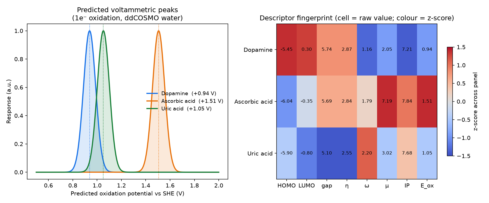
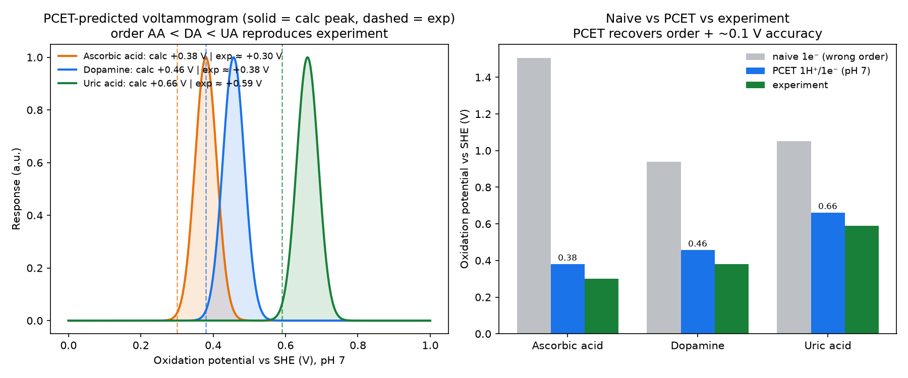

# From binding energy to an electrochemical sensor: a computational descriptor pipeline

**How to reuse the UMA + PySCF/QE toolchain from this project to screen materials
and molecules for electrochemical / drug-detection sensors.**

For a sensor, the useful quantity is **not Kₐ** — binding only tells you the analyte
sticks. The measurable signal is the *electronic response to adsorption / redox*:
charge transfer, work-function change, DOS change, and the redox potential. This
document maps each of those to a concrete open-source method and demonstrates the
molecular-descriptor stage on the classic **dopamine / ascorbic acid / uric acid
(DA/AA/UA)** sensing benchmark.

---

## 1. Sensor signal ↔ descriptor ↔ method

| Sensor modality (what it reads) | Key descriptor | Engine | In this repo |
|---|---|---|---|
| **Voltammetric (CV/DPV)** peak potential | redox potential **E°(vs SHE)**; HOMO/IP (oxidation), LUMO/EA (reduction) | PySCF + implicit solvent (ddCOSMO/PCM) + thermodynamic cycle | ✅ `06_sensor_descriptors.py` |
| **Chemiresistive / FET** conductance | adsorption **charge transfer ΔQ** (Bader), doping sign (n/p) | UMA screen + QE/GPAW + Henkelman `bader` | ✅ `04_*`, `05_*` |
| **Work-function** (Kelvin probe / FET V_th) | **Δφ** = φ(slab+analyte) − φ(slab) | QE/GPAW slab (vacuum electrostatic potential − E_F) | driver in `05_*` |
| **Electronic-state** response | **DOS/PDOS** shift, Fermi-level shift, in-gap states | QE/GPAW slab PDOS | driver in `05_*` |
| **Selectivity / affinity** | adsorption energy E_ads (target vs interferents) | **UMA** (fast, large panels) | ✅ `01b_*`, `02_*` |
| Intrinsic reactivity | χ, η, ω, dipole | PySCF | ✅ `03_*`, `06_*` |

The three "electronic" descriptors an MLIP can't give (redox E, ΔQ, Δφ/DOS) all come
from open-source DFT — the same engines this project already uses.

## 2. Screening workflow

```
① UMA fast screen  (cheap, scales to hundreds of molecules)
   for each (analyte × electrode/recognition-material): relax + E_ads
   → rank by selectivity (target binds, interferents don't)
        │ top hits
        ▼
② DFT electronic fingerprint  (accurate, on the few hits)
   molecular (PySCF):  HOMO/LUMO, IP/EA, redox E (+solvent), dipole
   surface   (QE/GPAW): ΔQ (Bader), Δφ, DOS/PDOS shift, E_F shift
        ▼
③ Fingerprint table: each analyte → descriptor vector
   compare orthogonality → which material separates target from interferents
        ▼
④ (optional) use descriptors as a virtual cross-reactive sensor array,
   or ML-regress descriptors → measured response (electronic-nose pattern ID)
```

## 3. Redox potential (the electrochemistry core)

For a one-electron oxidation A → A⁺ + e⁻:

```
ΔG_ox = G(A⁺, solvated) − G(A, solvated)          (ddCOSMO/PCM water)
E_ox(vs SHE) = ΔG_ox − 4.44 V                      (4.44 V ≈ absolute SHE)
```

Needs the neutral and the ion each geometry-relaxed + a solvated single point.
Typical accuracy ~0.1–0.3 V — enough to **rank/separate** analytes, which is what
sensor selectivity requires.

## 4. Demonstration — DA / AA / UA fingerprint

`06_sensor_descriptors.py`: UMA(omol) geometries + PySCF B3LYP/6-31G*, ddCOSMO water.

| Analyte | HOMO (eV) | gap (eV) | η (eV) | ω (eV) | μ (D) | IP_gas (eV) | E_ox vs SHE (V) |
|---|---|---|---|---|---|---|---|
| **Dopamine**      | −5.45 | 5.74 | 2.87 | 1.16 | 2.05 | 7.21 | **+0.94** |
| **Uric acid**     | −5.90 | 5.10 | 2.55 | 2.20 | 3.02 | 7.68 | **+1.05** |
| **Ascorbic acid** | −6.04 | 5.69 | 2.84 | 1.79 | 7.19 | 7.84 | **+1.51** |



Each analyte occupies a **distinct position in descriptor space** (right panel) —
the basis on which a sensor material can discriminate them. The predicted 1e⁻
oxidation peaks (left panel) put dopamine and uric acid close (+0.94/+1.05 V) and
ascorbic acid well separated (+1.51 V).

### 4b. The PCET fix — recovering the experimental order

The naive 1-electron radical-cation route above mis-orders these molecules
(ascorbic acid comes out *hardest* to oxidise, which is wrong) because their real
oxidation is **proton-coupled (PCET)**. The physically correct first oxidation is a
**1H⁺/1e⁻ step forming the neutral radical** (the antioxidant mechanism):

```
RedH(aq) → Red•(aq) + H⁺(aq) + e⁻(vac)
E°(vs SHE, pH 0) = [E(Red•,aq) − E(RedH,aq) + G(H⁺,aq)] − E_abs(SHE)
E°(pH 7)         = E°(pH 0) − 0.05916 · 7                       (Nernst, 1H⁺/1e⁻)
```

`06b_pcet_oxidation.py` implements this: for each analyte it removes every O–H/N–H,
UMA-relaxes the neutral radical, evaluates a solvated (ddCOSMO water) energy, and
takes the most stable radical as the product (no hand-picking). Result:

| Analyte | naive 1e⁻ (wrong) | **PCET, pH 7** | experiment (pH 7) |
|---|---|---|---|
| **Ascorbic acid** | +1.51 V (hardest ✗) | **+0.38 V** | ≈ 0.06–0.35 V |
| **Dopamine**      | +0.94 V | **+0.46 V** | ≈ 0.38 V |
| **Uric acid**     | +1.05 V | **+0.66 V** | ≈ 0.59 V |

**Predicted order AA < DA < UA = experimental order**, and absolute values land
within ~0.1 V. The physics: the best H-atom donor (strongest antioxidant, ascorbic
acid) oxidises at the lowest potential — captured only when the coupled proton is
included.



Constants used: G(H⁺,aq) = −11.72 eV (−270.3 kcal/mol), E_abs(SHE) = 4.44 V (a
uniform shift; using 4.28 V moves all values by +0.16 V and does not change the
order). Absolute accuracy is also limited by functional/basis and the neglect of
ZPE/thermal terms; the ordering and ~0.1 V agreement are the deliverable.

> Take-away for sensor design: **the redox descriptor must use the right
> electrochemical mechanism (PCET, pH) to be quantitative** — the naive electron
> removal is only a rough reactivity proxy. This is exactly the kind of correction
> a screening pipeline needs to build in for drug/metabolite analytes.

## 5. Reproduce

```bash
python 06_sensor_descriptors.py   # DA/AA/UA descriptor fingerprint
python plot_sensor.py             # figures/sensor_fingerprint.png
python 06b_pcet_oxidation.py      # PCET oxidation potentials (correct order)
python plot_pcet.py               # figures/sensor_pcet.png
```
Swap the `ANALYTES` dict for your own SMILES to screen any drug/interferent panel.
Add the surface descriptors (ΔQ, Δφ, DOS) with `05_full_systems_inputs.py` on HPC.
