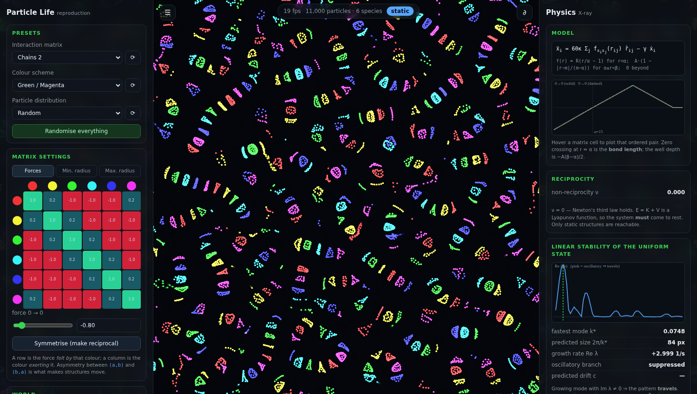

# Particle Life — 复现 + 物理数学模型

复现 [`sandbox-science.com/particle-life`](https://sandbox-science.com/particle-life)，
并把它背后的物理/数学模型完整挖出来：从力律、势函数、互易性定理、自驱动机理，
一直到决定"演化成哪种结构"的连续介质线性稳定性理论 —— 每一条都有数值验证。

```
particle-life/
├── THEORY.md                     ← 主报告：物理数学模型（先读这个）
├── docs/PATTERN_CARDS.md         ← 形态参数卡：每种结构的核心参数 + 模型 + 分析
├── docs/PROTEIN_MAPPING.md       ← 用到蛋白上：Kd + 浓度 ⇄ 细胞内结构（正/反问题）
├── docs/PATHWAY_ATLAS.md         ← 真实信号通路：一个 pool 里会长成什么？需要什么条件？
├── docs/
│   ├── REVERSE_ENGINEERING.md    ← 从站点 WebGPU 内核逐字取出的真实模型
│   ├── VALIDATION.md             ← 所有预言 vs 测量的汇总（含 ⚠️ 保留项）
│   └── summary.html              ← 可视化总结页（含可交互的互易性演示）
├── web/                          ← 可运行的复现（含独有的 "Physics X-ray" 面板）
│   ├── index.html
│   └── js/{model,engine,theory,main}.js
└── theory/
    ├── plife/                    ← Python 物理包
    │   ├── kernels.py            力律、势、Hankel 变换
    │   ├── matrices.py           站点的矩阵生成器 + 互易性代数
    │   ├── model.py              N 体积分器（与站点更新顺序一致）
    │   ├── twobody.py            自驱动二聚体、团簇内力/内力矩
    │   ├── stability.py          连续介质线性稳定性、色散、例外点
    │   ├── observables.py        序参量与形态分类
    │   └── bio/                  蛋白版：Kd → Wertheim → 结构
    │       ├── units.py          Kd / µM / kDa / TPM → nm、kT、nm⁻³
    │       ├── thermo.py         Wertheim TPT1 + BMCSL：binodal / spinodal / 分配
    │       ├── sites.py          多结构域蛋白（一个 SH2 不是两个 SH2）
    │       ├── phases.py         双蛋白相图与形态判定
    │       ├── inverse.py        从观测反推 Kd 与浓度
    │       └── pathways.py       四个闭式条件 + 12 个真实通路 + 共享 pool
    ├── experiments/e01…e10       十个验证实验（e08 = 形态参数卡，e10 = 信号通路 pool）
    ├── test_plife.py             快速自检（几秒钟）
    ├── test_bio.py               蛋白模块自检（质量作用定律、价数门等极限）
    ├── test_pathways.py          通路模块自检（四个条件 vs 完整数值解，29 项）
    ├── figures/                  实验产出的图
    └── results/                  实验产出的数值
```



*左：复刻的控制面板（Forces / Min. Radius / Max. Radius 三个矩阵页签）。
右：原站没有的物理面板——实时计算连续介质线性稳定性，并与模拟测量并排显示。
此帧：ν = 0.000（矩阵互易）⇒ 判定 "static"，理论预言结构尺度 84 px。*

## 快速开始

**跑模拟器**（无需构建，任意静态服务器）：

```bash
cd particle-life/web && python3 -m http.server 8080
# 打开 http://localhost:8080
```

左栏是复刻的控制面板（力矩阵 / 最小半径 / 最大半径三个页签、预设、物理与图形参数）。
右栏是原站没有的东西：**实时把连续介质线性稳定性理论算出来**，
并与模拟测得的 S(k)、团簇数、运动性并排显示。

**跑理论与验证实验**：

```bash
cd particle-life/theory
pip install -r ../requirements.txt
cd experiments
python3 e01_force_law.py             # 力律与势的解析核对
python3 e02_self_propelled_dimer.py  # 自驱动二聚体（误差 < 0.05%）
python3 e03_reciprocity_theorem.py   # 互易 ⇒ 必然静止
python3 e04_linear_stability.py      # 结构尺度选择
python3 e05_nonreciprocal_transition.py  # 行波相变与摩擦阈值
python3 e06_structure_atlas.py       # 21 种形态图谱
python3 e07_morphogenesis_map.py     # 形态发生相图
python3 e08_pattern_cards.py         # 十张形态参数卡 + 敏感性扫描
python3 e09_protein_phases.py        # 蛋白：相图 / 滴定 / 反演 / 可辨识性
python3 e10_signaling_pool.py        # 真实信号通路：四个条件 + 共享 pool 的分选
```

## 三句话版本的答案

1. **模型**：`ẍᵢ = 60κ Σⱼ f(rᵢⱼ) r̂ᵢⱼ − γẋᵢ`，其中 f 是"核心排斥 + 帐篷形吸引"的分段线性函数，
   参数是三个**有序对**矩阵（力、最小半径、最大半径）。`minRadius` 就是键长，势阱深度是 −A(β−α)/2。
2. **为什么会动**：力矩阵不对称 ⇒ 牛顿第三定律被打破 ⇒ 束缚团簇的净内力和净内力矩不为零 ⇒
   团簇自己推自己。互易时 `E = K + V` 是 Lyapunov 函数，系统**必然停下**（已证明并验证：
   互易情形注入功率恒等于 0）。
3. **为什么是这种结构**：把 A 看成物种上的有向图。图的**拓扑**决定形状（环图→链/蛇，二部→核壳细胞，
   循环追逐→旋涡），边的**不对称性**决定动不动，`minRadius` 决定尺寸（ℓ ∝ α）。
   均匀态的线性稳定性给出色散关系 `λ² + γλ + 60κk²σₙ(k) = 0`，
   最不稳定波数 k\* 给出结构尺度，复本征值给出行波（会动的结构）。

细节、推导与验证数据见 [`THEORY.md`](THEORY.md)。
