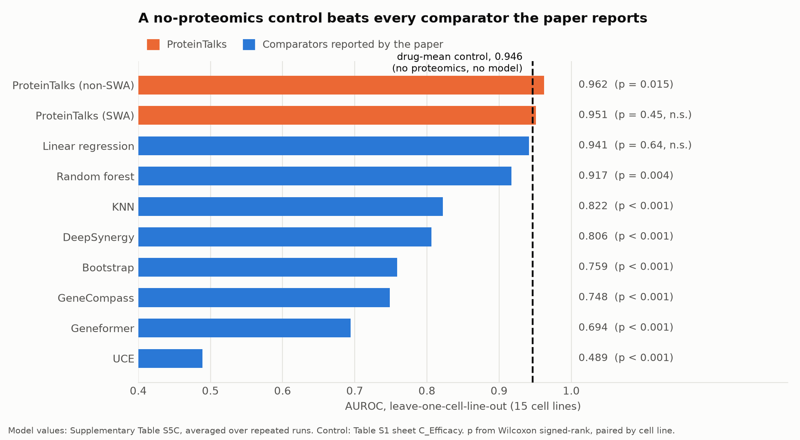

# ProteinTalks against the rest of the virtual-cell field

A comparison has to answer two different questions, and they have different
answers here:

1. **Is ProteinTalks unusual?** Yes, clearly. It is the only perturbation
   *proteomics* foundation model that exists, and close to the only
   perturbation model of any modality that treats time as a first-class
   variable.
2. **Is ProteinTalks better?** Mostly unanswerable, because it shares no
   held-out benchmark with any of the models it would be compared against. Where
   a comparison does exist — inside the paper's own benchmark — it wins clearly
   against transcriptomic foundation models applied zero-shot, and wins narrowly
   or not at all against classical statistics.

Claims below are cited. Items we could not verify are marked ⚠ and should not be
repeated without checking.

---

## 1. Where it sits

| Model | Year | Modality | Pretraining corpus | Params | Architecture | Models time? |
|---|---|---|---|---|---|---|
| **ProteinTalks** | 2026 | **Bulk DIA-MS proteome** | 16,311 proteomes, >38 M measurements | **790,306** (verified) | Neural ODE + conv head | **Yes, explicitly** |
| scGPT | 2024 | scRNA-seq | 33 M cells | ~50 M ⚠ | Generative transformer | No |
| Geneformer | 2023 | scRNA-seq | 29.9 M cells (V2: ~104 M) | ~10 M / 104 M / 316 M | BERT, rank-value encoding | No |
| scFoundation | 2024 | scRNA-seq | >50 M cells | 100 M | xTrimoGene transformer | No |
| UCE | 2023/26 | scRNA-seq, 8 species | 36 M cells | >650 M | Transformer | No |
| AIDO.Cell | 2024–26 | scRNA-seq | 50 M cells | 3 M–650 M | Dense encoder, full gene context | No |
| TranscriptFormer | 2025 | scRNA-seq, 12 species | 112 M cells | 444 M + 633 M frozen | Autoregressive transformer | No |
| C2S-Scale | 2025 | scRNA-seq as text | 57 M cells, >1 B tokens | 410 M → 27 B | Decoder-only LLM | No |
| Nicheformer | 2025 | sc + spatial | 110 M cells | 49.3 M | Transformer | No |
| GEARS | 2023 | scRNA-seq | — | — | GNN over GO + co-expression | No |
| CPA / chemCPA | 2023 | scRNA-seq | — | — | Adversarial autoencoder | Dose only |
| STATE (Arc) | 2025 | scRNA-seq | 167 M obs. + >100 M pert. cells | SE 600 M; ST ⚠ | Transformer over cell sets | No |
| CellOT | 2023 | scRNA-seq + **4i protein imaging** | — | — | Neural optimal transport | No |
| E. coli whole-cell | 2020 | Mechanistic | 1,214 genes (43% annotated) | Hand-parameterised | ODE/stochastic hybrid | Yes |
| VCell | ongoing | Mechanistic | — | Hand-parameterised | PDE/ODE solver | Yes |

Sources: scGPT [Nat Methods](https://doi.org/10.1038/s41592-024-02201-0);
Geneformer [Nature 618:616](https://doi.org/10.1038/s41586-023-06139-9);
scFoundation [Nat Methods](https://doi.org/10.1038/s41592-024-02305-7);
UCE [Nature 2026](https://doi.org/10.1038/s41586-026-10689-z) ⚠ (search also
returned a near-identical Nature Genetics entry; resolve before citing);
Nicheformer [Nat Methods](https://doi.org/10.1038/s41592-025-02814-z);
GEARS [Nat Biotechnol 42:927](https://doi.org/10.1038/s41587-023-01905-6);
CPA [Mol Syst Biol](https://doi.org/10.15252/msb.202211517);
STATE [bioRxiv](https://doi.org/10.1101/2025.06.26.661135);
CellOT [Nat Methods 20:1759](https://doi.org/10.1038/s41592-023-01969-x);
Macklin et al. [Science 369:eaav3751](https://doi.org/10.1126/science.aav3751);
AIVC vision paper, Bunne et al. [Cell 187:7045](https://doi.org/10.1016/j.cell.2024.11.015).

## 2. The two things that are genuinely different

### Proteomics instead of transcriptomics

Every model above except CellOT reads RNA. ProteinTalks reads protein. A 2024
review from the same lab stated the position plainly: *"perturbation proteomics
datasets sufficient to build a large pretrained model are currently not
available"* ([Cell Genomics, PMC11605689](https://pmc.ncbi.nlm.nih.gov/articles/PMC11605689/)).
ProteinTalks is the dataset built to falsify that sentence, and it succeeds at
that: no other perturbation-proteomics foundation model exists. The
proteomics resources that do exist — decryptM (~1.8 M dose-response curves),
decryptE (>1 M curves, 144 drugs), Mitchell et al.'s 875-compound MOA atlas,
ProCan-DepMapSanger (8,498 proteins × 949 cell lines) — are **atlases without a
pretrained predictive model**. A 2026 review's table of virtual-cell models
contains no proteomics entry at all
([Front Cell Dev Biol](https://doi.org/10.3389/fcell.2026.1900624)).

Whether protein is the *better* readout is a separate question, and the best
available evidence is equivocal: ProCan-DepMapSanger found protein networks are
more strongly co-regulated than transcript networks, but also that *"the power
of the proteome to predict drug response is very similar to that of the
transcriptome"* ([Cancer Cell 40:835](https://doi.org/10.1016/j.ccell.2022.06.010)).
The strongest honest framing is that proteomics is complementary and
under-explored, not that it is superior.

### Explicit time

Of every model in the table, only the mechanistic simulators and ProteinTalks
represent elapsed time. CPA and chemCPA model *dose*. GEARS, scGen, STATE,
CellOT, Biolord, SAMS-VAE and PerturbNet are endpoint models. Neural-ODE
single-cell models do exist — PRESCIENT (Nat Commun 2021) and
[scNODE](https://doi.org/10.1093/bioinformatics/btae393) — but they interpolate
developmental trajectories rather than predict perturbation responses.
"Neural ODE × perturbation × proteome" appears to be unoccupied apart from this
paper.

**With two caveats.**

First, established in `REPRODUCTION_STATUS.md` §4: the released code integrates
the ODE over `linspace(0, 3, 4)` — integer ticks — not over 0, 6, 24, 48 hours.
The model is never told that the 24→48 h gap is four times the 0→6 h gap. So the
continuous-time formalism is, in the shipped implementation, a uniform
three-step recurrence solved with RK4.

Second, the *Nature* version's own extended-data figure caption reports that on
its multi-timepoint dataset, **AUPRC and AUROC *decrease* as the number of
timepoints increases**, while accuracy increases. That is a striking result for a
model whose central claim is that time is the missing dimension, and it is worth
weighing before treating denser temporal sampling as the obvious next step. (We
read this from the openly available figure caption; the body text discussing it
is paywalled, so we cannot report how the authors interpret it.)

The temporal *data* is a real and rare asset. The temporal *modelling* is
thinner than the framing suggests.

## 3. The one head-to-head comparison that exists

The paper benchmarked three transcriptomic foundation models on its own
leave-one-cell-line-out drug-response task (Supplementary Table S5A). We add the
drug-mean control from `REPRODUCTION_STATUS.md` §5:

| Model | AUROC | AUPRC | Accuracy |
|---|---|---|---|
| **ProteinTalks** | **0.953** | 0.891 | 0.902 |
| *drug-mean control (no model, no data)* | *0.919* | *0.859* | *0.860* |
| KNN | 0.805 | 0.631 | 0.817 |
| GeneCompass | 0.751 | 0.533 | 0.744 |
| Geneformer | 0.684 | 0.453 | 0.744 |
| UCE | 0.482 | 0.277 | 0.744 |

ProteinTalks beats all three transcriptomic foundation models decisively. But
note that GeneCompass, Geneformer and UCE all report **accuracy 0.744, identical
to three decimal places**, which is the signature of three models collapsing
onto the majority class. And UCE at AUROC 0.482 is at chance. This is a
comparison against transcriptomic models applied zero-shot to a proteomic task
they were never designed for — informative about modality transfer, weak as
evidence of architectural superiority.

The more demanding comparison is against the drug-mean control, which beats
every one of those three models by a wide margin and comes within 0.034 of
ProteinTalks. Paired per cell line, ProteinTalks (non-SWA) is ahead by 0.016
AUROC, p = 0.015 (`REPRODUCTION_STATUS.md` §6).

## 4. Context: the field's baseline problem

ProteinTalks should be judged against what the rest of the field achieves
against simple controls, and by that standard it does comparatively well.

- **Ahlmann-Eltze, Huber & Anders**, [Nat Methods 22:1657 (2025)](https://doi.org/10.1038/s41592-025-02772-6):
  GEARS, scGPT, scFoundation, CPA, Geneformer, scBERT and UCE were tested against
  no-change, additive, mean and linear-on-PCA baselines. *"None of the deep
  learning models was able to consistently outperform the mean prediction or the
  linear model."* For double perturbations, every deep model was worse than a
  simple additive baseline.
- **Csendes et al.**, [BMC Genomics 26:393 (2025)](https://doi.org/10.1186/s12864-025-11600-2):
  a "train mean" predictor scored 0.711 / 0.557 / 0.373 / 0.628 correlation on
  Adamson / Norman / Replogle-K562 / Replogle-RPE1, beating scGPT and
  scFoundation; random forest with GO features beat them "by a large margin".
- **Wong, Hill & Moccia**, [Bioinformatics 41:btaf317 (2025)](https://doi.org/10.1093/bioinformatics/btaf317):
  a CRISPR-informed mean control beat GEARS by 0.08 Pearson-Δ (p = 9.3e-4) and
  scGPT by 0.11 (p = 8.1e-6). Ablating scGPT's pretrained weights entirely
  changed nothing (Δ = 0.004, p = 0.89).
- **Bendidi et al.**, [arXiv:2410.13956](https://arxiv.org/abs/2410.13956):
  PCA scored ~5× scGPT on perturbation linear separability (top-5 probe 0.058 vs
  0.011). Fine-tuning scGPT *reduced* known-relationship recall from 0.389 to 0.166.
- **Kedzierska et al.**, [Genome Biology 26:101 (2025)](https://doi.org/10.1186/s13059-025-03574-x):
  *"Both Geneformer and scGPT exhibit limited reliability in zero-shot settings
  and often underperform compared to simpler methods."* More pretraining data did
  not monotonically help.
- **Arc Virtual Cell Challenge 2025** ([wrap-up](https://arcinstitute.org/news/virtual-cell-challenge-2025-wrap-up)):
  >1,200 teams. Arc's own summary: *"Almost all models performed worse than
  baseline on MAE"* and *"perturbation prediction models are not yet consistently
  outperforming naive baselines across all metrics."* The first-place team
  concluded that *"purely AI-based approaches did not consistently outperform
  statistical baselines."* Turbine.ai's ridge regression — the 1970 method —
  placed 15th and briefly led the leaderboard.

There is a **rebuttal** and it should be represented: Miller et al.,
[bioRxiv 2025.10.20.683304](https://doi.org/10.1101/2025.10.20.683304), argue
these negative results are an artefact of metric miscalibration, and that on
well-calibrated rank-based metrics several deep models do significantly beat the
mean baseline. ⚠ Preprint, not peer-reviewed. Similarly,
[Mao et al. (arXiv:2604.27646)](https://arxiv.org/abs/2604.27646) find that
*"linear additive baselines are consistently weaker than more expressive deep
models such as SAMS-VAE"* on some metrics, while confirming that performance is
"often overestimated" in common setups.

Against that backdrop, ProteinTalks being significantly above a no-input control
on one of three settings, and statistically tied on the others, is a middling-to-good
result by current standards rather than a poor one.

## 5. Scale: the argument is not what it looks like

| | Transcriptomic virtual cells | ProteinTalks |
|---|---|---|
| Units | Tahoe-100M: 100 M cells; STATE-SE: 167 M | 16,311 proteomes |
| Features per unit | ~2,000 detected genes, sparse, dropout-heavy | ~5,530 protein groups, dense |
| Total measurements | ~10¹¹, mostly zeros | 3.8 × 10⁷, dense |
| **Effective perturbation n** | Tahoe: 17,813 cell-line × drug conditions; **VCC: ~300** | **1,116 cell-line × drug conditions** |
| Time | Fixed endpoint | 0 / 6 / 24 / 48 h |
| Parameters | 10 M – 27 B | 790,306 |

The four-orders-of-magnitude gap in "cells" collapses to less than one order in
*effective perturbation conditions*, which is the unit that actually constrains
a perturbation model. Turbine.ai's observation about the Virtual Cell Challenge
is the sharpest statement of this: *"effective datasets contain only ~300 data
points despite millions of sequenced cells."* ProteinTalks' 1,116 labelled
conditions are not obviously a worse effective sample size than the VCC's 300
perturbations.

This cuts both ways. It defends ProteinTalks against "your dataset is tiny". It
also means that a 790 K-parameter model on ~1,100 labelled conditions is in a
regime where classical statistics is expected to be competitive — which is
exactly what the paper's own Table S6 shows for unseen drugs.

## 6. What is not comparable

ProteinTalks' 0.960 AUROC is **binary drug-response classification**. The
transcriptomic benchmarks report Perturbation Discrimination Score, Differential
Expression Score, Pearson-Δ or MSE on continuous expression vectors. There is no
shared held-out set, no shared metric, and no shared task. Any table that places
0.960 next to a PDS or a Pearson-Δ is comparing incommensurable quantities.

The only defensible cross-model statements are the ones the paper itself
enables: ProteinTalks vs Geneformer/UCE/GeneCompass on *its* task (§3), and
ProteinTalks vs simple controls on *its* labels (§4 and `REPRODUCTION_STATUS.md`).

## 7. Verdict

**Strongest claims, well supported.**
The dataset is a genuine and expensive contribution with no equivalent: 16,311
perturbation proteomes across 18 cell lines, 63 drugs and four timepoints. The
model is small, fully released with weights under MIT, and exactly reproducible
— we matched the reference implementation to 1.8e-7 using the published
checkpoint. On its own leave-one-cell-line-out task it is the only model
benchmarked that is not significantly worse than a no-input control. Four
predicted synergies validated in cells.

**Claims that need qualification.**
"Virtual cell" is doing heavy lifting for a model that predicts a 5,585-vector
at three timepoints and a binary label, in one tissue lineage, from one assay.
"Protein network dynamics" is not represented in the dynamics module, which is
protein-independent by construction. "Neural ODE over time" is implemented over
uniform integer ticks, not real hours. And 90.5% of the parameters are a single
linear map from proteins to a 32-dimensional feature.

**The gap that matters.**
On unseen drugs — the setting that determines whether this is useful for drug
discovery — the paper's own supplement reports ProteinTalks at AUROC 0.638
against random forest 0.648 and linear regression 0.669, with the differences
explicitly marked not significant. That is the number to watch in future
versions, and it is the number a proteomic virtual cell will ultimately be
judged on.
