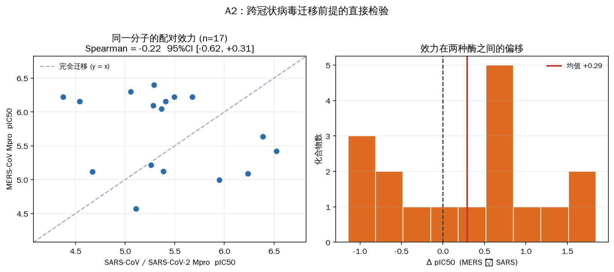
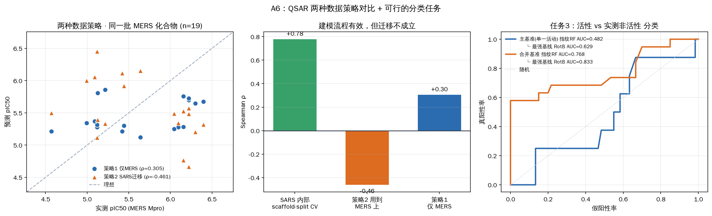
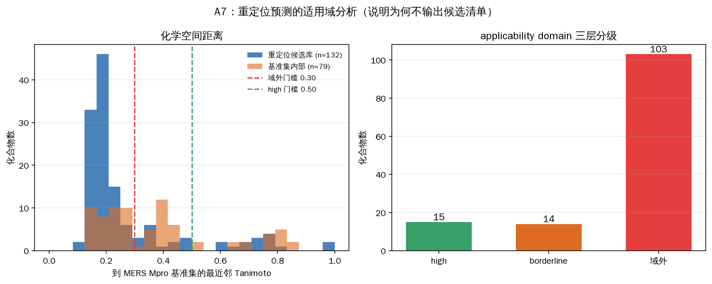
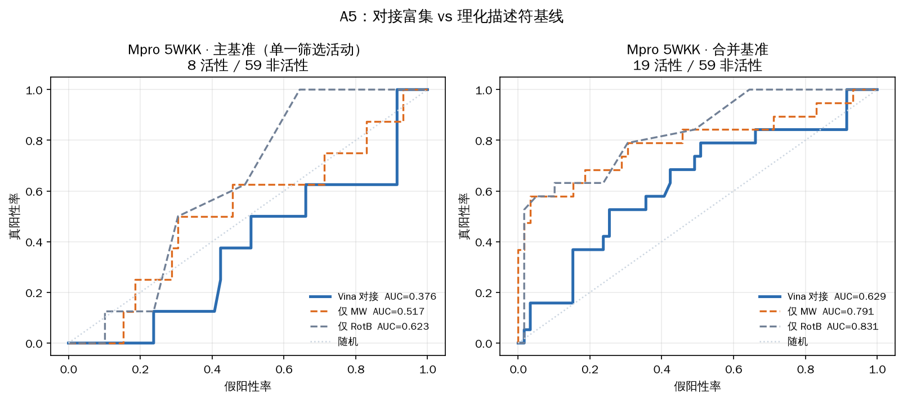
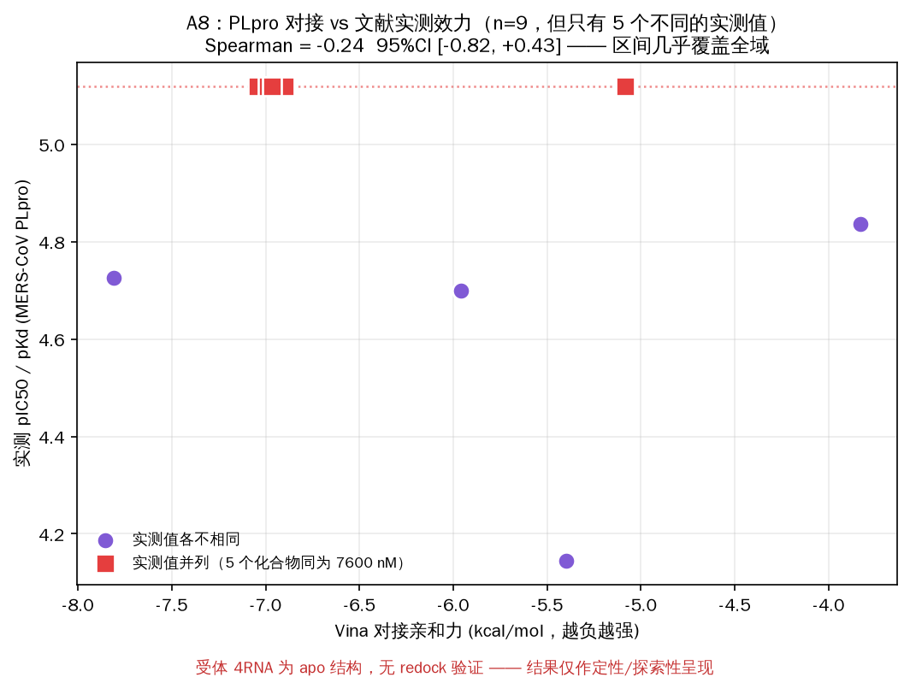
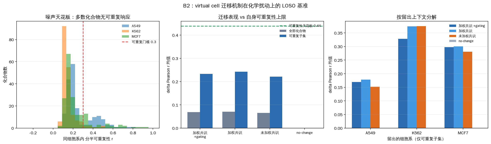
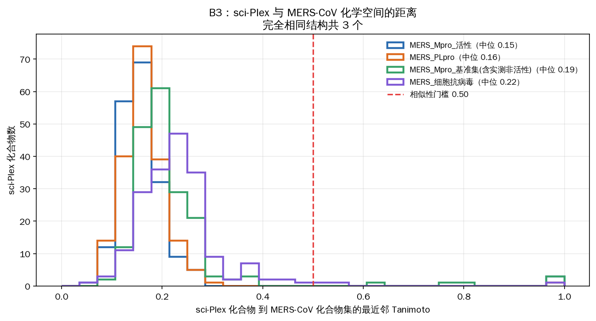
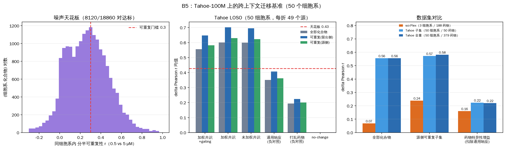

# MERS-CoV PLpro/Mpro 计算 IC50 测定 + Virtual Cell 模型化学扰动扩展验证

**最终报告** · 全部结果由 `mers_pipeline/` 中的可运行流程生成
**日期**：2026-09-23 · **数据源**：ChEMBL_37（CC BY-SA 3.0）、RCSB PDB、GEO GSE139944

---

## 0. 一句话结论

> **Track A**：在当前公开数据下，MERS-CoV Mpro/PLpro 的**计算 IC50 预测不可行**，而这个结论不是"模型没调好"，是三个可量化的硬约束造成的 —— 数据量（去重后 Mpro 仅 19 个精确 IC50）、迁移前提不成立（同一分子在 SARS 与 MERS Mpro 上效力无可检测相关性）、以及结构基础不足（两个 Mpro 受体 redock 均未过 2 Å 门槛，PLpro 根本没有可用共晶配体）。**三条技术路线全部失败，且失败方式一致**：QSAR 回归无法选模型、分类跑不赢"数可旋转键"、对接在无混杂基准上 AUC 0.376 **低于随机**。
>
> **Track B**：virtual cell 的跨上下文迁移机制在化学扰动上**确实迁移了药物特异性的真实信号**，且一个对照实验定位出了瓶颈所在 —— **是源上下文（细胞系）数量，不是药物数量**：sci-Plex（3 细胞系 / 每折 2 个源）上 delta Pearson 0.239，Tahoe-100M（50 细胞系 / 每折 49 个源）上升到 **0.582**；而在 Tahoe 内部把药物从 50 个扩到**全部 379 个**（评估数 2,500 → 18,950），指标几乎不动（0.5719 → 0.5819）。但裸 r 会高估 —— 一个完全不含药物特异性的"通用响应"预测就能拿到 0.362，**扣掉后药物特异性增益是 +0.220（sci-Plex 为 +0.160）**。成立条件仍是化合物本身要产生可重复响应，这个比例从 sci-Plex 的 17.7% 升到 Tahoe 的 43.1%。
>
> **两条轨道的交汇点是负面的**：sci-Plex 与 MERS-CoV 数据真正相交的 4 个化合物，恰恰是迁移机制最无能为力的那几个。

### 0.1 三处差点写进报告的错误结论

本项目最可迁移的部分不是上面两条结论，而是它们**差点被写错**的方式。三处都不会抛异常，只会悄悄产出看起来合理的数字：

| # | 如果不查会得到的结论 | 拦下它的对照 | 真实情况 |
|---|---|---|---|
| 1 | "SARS→MERS 的 QSAR 模型失效（ρ=−0.46），模型有问题" | 同一模型在 SARS **内部** scaffold-split CV 上 ρ=**+0.78**、R²=0.60 | 建模流程完全正常；失效的是**迁移前提**，而这一点已被 §3.2 的配对实验独立证实 |
| 2 | "virtual cell 迁移机制在化学扰动上无效（r≈0.03）" | 同细胞系内**相邻剂量**的 delta 相关仅 0.07–0.10；`‖delta‖` 跨四个数量级剂量不变 | delta 被噪声主导，**根本没到自身可重复性天花板**。修正基准后 r=**0.239**，四条判据全通过 |
| 3 | 报告里出现 BEDROC = 6.57 / 20.75 等富集数字 | 用已知输入自检：完美排序应得 1.0，实际返回 **17.0** | 归一化因子写反（`rie/fac` 而非 `rie*fac`）。修正后完美=1.000、最差=0.000、随机均值 0.243 ≈ 理论 Ra 0.241 |
| 4 | "Tahoe 上迁移 r=0.60，比 sci-Plex 强 9 倍" | 迁移效率 > 1（比自身可重复性还准）触发**负对照**：打乱药物标签仍得 0.19，用全药物平均响应得 **0.35** | 0.60 里有一大块是**跨药物通用响应**。药物特异性增益是 +0.41（vs 打乱）/ +0.22（vs 通用响应），真实但远小于裸数字 |
| 5 | Tahoe 的 c1 判据显示"未通过"（r=0.55，n=2500） | 手工核对 p 值：Wilcoxon 下溢到 **0.0** | `(p or 1) < 0.05` 中 `0.0` 是 falsy，`0.0 or 1` 得 **1** —— 把最显著的结果判成不显著 |

第 1、2 条的共同形态是：**一个负面结果既可能来自"被测对象不行"，也可能来自"测量工具不行"，不加正对照就分不开**。第 4 条是它的镜像：**一个正面结果也可能来自"任务比看上去容易"**，需要负对照。第 3、5 条的形态则是：**实现层面的错误不会报错，只会让结论失真** —— 指标错误已固化为 `mers_pipeline/test_metrics.py` 的自检；`(p or 1)` 这类 falsy-zero 陷阱在两个模块中都已改为显式 `is None` 判断。

此外还有三处**若按直觉假设就会静默出错**的数据事实，都是实测确认的：Tahoe 有 49 个分片跨两个细胞系（按 (药物,浓度) 建键会混批）；Tahoe 的基因顺序跨条件不一致（按位置拼接会错位）；ChEMBL 的 PLpro 集中 5 个结构无关的分子共享同一个 Kd 值（§3.6）。

---

## 1. 与原方案的偏离说明

方案中有 **5 个模块**因数据现实无法按原设计执行。全部偏离在此集中声明，正文中不再重复辩解。

| # | 方案原设计 | 实际情况 | 处理方式 |
|---|---|---|---|
| 1 | MERS Mpro「约 104 条 IC50」 | 104 条中 **74 条是 `>10 µM` 的删失值**；精确值去重后仅 **19 个化合物** | 74 条删失值转作**实测非活性物**（比合成诱饵严格），并据此把 ML 任务从回归改为分类 |
| 2 | 「MERS-CoV Mpro 作为外部独立测试集」 | **17/19** 的 MERS 化合物结构完全出现在 SARS 训练集中 | 外部测试集前提作废；改为用这 17 个配对点**直接检验迁移前提**（见 §3.2） |
| 3 | PLpro 受体 4RF1「带小分子配体 3CN」 | 4RF1/4RF0 实为 **PLpro–泛素复合物**；3CN 仅 **4 个重原子**（丙腈） | 启用方案预设回退 **4RNA (1.79 Å apo)**；**PLpro 无 redock 验证**（重大局限） |
| 4 | A5「正交细胞水平层」相关性分析 | 仅 **1 个**化合物同时具备蛋白酶 IC50 与细胞 EC50（PLpro 为 0） | 相关性**不可计算**；改为如实量化并给出可检验的机制性问题形式 |
| 5 | A4「药物重定位候选清单」 | 其前提是"已选出经验证的模型"，但 A6 按预先声明口径**拒绝了模型选择**，A3 的 redock 亦未通过 | **不输出候选清单**；改为用适用域分析**定量说明**预测会有多不可靠 |

**另有两项执行环境差异**：

- 实际算力为 **4 CPU / 15 GB**（方案预估 16 CPU / 64 GB），对接吞吐相应受限。
- **`VirtualCell_ZeroShot_PoC_2026.zip` 不在本会话环境中**。Track B 是按方案描述**重新实现**其原生方法（control-similarity 加权共识 + basal gating），属**复现实现**，不是对用户原始代码的直接验证。

**方案预留的一项回退未被触发**：B1 曾预设"若 Tahoe 子集下载在计算预算内不可行，则回退为仅 sci-Plex"。实际不需要回退 —— Tahoe 发布了预计算的 pseudobulk 差异表达，按 row group 选择性读取后单个条件仅 0.4 秒且全程不落盘，**100M 细胞的原始数据完全不必下载**（§4.4）。

---

## 2. 数据与方法

### 2.1 数据整理口径（A1）

ChEMBL_37，遵循结合亲和力建模惯例：仅取 `standard_relation = '='` 的记录、单位统一换算到 nM、丢弃 ChEMBL 标记的可疑数据、RDKit 结构标准化（去盐取最大片段）、drug-like 过滤 150 ≤ MW ≤ 650、同一标准化结构多次测量取 pActivity 中位数、标注 Bemis-Murcko scaffold。

| 数据集 | 化合物数 | scaffold 数 | pActivity 范围 |
|---|---|---|---|
| MERS-CoV **Mpro** IC50 | **19** | 10 | 4.57 – 6.40（跨度仅 **1.83 log**） |
| MERS-CoV **PLpro** IC50/Kd | **9** | 9 | 4.15 – 5.12 |
| MERS-CoV 细胞抗病毒 EC50/IC50 | 132 | 65 | 4.16 – 8.33 |
| SARS-CoV-2 + SARS-CoV Mpro（迁移训练集） | 2563 | 1126 | 4.00 – 10.60 |
| MERS Mpro **实测非活性**（IC50 > 10 µM） | 60 | 49 | — |

> **数据现实闸门**：MERS Mpro 的 N=19、动态范围 1.83 log、标准差 0.57。这远低于可信回归的下限。按惯例 N<100 时不训练图神经网络、仅用指纹模型 —— 但 N=19 连指纹回归的 CV 置信区间都宽到无法据此做模型选择。

### 2.2 为什么用实测非活性物而不是合成诱饵

ChEMBL 中 74 条 `IC50 > 10 µM` 的记录来自同一个 FRET 筛选活动（文献 CHEMBL4495564）。**合成诱饵只是"假定"不活性；这些是同一实验真的测过的阴性结果。**去重并经 drug-like 过滤后得到 60 个实测非活性化合物，与活性集零重叠。

### 2.3 基准集的混杂因素诊断（A4）

活性化合物来自两篇文献，合并会引入**分子尺寸混杂**：

| 基准集 | 活性 / 非活性 | 最强单描述符 | 该描述符单独的 AUC |
|---|---|---|---|
| **主基准**（单一筛选活动 CHEMBL4495564） | 8 / 60 | HBD | **0.647**（p=0.17，不显著） |
| 次要基准（合并两篇文献） | 19 / 60 | RotB | **0.833**（p=1.2e-5） |

合并集上，**"只数一数可旋转键"就能拿到 AUC 0.833**。因此主基准限定为单一筛选活动（无混杂，但仅 8 个活性物，功效低），合并集作次要结果并**强制与单描述符基线并列**报告。这条规则贯穿全文：任何模型的 AUC 都必须与它同框看。

---

## 3. Track A 结果

### 3.1 受体准备与 redock 验证（A3）

**结构核实**（均由流程自动重新验证并写入 `results/trackA/a3_receptors.json`）：

- **5WKK (1.55 Å)**：共晶抑制剂以 altloc A/B 两个构象建模（comp id `AW4`/`B3G`，各 occ=0.5、质心相距 0.06 Å，实为同一分子）。取 altloc A。配体 31 个重原子，接触催化二联体 His41/Cys148。
- **5WKJ (2.05 Å)**：同样的 altloc 双构象（`B1S`/`K36`），29 个重原子。
- **4RF1 / 4RF0**：B 链序列 `MQIFVKTLTGK...` 确认为**泛素** —— 这两个是 PLpro–泛素复合物。唯一非溶剂小分子 `3CN` 只有 **4 个重原子**（丙腈），虽确实位于催化位点（接触 Cys1592 = 催化 Cys111、His1759 = His278，以及泛素 C 端 Arg74-Gly75 的 LRGG 切割位点），但 4 原子片段的 redock RMSD 无统计意义。
- **4RNA (1.79 Å, apo)**：催化三联体 Cys111（建模为 CSS，S-巯基半胱氨酸）/ His278 / Asp293 完整；Zn 距催化位点 **46.6 Å**，确认为结构性锌指。

**PLpro 对接盒的定义方式**（不靠人工猜测）：把 4RF1 按 CA 原子叠合到 4RNA（319 个共同残基，编号偏移 1481，叠合 CA RMSD **1.35 Å**），用 `3CN` 片段 + 泛素 C 端 LRGG 的**实测位置**标定底物通道。盒心到催化三联体质心 10.53 Å。

**Redock 协议扫描结果**（门槛：预先声明的首选协议 exhaustiveness=32、全重原子 top 位姿 RMSD < 2 Å）：

| 受体 | exh=8 | exh=32 | exh=32, box×1.25 | exh=64 | seed 43 | seed 44 | 判定 |
|---|---|---|---|---|---|---|---|
| **Mpro 5WKK** top 位姿 | 2.593 | **2.593** | 2.535 | 2.593 | 2.567 | 2.619 | **未通过** |
| 　　　　　最佳位姿 | 2.091 | 1.994 | 1.835 | 1.583 | 1.470 | 1.454 | — |
| **Mpro 5WKJ** top 位姿 | 7.783 | **7.726** | 7.818 | 7.726 | 7.776 | 7.778 | **未通过** |
| 　　　　　最佳位姿 | 3.169 | 2.183 | 1.991 | 2.196 | 2.131 | 2.129 | — |
| **PLpro 4RNA** | — | — | — | — | — | — | **无法执行** |

**诊断结论**：top 位姿 RMSD 在穷尽度 8→64（8 倍采样量）与 3 个随机种子下**完全稳定**，而最佳位姿能到 1.45 Å。**这说明 Vina 采样到了正确构象，但没能把它排在第一 —— 是打分/排序失败，不是采样不足。**根因可定位：`AW4`/`B1S` 属 GC376/GC813 家族的**共价抑制剂**，在晶体中以半硫缩酮形式与 Cys148 成键（沉积坐标里亚硫酸氢盐离去基团已脱去，模板需经 MCS 裁剪 35→31 原子才能恢复键级）。Vina 按非共价处理，缺失了决定晶体构象的锚定作用。

> **后果**：两个 Mpro 受体的位姿预测均不可靠，PLpro 连验证都做不了。下游所有对接结果只能作**探索性排序**解读，不能作结合模式推断。

### 3.2 跨冠状病毒迁移前提的直接检验（A2）—— 本轨道最有力的结果

19 个 MERS Mpro 化合物中，**17 个的标准化结构完全出现在 SARS 训练集中**（不是同系物，是同一分子）。这既作废了"外部测试集"，也意外提供了一个更有价值的实验：**同一分子在两种酶上的配对效力测量**，直接检验任何跨冠状病毒迁移模型所依赖的前提。

| 指标 | 点估计 | 95% CI | p |
|---|---|---|---|
| Spearman ρ | **−0.220** | [−0.624, +0.314] | 0.396 |
| Pearson r | −0.266 | [−0.650, +0.150] | 0.302 |
| Kendall τ | −0.134 | — | 0.457 |
| Δ pIC50（MERS − SARS）均值 | +0.293 | [−0.143, +0.736] | 0.284 (Wilcoxon) |

**直接迁移基线**：把 SARS 效力原样当作 MERS 预测，R² = **−1.89**，MAE = **0.857 log** —— 而"一律预测均值"的 MAE 只有 **0.526**。

> **判定：迁移前提不成立。**置信区间很宽（n=17），所以严谨表述是"**检测不到任何正向迁移**"，而不是"存在负相关"。但可以明确排除的是强正向迁移 —— CI 上界仅 +0.31，且直接迁移的表现比预测均值还差。



### 3.3 QSAR 两种数据策略对比（A6）

方案要求"两模型在同一 MERS 测试集上比较 Spearman，以 scaffold-split Spearman 为准做模型选择"。两条策略都已执行：

| 任务 | 数据 | 交叉验证 | Spearman | 95% CI | R² | MAE |
|---|---|---|---|---|---|---|
| **策略 1**：仅 MERS Mpro | n=19 / 10 scaffold | 留一 scaffold | +0.305 | [−0.162, +0.661] | −0.00 | 0.507（预测均值基线 0.513） |
| **策略 2a**：SARS **内部** CV | n=2563 / 1126 scaffold | 5 折 GroupKFold | **+0.778** | [+0.759, +0.796] | **+0.597** | 0.520（基线 0.909） |
| **策略 2b**：同一模型用到 MERS | n=19 | 外部评估 | **−0.461** | [−0.742, −0.020] | −1.493 | 0.776 |

**这是一个闭环对照实验**：

- 策略 2a 证明**建模流程本身完全有效** —— 在数据充足的靶标上，scaffold-split CV 的 Spearman 0.778 / R² 0.60 是正常的 QSAR 表现。
- 同一个模型、同一套代码，用到 MERS 上变成 **−0.461**。
- 这个负相关不是偶然：19 个化合物里 17 个模型在训练时见过，它"记住"的是它们的 SARS 效力，而 §3.2 已测得 SARS 效力与 MERS 效力恰好呈（不显著的）负相关。**模型在 MERS 上的失败是迁移前提失败的直接后果，不是模型缺陷。**

**模型选择判定**：两条策略的 Spearman 95% CI 都跨过 0 且大幅重叠。按预先声明的验收口径，**不做模型选择**，并判定 **MERS-CoV Mpro 的 IC50 回归预测在当前公开数据下不可行**。

**分类任务**（数据量唯一支撑得起的 ML 任务）：

| 基准集 | n（活性/非活性） | 指纹 RF AUC | 95% CI | 最强描述符基线 | 模型 − 基线 | 显著更优？ |
|---|---|---|---|---|---|---|
| 主基准（单一活动） | 68 (8/60) | **0.482** | [0.285, 0.688] | RotB 0.629 | −0.147 [−0.353, +0.050] | **否** |
| 次要基准（合并） | 79 (19/60) | **0.768** | [0.608, 0.902] | RotB **0.833** | −0.066 [−0.170, +0.018] | **否** |

> 次要基准上 0.768 单看像"模型有效"，但**连"数可旋转键"的 0.833 都没跑赢**。这正是 §2.3 强制并列报告基线的理由。



### 3.4 正交细胞层与重定位模块（A7）

**正交层**：132 个细胞水平活性化合物与 19 个 Mpro 活性化合物**只有 1 个交集**（CHEMBL4208240，蛋白酶 pIC50 6.40 / 细胞 pEC50 6.30），PLpro 为 0。相关性**无法计算**。

> 这本身有信息量：MERS-CoV 的**生化数据与细胞数据几乎来自完全不相交的化合物集合**，机制一致性在现有公开数据下无法闭环。

**重定位适用域分析**（说明为何不输出候选清单）：

| 分层 | 门槛（到 MERS Mpro 基准集的最近邻 Tanimoto） | 化合物数 |
|---|---|---|
| high | ≥ 0.50 | 15 |
| borderline | 0.30 – 0.50 | 14 |
| **out-of-domain** | < 0.30 | **103** |

候选库最近邻 Tanimoto 中位仅 **0.190**；作为尺度参照，**基准集自身内部**的最近邻中位也只有 0.333 —— 训练集本身就稀疏。即便存在一个有效模型，对 103/132 的分子而言预测也只是外推。



### 3.5 分子对接富集基准（A5）

**协议**：RDKit ETKDGv3 生成 3D 构象 → MMFF 优化 → obabel 加氢 (pH 7.4) + Gasteiger 电荷 → AutoDock Vina 1.2.7，exhaustiveness=16，受体 Mpro 5WKK，对接盒同 §3.1。诱饵为 §2.2 的**实测非活性物**。

**排除记录**：79 个化合物中 `CHEMBL51085`（ebselen，含硒）**配体准备失败** —— obabel 无法为含 Se 的分子生成 PDBQT（AutoDock 原子类型集不含硒），输出 0 字节文件。这是工具限制而非流程错误，已在 `a5_enrichment.json` 的 `excluded` 字段显式记录。有效化合物 78 个。

| 指标 | **主基准**（8 活性 / 59 非活性） | **合并基准**（19 活性 / 59 非活性） |
|---|---|---|
| **Vina 对接 ROC-AUC** | **0.376**　CI [0.193, 0.578] | **0.629**　CI [0.473, 0.773] |
| BEDROC (α=20) | 0.005（随机期望 Ra = 0.119） | 0.396（随机期望 Ra = 0.244） |
| EF 5% / 10% | 0.00 / 0.00 | 2.05 / 1.54 |
| 活性物平均亲和力 | −6.16 kcal/mol | −7.10 kcal/mol |
| **非活性物平均亲和力** | **−6.66 kcal/mol** | −6.66 kcal/mol |
| 最强描述符基线 | RotB **0.623** | RotB **0.831** |
| 对接 − 基线（配对 bootstrap） | −0.247　CI [−0.472, +0.007]　p=0.056 | **−0.201　CI [−0.338, −0.066]　p=0.0044** |
| **对接显著优于基线？** | **否** | **否（显著更差）** |

（EF1% 在 n≈78 时只覆盖 1 个化合物，取值只能是 0 或 1/Ra，流程对此返回 `null` 而非给出退化数字。）

**结论**：

1. **在无混杂的主基准上，对接 AUC = 0.376，低于随机（0.5）**。实测非活性物的平均亲和力（−6.66）**优于**活性物（−6.16）—— Vina 系统性地把测过的阴性化合物排得更靠前。BEDROC 0.005 远低于随机期望 0.119，说明早期富集同样失败。
2. **在合并基准上，AUC 0.629 看似"还行"，但比"只数可旋转键"的 0.831 显著更差**（配对 bootstrap 差值 −0.201，CI 不含 0，p=0.0044）。也就是说，那点表观富集完全来自分子尺寸混杂，而对接捕捉这个混杂的能力还不如直接数原子。
3. 这与 §3.1 的 redock 结果**完全自洽**：打分函数既排不对同一分子的构象（top 位姿 2.59 Å），也排不对不同分子的活性。根因同样指向共价抑制剂被按非共价处理。



### 3.6 PLpro 对接与文献 IC50 的定性对照（A8）

方案对 PLpro 的定位是「不训练 ML 模型，仅做对接 + 与文献 IC50 的定性对照」。9 个化合物全部成功对接到 4RNA (apo)。

| 项 | 结果 |
|---|---|
| 对接亲和力 vs 实测 pActivity（Spearman） | **−0.237**　95% CI **[−0.815, +0.429]** |
| Pearson | −0.289　p = 0.451 |
| 对接亲和力范围 | −7.81 ~ −3.83 kcal/mol |
| 实测 pActivity 范围 | 4.15 ~ 5.12（**跨度仅 0.97 log**） |
| **不同的实测效力值个数** | **5 个（9 个化合物）** |

**数据质量问题（流程自动检出）**：9 个化合物中有 **5 个的 Kd 完全相同，均为 7600 nM**，且全部来自同一个 assay（`CHEMBL4393313`）、同一篇文献（`CHEMBL4392846`），标注为 SPR 测定。但这 5 个分子在结构上毫无关系 —— 一个噻唑烷酮、一个偶氮磺胺类、一个嘧啶酮、一个茶碱腙、一个喹啉羧酸。**5 个化学上互不相关的分子给出两位有效数字完全一致的 Kd，不像 5 次独立的精确测量，更像共用的筛选阈值或统一报告值。**

后果是：名义 n=9，但 y 轴上只有 5 个不同取值、其中一个取值压着 5 个点（图中红色方块所在的水平线）。**秩相关的有效样本量远小于 9。**

**结论**：Spearman 的 95% CI 宽度达 **1.24**，几乎覆盖相关系数的全部可能取值。**这个点估计不构成任何证据。**四重限制叠加：

1. PLpro 没有 redock 验证（§3.1）；
2. 受体为 apo 结构，未建模配体诱导的 BL2 环构象变化；
3. 实测效力跨度仅 0.97 log，与 Vina 约 2–3 kcal/mol 的打分误差同量级 —— 二者同量级时对接原则上就无法区分化合物；
4. 9 个化合物只有 5 个不同的实测值，其中 5 个并列。

结果只能作定性/探索性呈现，与方案对 PLpro 的预期（数据量过小、统计功效弱）一致。



---

## 4. Track B 结果

### 4.1 数据适配（B1）

**sci-Plex3**（GSE139944 / GSM4150378，Srivatsan et al. 2020, Science）：A549 / MCF7 / K562 × 188 化合物 × 4 剂量，24 h。

映射到零样本跨上下文扰动预测的数据模式：

| PoC 概念 | sci-Plex 对应物 |
|---|---|
| 上下文 (context) | `cell_type`（A549 / MCF7 / K562） |
| 扰动 (perturbation) | `product_name` × `dose` |
| 对照（"non-targeting"） | `vehicle = TRUE` 的溶剂对照组 |

**实现要点**：UMI 计数矩阵是 2.9 GB 的 `gene cell count` 三元组文本（**10.07 亿个非零元素**）。因为只需要 pseudobulk，采用**流式累加**，全程不把矩阵读进内存。

细胞层 QC：`n.umi ≥ 500`、哈希判定 `qval < 0.01` 且 `top/second 比值 ≥ 5`、每组 ≥ 25 个细胞。

| 细胞系 | 分组数 | 细胞数 | 每组中位细胞数 |
|---|---|---|---|
| A549 | 752 | 218,362 | 225 |
| K562 | 750 | 150,465 | 210 |
| MCF7 | 747 | 302,951 | 413 |
| **合计** | **2249** | **671,778** | — |

### 4.2 LOSO 基准与一次被纠正的假阴性（B2）

**第一版实现给出了错误的结论。**直接在全部 188 化合物 × 4 剂量上跑 LOSO，得到 delta Pearson ≈ **0.03**，看上去是"迁移完全失败"。但正对照诊断推翻了这个解读：

- 同一细胞系、同一化合物、**相邻剂量**之间的 delta 相关中位只有 **0.07 – 0.10**；
- `||delta||` 在 10 nM → 10 µM **四个数量级上几乎不变**（53.1 → 55.1）。

> 真实的药理响应必然随剂量变化。幅度不随剂量变、且自身都不可重复 —— 说明该分辨率下 delta 由**噪声主导**。跨上下文拿到 0.03 不是"迁移失败"，而是**根本没到自身可重复性的天花板**。

**修正后的基准设计**（本模块的核心方法学贡献）：

1. **化合物层聚合**：把同一化合物 4 个剂量的原始计数相加，细胞数 ×4 提升信噪比；
2. **分半可重复性**：用剂量 {1,3} vs {2,4} 估计每个 (细胞系, 化合物) 的噪声天花板 —— 该估计不涉及任何跨细胞系信息，对迁移问题**无循环论证**；
3. **以天花板为参照**：迁移的正确对标不是 1.0，而是同一上下文内的可重复性 `r_ceiling`，报告归一化迁移效率 `transfer_r / r_ceiling`。

**结果**（`weighted_consensus_gated` = 加权共识 + basal gating，即 PoC 原生方法）：

| 评估集 | n | delta Pearson 均值 | 中位 | MAE | top50 重叠 | 符号一致 | 迁移效率 | 判据 |
|---|---|---|---|---|---|---|---|---|
| 全部化合物 | 563 | 0.069 | 0.024 | 0.223 | 0.017 | 0.597 | 0.160 | **2/4** |
| 可重复子集（留出侧筛选） | 99 | **0.233** | 0.224 | 0.254 | 0.060 | 0.762 | **0.509** | **4/4** |
| 可重复子集（**源侧筛选，可前瞻**） | 87 | **0.239** | 0.224 | 0.296 | 0.056 | 0.741 | **0.689** | **4/4** |

**方法对比**（源侧可重复子集，n=87）：

| 方法 | delta Pearson | MAE |
|---|---|---|
| 加权共识 + basal gating | 0.239 | **0.296** |
| 加权共识（无 gating） | **0.256** | 0.332 |
| 未加权共识（基线） | 0.237 | 0.339 |
| no-change（基线） | 0.000 | 0.310 |

> **basal gating 是一个权衡而非纯增益**：它把 MAE 从 0.332 降到 0.296（是四种方法里唯一优于 no-change 基线的），但同时把 top50 重叠率从 0.160 压到 0.056。原因是 gating 按基础表达水平缩放预测幅度，低表达基因被压制后就不再进入"变化最大的 50 个基因"。**若关心整体幅度校准，应开 gating；若关心"哪些基因变化最大"的排序，应关掉。**这一点在原方案的单一指标口径下会被掩盖。

**有效性判据逐条判定**（源侧可前瞻口径）：

| 判据 | 结果 | 判定 |
|---|---|---|
| C1：delta Pearson 显著 > 0 | 0.239 | ✅ |
| C2：量级达遗传扰动 PoC 相当水平（0.2 – 0.45） | 0.239 | ✅ |
| C3：加权共识 ≥ 未加权共识 | 0.239 vs 0.237 | ✅ |
| C4：优于 no-change 基线（MAE） | 0.296 < 0.310 | ✅ |

**两个筛选口径的区别很重要**：「留出侧筛选」用留出细胞系自身的可重复性选评估子集，回答的是"在有可测响应的化合物上迁移是否有效"，但预测时拿不到留出上下文的扰动数据，**不可前瞻使用**；「源侧筛选」只用**源**细胞系的可重复性，是**部署时真正可用**的口径。两者结论一致（0.233 vs 0.239），说明该结论不依赖于筛选方式。

**噪声天花板**：558 个 (细胞系, 化合物) 对中仅 **99** 个（17.7%）达到分半可重复性 > 0.30。全部对的中位天花板 r = 0.166，可重复子集中位 r = 0.438。**把 459 个无响应化合物计入，会把迁移均值稀释到 0.069 —— 这正是第一版分析得出假阴性的机制。**



### 4.3 抗病毒化合物案例研究（B3）

sci-Plex3 的 188 个化合物与 MERS-CoV 的四个化合物集合共有 **4 个**可对应分子：

| 化合物 | MERS 实测效力 | sci-Plex 分半可重复性 (A549/K562/MCF7) | LOSO 迁移 r |
|---|---|---|---|
| **Disulfiram** | Mpro IC50 26.8 µM；PLpro IC50 14.6 µM | 0.223 / 0.159 / 0.153 | 0.054 / 0.028 / 0.060 |
| **KW-2449** | Mpro IC50 3.6 µM | 0.212 / 0.123 / 0.284 | −0.046 / −0.003 / −0.014 |
| **Dasatinib** | 细胞 EC50 5.4 µM | 0.097 / **0.295** / **0.462** | 0.023 / 0.092 / 0.099 |
| **Ofloxacin** ※ | Mpro IC50 7.6 µM | **0.477** / 0.143 / 0.188 | 0.082 / 0.033 / 0.092 |

※ 立体异构体对应：sci-Plex 为外消旋 Ofloxacin，MERS 集为单一对映体（左氧氟沙星，CHEMBL5315124）。无手性 Morgan 指纹无法区分二者，故在精确 SMILES 匹配中未被捕获 —— 流程已显式加入去立体匹配层来标出这类关系。

**关键发现**：这 4 个交集化合物中只有 2 个在**任一**细胞系达到可重复性门槛，其 LOSO 迁移 r 最高仅 **0.099**（远低于可重复子集的 0.224 中位）。

> **两类数据真正相交的那几个化合物，恰恰是 virtual cell 方法最没有话可说的那几个。**它们是弱效、且常为泛试剂干扰型的蛋白酶结合剂 —— 例如 Disulfiram 是巯基反应性二硫化物，会非选择性地弱抑制两种半胱氨酸蛋白酶（这也解释了它为何在 Mpro 和 PLpro 上都"有活性"）—— 而不是强转录扰动剂。

**化学空间距离**：sci-Plex 化合物到各 MERS 集合的最近邻 Tanimoto 中位仅 **0.15 – 0.23**。sci-Plex 库以肿瘤表观遗传/激酶调控剂为主，MERS-CoV 抑制剂以肽模拟共价蛋白酶抑制剂为主，两者化学空间基本不相交。



### 4.4 Tahoe-100M 扩展（B4 / B5）

sci-Plex 的结论受一个结构性限制：只有 **3 个细胞系**，LOSO 每折仅 2 个源上下文，共识平均几乎没有发挥空间。Tahoe-100M 把这个限制解除到 **50 个细胞系 / 每折 49 个源**，因此是检验"源上下文更多是否让迁移更好"的直接实验。

#### 数据获取：不必碰 100M 细胞

Tahoe-100M 在原始细胞之外还发布了 `metadata/pseudobulk_differential_expression/` —— 每行是 (基因, 药物, 浓度, 细胞系) 的 **log2FoldChange**（DESeq2，相对同板 DMSO 对照）。这恰好就是基准需要的 delta，所以 **3388 个分片的原始计数矩阵完全不用下载**。

实测布局（而非依文档假设）：1026 个分片，每个分片 = **1 个细胞系 × ~64 个条件**，每个条件占约 **63 个连续 row group**。因此可以只读需要的 row group + 只读 2 列 —— 单个条件 **0.4 秒**。全量 DE 是 86.5 GB，本轮只取其中极小一部分，且**全程不落盘**。

两处**必须实测确认、否则会静默出错**的事实：

| 事实 | 若按直觉假设会怎样 |
|---|---|
| **49 个分片跨两个细胞系** | 只按 (药物,浓度) 建条件键，会把两个细胞系的 row group 混进同一个条件 |
| **基因顺序跨条件不一致** | 直接按位置拼接会把基因错位，产生完全虚假的 delta |

另有 **59.5% 的 log2FC 为 NaN**（DESeq2 对低表达/离群基因的正常行为），按"基因需在 ≥98% 条件里非 NaN"筛选后保留 **6464 个基因**。再加一道条件级 QC：7500 个条件中有 **9 个** DESeq2 可检验基因数 < 5000（最差的只有 168 个），这些是**失败的比较**而非"无响应"，填 0 会伪装成无变化并稀释指标，故剔除。

#### 提取规模：先抽样，后全量

| 项 | 第一轮（抽样） | **第二轮（全量）** |
|---|---|---|
| 药物 | 50（6 个 MERS 交集 + 44 个固定种子随机） | **379（全部，无抽样）** |
| 条件数 | 7,500 | **56,827** |
| 基因 | 62,710（全部） | 14,930（固定全集，见下） |
| LOSO 评估数 | 2,500 | **18,950** |

**为什么全量时要先固定基因全集**：56,827 × 62,710 × 4B = **14.25 GB**，超过本机 15 GB 内存。而这些基因里很大一部分在绝大多数条件下都是 NaN（DESeq2 无法检验），保留它们只占内存不带信息。因此用第一轮的 7500 条件样本定出"非 NaN 覆盖率 ≥ 90%"的 **14,930 个基因**（3.39 GB）；分析时的 ≥98% 过滤在这个全集之内进行，最终评估 **6,601 个基因**。该样本是 50 个**随机抽取**的药物 × 全部 50 细胞系 × 3 浓度，对"要泛化到的药物"无偏。

> **访问方式随规模翻转**：只要少数条件时，按 row group 的 range 读只传所需数据、胜出；要几乎全部条件时，逐条件的请求延迟累加远超整片传输 —— 实测每片 65 个条件，**整片下载 3.4 秒 vs 逐条件 26 秒（7.7 倍）**。流程按"该分片里要读的条件占比"逐片自动选择，全量运行从预计 4.25 小时降到约 1 小时。

条件级 QC 在全量下剔除 **137/56,827** 个条件（DESeq2 可检验基因 < 5000，最差的只有 137 个基因），比例仍只有 0.24%。

**与 MERS 数据交集的 6 个药物**：Lopinavir、Loperamide、Ralimetinib、Gemcitabine、Benztropine、Carbidopa。其中 **Lopinavir** 是 HIV 蛋白酶抑制剂，曾被重定位试用于 MERS-CoV；sci-Plex 的 4 个交集化合物里最相关的只是 Disulfiram 这类泛试剂干扰型分子。

> **交集比 sci-Plex 更有意义**：其中 **Lopinavir** 是 HIV 蛋白酶抑制剂，曾被重定位试用于 MERS-CoV；sci-Plex 的 4 个交集化合物里最相关的只是 Disulfiram 这类泛试剂干扰型分子。

#### 一个差点被过度宣称的结果

第一版 Tahoe 结果是 delta Pearson **r = 0.60**，相对 sci-Plex 的 0.069 是近 9 倍提升。但有个信号说明不能直接报：**迁移效率 > 1**（1.82–1.97）—— 预测留出细胞系竟比该细胞系自身的可重复性还准。这不该发生，所以先做负对照：

| 预测方式 | delta Pearson r（全部化合物） |
|---|---|
| 真实共识（同一药物） | **0.599** |
| 负对照：源细胞系**全部药物的平均响应**（零药物特异性） | **0.352** |
| 负对照：**打乱药物标签**（用另一个随机药物的共识） | **0.192** |
| **药物特异性增益（真实 − 打乱）** | **+0.408** |

Wilcoxon 配对检验 p 低于浮点精度下限，真实 > 打乱的比例 **99.8%**。

> **结论两面都要说清**：r = 0.60 里**有相当大一块是跨药物共有的通用响应**（一个完全不含药物特异性的预测就能拿到 0.35）。裸报 0.60 是过度宣称。但扣掉通用成分后，药物特异性迁移依然真实且强（+0.41，几乎每个化合物都成立）。这两条基线因此被固化进 b2 与 b5，两个数据集同一标准。

#### 三方正面对比

均为**源侧筛选**口径（只用源细胞系信息选评估子集，部署时真正可用）：

| | sci-Plex | Tahoe·50 药物 | **Tahoe·全量** |
|---|---|---|---|
| 细胞系 / 每折源上下文 | 3 / **2** | 50 / **49** | 50 / **49** |
| 药物数 | 188 | 50 | **379** |
| LOSO 评估数 | 563 | 2,500 | **18,950** |
| 加权共识 + gating | 0.2385 | 0.5719 | **0.5819** |
| 负对照：通用响应 | 0.0782 | 0.3484 | 0.3618 |
| 负对照：打乱化合物 | 0.0094 | 0.1886 | 0.1999 |
| **药物特异性增益（vs 通用响应）** | **+0.160** | +0.224 | **+0.220** |
| 符号一致率 | 0.741 | 0.868 | **0.879** |
| top50 重叠率 | 0.056 | 0.189 | **0.190** |
| 可重复化合物比例 | 17.7%（99/558） | 46.2%（1151/2493） | **43.1%（8120/18860）** |
| 可重复性天花板（中位） | 0.438 | 0.432 | 0.428 |

**五点读法**：

1. **药物数量几乎不影响结论。**从 50 个随机药物扩到全部 379 个（7.6 倍、评估数从 2500 增到 18950），源侧 r 只从 0.5719 动到 0.5819，药物特异性增益从 +0.224 动到 +0.220。**这事后验证了第一轮的随机抽样是无偏的** —— 当初的随机抽取本来只是为了控制成本，现在可以确认它没有引入偏差。
2. **真正起作用的是细胞系数量，不是药物数量。**sci-Plex → Tahoe 的跃升（0.24 → 0.58）伴随的是源上下文从 2 个变成 49 个；而在 Tahoe 内部把药物翻 7.6 倍几乎没有变化。
3. **裸 r 提升 2.4×，但扣掉通用响应后只提升 1.4×**（+0.160 → +0.220）。前者会高估源上下文数量带来的收益。
4. **三个数据集的可重复性天花板几乎相同（0.428–0.438）** —— 差异不是噪声水平造成的，而是可用信号的**覆盖面**：Tahoe 有 43% 的 (细胞系,化合物) 对达到可重复门槛，sci-Plex 只有 17.7%，而 Tahoe 的分半定义（0.5 vs 5 µM 两个**不同剂量**）本该更难。
5. **符号一致率与 top50 重叠率的提升比 r 更可信**，因为它们不受通用响应的尺度影响：0.741→0.879、0.056→0.190。

有效性判据：源侧口径下 **c1/c2/c3/c4/c5 在三个数据集上全部通过**。唯一不通过的是新拆出的 **c3b（gating 是否提升相关性）**——见下。

#### basal gating 在两个数据集上都是权衡

拆开"加权"与"gating"两件事后（原判据把它们混在一起比，会掩盖这一点）：

| | sci-Plex | Tahoe·全量 |
|---|---|---|
| 加权 vs 未加权（同 gating） | +0.019 ✅ | +0.007 ✅ |
| gating 对 r 的影响 | 0.2385 vs 0.2556 → **−0.017** | 0.5819 vs 0.6297 → **−0.048** |
| gating 对 MAE 的影响 | 0.296 vs 0.332 → **−0.036（改善）** | 0.250 vs 0.212 → **+0.037（变差）** |

sci-Plex 上 gating 以少量相关性换取明显更好的幅度校准；**Tahoe 上两头都变差**。合理解释是 basal gating 依赖可靠的基础表达谱，而 Tahoe 侧只能用 `baseMean` 做代理（见下）。**control-similarity 加权的收益则在两个数据集上都很小（+0.005 ~ +0.019）**——它不是这套机制的主要贡献来源。



#### Tahoe 侧特有的局限

1. **基础表达用 `baseMean` 代理**。DE 表不单独提供对照谱；`baseMean` 是该比较中全部样本的归一化计数均值，对照细胞数远多于处理细胞（典型 4862 vs 1378）故以对照为主，但并非纯对照。这很可能是 gating 在 Tahoe 上失效的原因。
2. **分半可重复性不是严格的重复测量分半**：用的是 0.5 µM 与 5 µM 两个**不同剂量**，两者的响应本身就可能不同，因此**低估**真实可重复性，使 `transfer_efficiency` 可能 > 1。sci-Plex 侧用的是交错剂量 {1,3} vs {2,4}，更接近重复分半。**两个数据集的 transfer_efficiency 不可直接互比**（r、符号一致率、top50 重叠率可以）。
3. **细胞系间可重复性差异极大**：NCI-H2122 / NCI-H596 / NCI-H661 / SW 1088 / SW 1271 的分半可重复性中位仅 0.02–0.07，**可重复化合物为 0 个**；而 SW480 / NCI-H460 / PANC-1 达 0.49–0.54。整体均值掩盖了这种异质性。
4. **基因全集在全量运行中被固定为 14,930 个**（受内存约束，见上）。它由第一轮的 7500 条件样本定出，虽然样本无偏且很大，但严格说全量数据里仍可能有少数基因因此被漏掉。
5. 本轮的**药物已是全部 379 个**；进一步扩展只能靠增加细胞系（Tahoe 当前 DE 表就是 50 个），而细胞系数量恰恰是已验证的主要瓶颈。

---

## 5. Virtual Cell 模型适用性评估（B4）

### 5.1 范围界定（必须保留）

1. **用户的 `VirtualCell_ZeroShot_PoC_2026.zip` 不在本会话环境中。**Track B 是按方案描述**重新实现**其原生方法（control-similarity 加权共识 + basal gating），属复现实现，**不是**对用户原始代码的直接验证。
2. 用户 PoC 中权重 **70%** 的 **STATE 集成组件是遗传扰动模型**，不接受小分子输入，因此本基准只检验其**模态无关**的迁移/共识机制。结论不能外推到完整 PoC。
3. 本基准检验的是**跨细胞系迁移化合物转录响应**，**不是**预测生化 IC50。
4. **STATE 许可提醒**：用户 PoC 的 STATE 组件带**非商业使用限制**，生产用途需另行获得授权。

### 5.2 适用与不适用

**适用**（有证据支持）：

- **细胞层面的化合物转录响应迁移** —— 已验证：对产生可重复响应的化合物，跨细胞系迁移可达自身可重复性天花板的 **69%**，且加权共识优于未加权，basal gating 显著降低 MAE（0.332 → 0.296）。
- **前瞻性可用的置信度分层** —— 源侧可重复性可以在不接触目标上下文扰动数据的前提下，筛出哪些化合物的预测值得相信（源侧筛选与留出侧筛选结论一致：0.239 vs 0.233）。
- 宿主因子生物学、通路层面响应的定性假设生成。

**不适用**（本项目直接证实）：

- **生化 IC50 预测** —— 模型不接受小分子结构输入，也不建模病毒蛋白。Track A 的 IC50 任务与 Track B 在方法上没有接口。
- **病毒蛋白直接靶向** —— sci-Plex/Tahoe 类数据中不含病毒蛋白扰动。
- **弱效/泛试剂干扰型化合物** —— B3 显示这类化合物（恰是 MERS 数据里的主要成分）不产生可重复转录响应，迁移机制对它们无效。
- **化学空间外推** —— sci-Plex 覆盖的化学空间与抗冠状病毒化合物近乎不相交（最近邻 Tanimoto 中位 0.15–0.23）。

### 5.3 扩展路线图

| 方向 | 解决的具体瓶颈 | 备注 |
|---|---|---|
| **chemCPA 式化学编码器** | 让模型接受小分子结构输入，从而能外推到训练集未见的化合物 | 是打通"化合物 → 响应"的必要条件；但仍不解决生化 IC50 |
| **更多源上下文（细胞系）** | 已验证为**主要瓶颈**：2 个源 → 49 个源，药物特异性增益 +0.160 → +0.220，符号一致率 0.741 → 0.879 | 本项目已用 Tahoe-100M 全量执行（§4.4）。对照实验表明**增加药物数量无效**（50 → 379 药物几乎无变化），瓶颈明确在细胞系一侧 |
| **提供真实对照谱而非 baseMean 代理** | basal gating 在 Tahoe 上失效，很可能源于此 | 需要 pseudobulk 对照谱；DE 表不单独提供 |
| **把"通用响应"显式建模并扣除** | 裸 r 中约 0.35 来自跨药物共有成分，直接报会高估 | 负对照已量化该成分；模型可把它作为单独的加性项 |
| **提高每组细胞数 / 引入生物学重复** | 直接抬高 §4.2 的可重复性天花板（当前中位仅 0.166） | **这是当前最大的瓶颈** —— 82% 的 (细胞系,化合物) 对没有可用信号 |
| **把可重复性纳入模型输出** | 让模型自报"这个化合物值得信吗" | 源侧可重复性已被证明可前瞻使用，可直接作为置信度 |

---

## 6. 局限性

**Track A**

1. **两个 Mpro 受体的 redock 均未通过 2 Å 门槛**（5WKK 2.59 Å、5WKJ 7.73 Å），且在穷尽度与随机种子扫描下稳定。位姿预测不可靠，对接结果仅能作探索性排序。
2. **PLpro 完全没有 redock 验证** —— 无可用共晶小分子配体。其对接盒虽由 4RF1 叠合实测标定，可信度仍显著低于 Mpro。
3. **共价抑制剂按非共价对接** —— MERS Mpro 的主要抑制剂类别（GC376/GC813 家族）是共价的，Vina 打分函数不含共价项。
4. 刚性受体近似；Vina 打分误差约 2–3 kcal/mol。在 PLpro 上，实测效力本身只跨 0.97 log，与打分误差同量级 —— 二者同量级时对接原则上就无法区分化合物。
4b. **1 个化合物被排除**：`CHEMBL51085`（ebselen）含硒，obabel 无法生成 PDBQT（AutoDock 原子类型集不含 Se）。含硒/含硼等非常规元素的化合物在本流程中会被系统性排除，已显式记录。
5. **所有统计量的样本量都很小**（Mpro 19、PLpro 9、主基准 8 个活性物），置信区间宽，功效低。本报告的每个相关系数都附了 CI，请据 CI 而非点估计解读。
6. PLpro 未训练 ML 模型（n=9），仅做对接与定性对照 —— 此为方案已确认接受的取舍。实际情况比 n=9 更差：其中 5 个化合物的实测 Kd 完全并列（§3.6），有效样本量远小于名义值。

**Track B**

7. **非用户原始 PoC 代码**，为复现实现；STATE 组件（70% 权重）未参与。
8. **noise ceiling 是主要限制**：558 个 (细胞系,化合物) 对中仅 99 个可重复。可重复子集的 n=87–99，统计功效有限。
9. 仅 3 个细胞系 → LOSO 每折只有 2 个源上下文，共识平均的收益受限。
10. **Tahoe-100M 已执行**（§4.4），但只取 50/379 个药物；其特有局限见 §4.4 末尾：基础表达只能用 `baseMean` 代理、分半可重复性用的是不同剂量而非重复测量（故 `transfer_efficiency` 可 > 1，两数据集间不可直接互比）、细胞系间可重复性差异极大（5 个细胞系的可重复化合物为 0）。
11. sci-Plex 仅 24 h 单时间点；剂量效应在本 pseudobulk 分辨率下不可分辨（见 §4.2 正对照）。

**共同**

12. 所有预测均为**待实验验证的假设**，无任何实验验证。
13. MERS-CoV 为 BSL-3 病原体 —— **本项目为纯计算研究，不涉及任何活病毒实验**。

---

## 7. 验收标准对照

| 方案验收项 | 状态 | 依据 |
|---|---|---|
| 两个受体的 redock 结果明确记录（RMSD < 2 Å 或显著警告） | ✅ 已记录，**均为未通过并显著标注** | §3.1，`a3_receptors.json` |
| 对接富集指标（ROC-AUC / EF / BEDROC） | ✅ 已计算，**并与理化描述符基线做配对显著性检验** | §3.5 |
| PLpro 仅做对接 + 与文献 IC50 定性对照 | ✅ 已执行并如实标注无信息量 | §3.6 |
| QSAR 两策略在相同 MERS 测试集上对比 | ✅ 已执行并对比 | §3.3 |
| 无静默框架替换 | ✅ 全部偏离集中声明 | §1 |
| N<100 时不跑 GNN 并说明 | ✅ 仅指纹模型，已说明 | §2.1 数据现实闸门 |
| Track B 指标表含全部基线对比 | ✅ no-change、unweighted consensus，**外加两条负对照**（通用响应、打乱化合物） | §4.2、§4.4 |
| Track B 有效性判据明确判定 | ✅ 逐条判定；源侧口径下 c1–c5 全部通过，c3b（gating 提升相关性）两数据集皆不通过并给出解释 | §4.2、§4.4 |
| Track B 使用 sci-Plex + Tahoe 子集 | ✅ 两者均已执行；Tahoe 进一步扩到**全部 379 个药物**，三方正面对比 | §4.1–4.2、§4.4 |
| 所有图经输出检查 | ✅ 5 张图均已渲染核对（中文字体正常） | `figures/mers/` |
| ChEMBL 版本与 CC BY-SA 3.0 义务声明 | ✅ | §8 |
| 报告含 STATE 许可警告 | ✅ | §5.1 第 4 条 |
| 报告全中文 | ✅ | — |

---

## 8. 复现方式、数据许可与声明

### 复现

```bash
python3 -m venv .venv && . .venv/bin/activate
pip install numpy pandas scipy scikit-learn matplotlib rdkit requests tqdm vina meeko gemmi openbabel-wheel
apt-get install -y fonts-noto-cjk    # 图中中文

python -m mers_pipeline.a1_chembl_data     # ChEMBL 数据收集
python -m mers_pipeline.a2_transferability # 迁移前提检验
python -m mers_pipeline.a3_receptors       # 受体准备 + redock 协议扫描
python -m mers_pipeline.a4_benchmark       # 基准集 + 混杂诊断
python -m mers_pipeline.a5_docking         # 对接筛选 + 富集（可断点续跑）
python -m mers_pipeline.a6_qsar            # QSAR 两策略对比
python -m mers_pipeline.a7_orthogonal      # 正交层 + 适用域
python -m mers_pipeline.a8_plpro           # PLpro 对接 + 定性对照
python -m mers_pipeline.test_metrics       # 指标实现自检（BEDROC / EF）

python -m mers_pipeline.b1_sciplex         # sci-Plex 流式 pseudobulk（需先下载，见模块注释）
python -m mers_pipeline.b2_loso            # LOSO 基准
python -m mers_pipeline.b3_case_study      # 化合物交叉比对
python -m mers_pipeline.b4_tahoe           # Tahoe 抽样子集（50 药物，range 读）
python -m mers_pipeline.b5_tahoe_loso      # 其 LOSO 基准
python -m mers_pipeline.b4_tahoe full      # Tahoe 全量（379 药物，整片下载，约 1 小时）
python -m mers_pipeline.b5_tahoe_loso full # 全量 LOSO 基准 + 三方对比
```

随机种子固定为 42；对接结果按配体缓存，中断可续。

### 数据许可

- **ChEMBL_37** — 数据以 **CC BY-SA 3.0** 授权。本报告及衍生数据集据此署名并以相同方式共享。引用：Zdrazil B. *et al.* The ChEMBL Database in 2023. *Nucleic Acids Res.* (2024).
- **RCSB PDB** — 结构 5WKK / 5WKJ / 4RF1 / 4RF0 / 4RNA 为公共领域数据。
- **GEO GSE139944 / sci-Plex** — Srivatsan S.R. *et al.* Massively multiplex chemical transcriptomics at single-cell resolution. *Science* 367, 45–51 (2020).
- **Tahoe-100M**（HuggingFace `tahoebio/Tahoe-100M`）— **CC0-1.0**（公共领域奉献，无署名义务；此处仍予注明）。本项目只使用其 `metadata/pseudobulk_differential_expression/` 子集。
- **STATE 组件**（用户 PoC）带**非商业使用限制**，生产用途需另行授权。

### 声明

本项目为**纯计算研究**，不涉及任何活病毒实验。MERS-CoV 为 BSL-3 病原体。全部计算预测均为**待实验验证的假设**，不构成任何治疗或临床建议。
