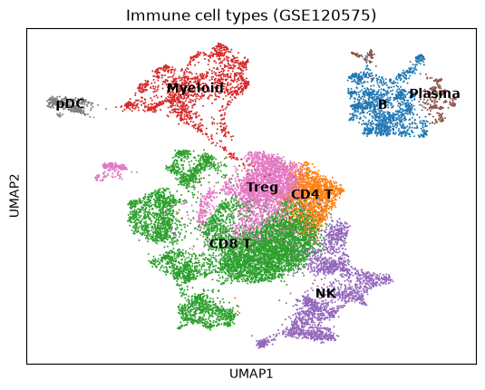
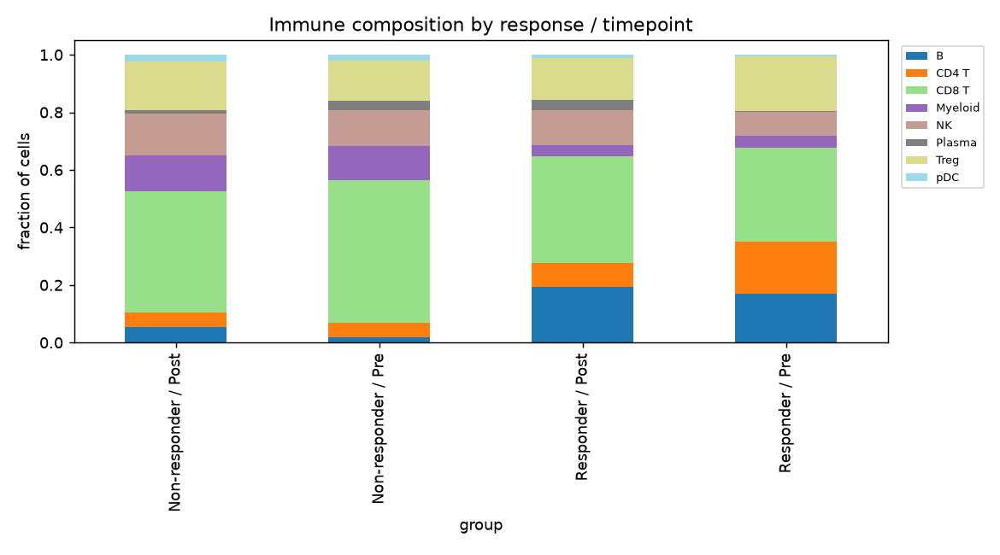
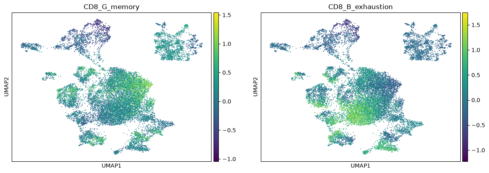
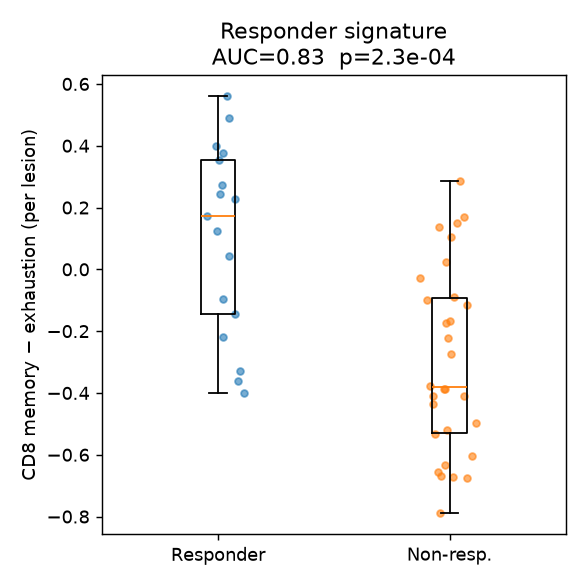

# scRNA-seq of melanoma before/after checkpoint immunotherapy — reanalysis

**Dataset:** Sade-Feldman et al., *Defining T Cell States Associated with Response
to Checkpoint Immunotherapy in Melanoma*, **Cell 2018** (GEO series **GSE120575**,
raw data dbGaP **phs001680**). CD45⁺ immune cells from 48 melanoma tumor biopsies
taken **before or on/after** immune-checkpoint blockade (anti–PD‑1 ± anti–CTLA‑4),
full-length Smart-seq2.

This is a fully reproducible reanalysis run from the raw GEO matrix
(`analysis/download_data.sh` → `analysis/run_scrna_analysis.py`). Data files are
large and referenced by name, not committed.

## What was run

- Loaded the genes × cells TPM matrix (**55,737 genes × 16,291 cells**) and the
  per-cell clinical annotation (patient, timepoint Pre/Post, Responder/Non-responder).
- QC (median **2,151 genes/cell**), log1p, 2,000 HVGs, PCA → kNN → **Leiden
  (24 clusters)** → UMAP.
- Annotated clusters to lineages by canonical markers.
- Scored two CD8 T-cell programs and derived a per-lesion responder signature.

Cells resolve into clean immune populations:



## 1. Populations that expand / contract

### With response (Responder vs Non-responder, per-lesion fractions)

| population | mean frac R | mean frac NR | log2FC (R/NR) | p (Mann–Whitney) |
|---|---|---|---|---|
| **B cells** | 0.160 | 0.041 | **+1.94** | **0.0029** |
| **CD4 T** | 0.127 | 0.052 | **+1.28** | **0.0008** |
| Plasma | 0.027 | 0.019 | +0.48 | 0.61 |
| Treg | 0.164 | 0.159 | +0.04 | 0.90 |
| CD8 T | 0.373 | 0.447 | −0.26 | 0.15 |
| NK | 0.098 | 0.137 | −0.47 | 0.20 |
| **pDC** | 0.007 | 0.022 | **−1.46** | **0.0033** |
| **Myeloid** | 0.043 | 0.123 | **−1.49** | **0.0088** |

**Expanded in responders:** B cells and CD4 T cells (both significant).
**Expanded in non-responders:** myeloid cells and pDCs (both significant).
The B-cell enrichment reproduces the original study and the later
tertiary-lymphoid-structure findings (Helmink et al., *Nature* 2020). Note the
*quantity* of CD8 T cells is **not** what separates responders — their *state* is
(section 3).

### With treatment (Post vs Pre)

Aggregated across all patients, **no population shifts significantly** with
treatment timepoint (all p > 0.05; CD4 T trends down, p≈0.06). This reproduces
the paper's observation that per-cluster frequencies show no consistent global
Pre→Post change — the informative axis is responder vs non-responder, and (in the
original TCR analysis) per-lesion transitions between memory and exhausted states.
Full tables: `population_enrichment_Post_vs_Pre.csv` and
`..._Post_vs_Pre_responders.csv`.



## 2. Marker genes (Wilcoxon, top per lineage)

| lineage | top markers |
|---|---|
| CD8 T | CD8A, CD8B, CCL5, NKG7, GZMA, CST7, TRAC |
| CD4 T / Treg | CD4, IL32, TNFRSF18, ICOS, CD28, TRAC |
| B | MS4A1, CD79A, BANK1, CD22, IRF8, HLA-DRA |
| NK | GNLY, NKG7, PRF1, KLRK1, TRDC |
| Myeloid | LYZ, IFI30, CST3, TYROBP, FCER1G, AIF1 |
| pDC | LILRA4 / IL3RA-defined cluster |

Full table: `cluster_marker_genes.csv`.

## 3. Responder signature from the two CD8 T-cell states

Two CD8 programs (gene sets curated from the paper's reported markers):

- **CD8_G — memory-like** (`TCF7, IL7R, SELL, CCR7, CD28, LEF1, CD27, GZMK, …`)
- **CD8_B — exhausted** (`PDCD1, HAVCR2, LAG3, TIGIT, CTLA4, ENTPD1, CD38, TOX, …`)



Per-lesion mean scores over 6,699 CD8 T cells (47 lesions with ≥10 CD8 cells;
17 responder, 30 non-responder):

| | CD8_G (memory) | CD8_B (exhaustion) | memory − exhaustion |
|---|---|---|---|
| Responder | 0.196 | 0.095 | **+0.101** |
| Non-responder | 0.047 | 0.346 | **−0.299** |

**Signature = mean(CD8_G) − mean(CD8_B) per lesion** separates responders with
**AUC = 0.827** (Mann–Whitney p = 2.3×10⁻⁴). The single-marker **TCF7⁺ fraction**
proxy reaches **AUC = 0.731**, confirming TCF7 alone carries much of the signal —
consistent with the paper's TCF7 protein-staining result.



### Proposed stratifier (deployable on bulk RNA too)

```
score = mean(TCF7, IL7R, SELL, CCR7, CD28, LEF1, CD27, GZMK)
      − mean(PDCD1, HAVCR2, LAG3, TIGIT, CTLA4, ENTPD1, CD38, TOX)
      (+ optional B-cell / TLS module: MS4A1, CD79A, BANK1)
```

High score → predicted responder. The gene sets are lineage-interpretable and
deconvolvable from bulk RNA-seq, so the signature can be tested beyond scRNA-seq
cohorts (e.g. Riaz, Van Allen anti–PD‑1 cohorts).

## Outputs

- `SUMMARY.txt` — headline numbers
- `population_enrichment_R_vs_NR.csv`, `population_enrichment_Post_vs_Pre*.csv`
- `cluster_marker_genes.csv`, `cluster_lineage_scores.csv`
- `per_lesion_cd8_signature.csv`, `per_lesion_TCF7_fraction.csv`
- `figures/*.png`

## Reproduce

```bash
python3 -m venv .venv && .venv/bin/pip install -r analysis/requirements.txt
bash analysis/download_data.sh          # fetches GSE120575 into data/ (not committed)
.venv/bin/python analysis/run_scrna_analysis.py
```
