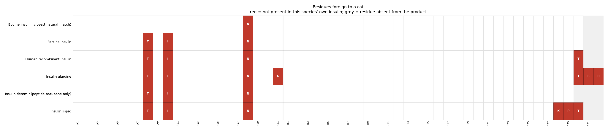
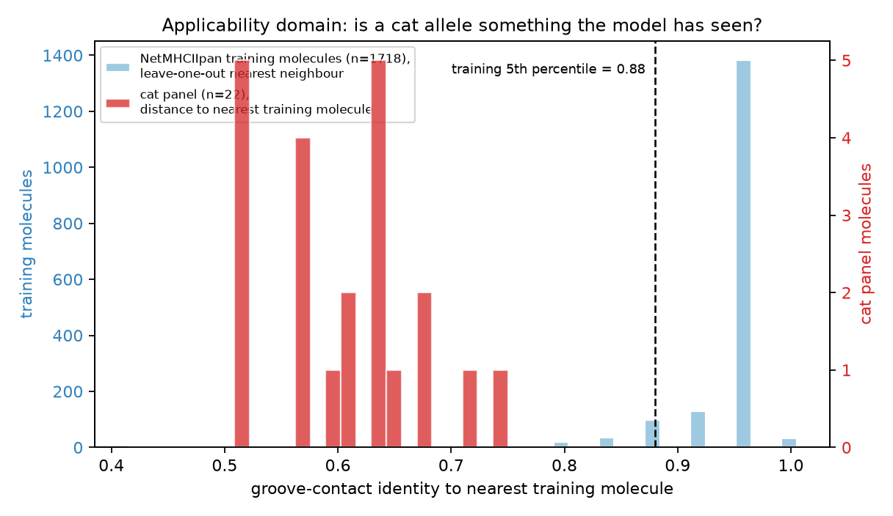
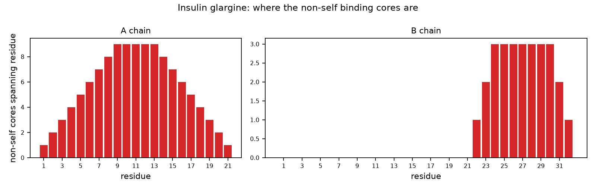

# MHC-II immunogenicity workflow — Cat (Felis catus)

*Generated by `vetimmuno`. Backend: `illustrative-pocket-surrogate`. Every number below is labelled **RIGOROUS**, **MEASURED** or **⚠️ ILLUSTRATIVE**.*

## 1. What is actually foreign to this animal

**RIGOROUS** — mature A/B chains taken from the UniProt records' own chain features; comparison is positional (insulin chains are colinear across mammals).

Recipient self-antigen: **cat insulin** (UniProt P06306 (INS_FELCA))

| product | foreign residues | positions | non-self 9-mer cores | fraction of all cores |
|---|---|---|---|---|
| Bovine insulin (closest natural match) | 1 | A18H>N | 4 | 0.11 |
| Porcine insulin | 3 | A8A>T, A10V>I, A18H>N | 13 | 0.37 |
| Human recombinant insulin | 4 | A8A>T, A10V>I, A18H>N, B30A>T | 14 | 0.40 |
| Insulin glargine | 7 | A8A>T, A10V>I, A18H>N, A21N>G, B30A>T, B31->R, B32->R | 16 | 0.43 |
| Insulin detemir (peptide backbone only) | 3 | A8A>T, A10V>I, A18H>N | 13 | 0.38 |
| Insulin lispro | 6 | A8A>T, A10V>I, A18H>N, B28P>K, B29K>P, B30A>T | 16 | 0.46 |

A *non-self core* is a 9-mer register in the administered insulin that does not occur anywhere in this animal's own insulin. Cores the animal already carries are removed by central tolerance and are dropped here — that filter is set arithmetic, and it is exactly as reliable for a cat as for a human.

## 2. The MHC-II panel that exists for this species

**MEASURED**

| locus | records considered | rejected | molecules kept | unique grooves | curated nomenclature | source |
|---|---|---|---|---|---|---|
| DRB | 74 | 41 | 22 | 22 | **no** | NCBI Protein (Felis catus); IPD-MHC has no feline entries |

> There is no allele-**frequency** database for either DLA or FLA, and IEDB's population-coverage tool is human-only. A panel here is a diversity sample of known sequences — it cannot be turned into a "% of the population covered" number the way an HLA panel can.

## 3. Is a pan-specific predictor even allowed to score these molecules?

**MEASURED**

NetMHCIIpan-4.3 is trained on human HLA-DR/DQ/DP, mouse H-2 and bovine BoLA-DRB3. We measured how far each cat molecule sits from that training space, in the same representation the model uses (groove-contact residues), and calibrated the scale against the training set's own leave-one-out nearest-neighbour distribution.

| locus | training molecules (unique grooves) | training NN identity: median | training NN identity: 5th pct | cat panel: median | cat panel: range | out-of-domain | marginal |
|---|---|---|---|---|---|---|---|
| DRB | 1718 | 0.960 | 0.880 | 0.609 | 0.520 – 0.739 | 22/22 | 0/22 |

Each locus is compared against its own training pool, so the rows are not on a common scale and are not pooled. "Training NN identity" is the leave-one-out nearest-neighbour identity *within* the training set — the calibration curve everything else is read against.

**Every cat molecule in this panel is outside the model's training space.** Its nearest training neighbour is further away than the nearest neighbour of essentially any molecule the model was actually trained on. Binding scores for this species are extrapolation, and there is no public cat benchmark that would tell you how far off they are. Report them as research-use hypotheses, never as a risk quantification.

## 4. Binding predictions

**⚠️ ILLUSTRATIVE** — produced by the untrained pocket-complementarity surrogate, which exists so this pipeline can run without a licensed NetMHCIIpan install. **These numbers rank peptides plausibly and predict nothing.** No risk statement in this report is derived from them. Install NetMHCIIpan-4.3 and re-run with `--backend netmhciipan` to make section 4 evidential.

It also reads only the four anchor positions, so cores differing solely at a non-anchor residue come out with the same score. Identical scores in the table below are that blindness, not a finding.

| products carrying this core | chain | core | position | foreign residues in core | strongest molecule | %rank (background) | class |
|---|---|---|---|---|---|---|---|
| 5 product(s): Porcine insulin; Human recombinant insulin; Insulin glargine; Insulin detemir (peptide backbone only); Insulin lispro | A | VEQCCTSIC | A3-A11 | A8A>T, A10V>I | FLA-DRB:AAB65590.1 (+1 identical-groove) | 0.185 | strong |
| 1 product(s): Bovine insulin (closest natural match) | A | VCSLYQLEN | A10-A18 | A18H>N | FLA-DRB:XP_003986036.3 | 0.25 | strong |
| 5 product(s): Porcine insulin; Human recombinant insulin; Insulin glargine; Insulin detemir (peptide backbone only); Insulin lispro | A | ICSLYQLEN | A10-A18 | A10V>I, A18H>N | FLA-DRB:XP_003986036.3 | 1.44 | strong |
| 5 product(s): Bovine insulin (closest natural match); Porcine insulin; Human recombinant insulin; Insulin detemir (peptide backbone only); Insulin lispro | A | LYQLENYCN | A13-A21 | A18H>N | FLA-DRB:XP_003986036.3 | 1.885 | strong |
| 1 product(s): Insulin glargine | A | LYQLENYCG | A13-A21 | A18H>N, A21N>G | FLA-DRB:AAB65540.1 | 2.355 | weak |
| 5 product(s): Porcine insulin; Human recombinant insulin; Insulin glargine; Insulin detemir (peptide backbone only); Insulin lispro | A | CTSICSLYQ | A7-A15 | A8A>T, A10V>I | FLA-DRB:XP_003986036.3 | 3.235 | weak |
| 5 product(s): Porcine insulin; Human recombinant insulin; Insulin glargine; Insulin detemir (peptide backbone only); Insulin lispro | A | IVEQCCTSI | A2-A10 | A8A>T, A10V>I | FLA-DRB:AAB65563.1 | 3.365 | weak |
| 6 product(s): Bovine insulin (closest natural match); Porcine insulin; Human recombinant insulin; Insulin glargine; Insulin detemir (peptide backbone only); Insulin lispro | A | SLYQLENYC | A12-A20 | A18H>N | FLA-DRB:XP_023105351.1 | 9.5 | weak |
| 5 product(s): Porcine insulin; Human recombinant insulin; Insulin glargine; Insulin detemir (peptide backbone only); Insulin lispro | A | CCTSICSLY | A6-A14 | A8A>T, A10V>I | FLA-DRB:BCB67706.1 | 13.025 | none |
| 6 product(s): Bovine insulin (closest natural match); Porcine insulin; Human recombinant insulin; Insulin glargine; Insulin detemir (peptide backbone only); Insulin lispro | A | CSLYQLENY | A11-A19 | A18H>N | FLA-DRB:BCB67706.1 | 14.54 | none |
| 1 product(s): Insulin glargine | B | FFYTPKTRR | B24-B32 | B30A>T, B31->R, B32->R | FLA-DRB:AAB65522.1 (+3 identical-groove) | 22.355 | none |
| 1 product(s): Insulin lispro | B | GERGFFYTK | B20-B28 | B28P>K | FLA-DRB:BCB67706.1 | 24.335 | none |
| 5 product(s): Porcine insulin; Human recombinant insulin; Insulin glargine; Insulin detemir (peptide backbone only); Insulin lispro | A | TSICSLYQL | A8-A16 | A8A>T, A10V>I | FLA-DRB:BCB67706.1 | 31.0 | none |
| 5 product(s): Porcine insulin; Human recombinant insulin; Insulin glargine; Insulin detemir (peptide backbone only); Insulin lispro | A | GIVEQCCTS | A1-A9 | A8A>T | FLA-DRB:BCB67706.1 | 32.575 | none |
| 1 product(s): Insulin glargine | B | GFFYTPKTR | B23-B31 | B30A>T, B31->R | FLA-DRB:XP_003986036.3 | 36.4 | none |

%rank is computed against a per-molecule background distribution of 20 000 random peptides, because NetMHCIIpan emits no %Rank for custom molecules. Lower is stronger; the MHC-II convention is strong ≤ 2, weak ≤ 10.

## 5. Validation harness

**MEASURED** — 15 of 16 checks passed.

| id | check | status | observed | expected |
|---|---|---|---|---|
| KAT-1.1 | human insulin vs dog self | PASS | 1 differences ['B30A>T'] | 1 differences ['B30A>T'] |
| KAT-1.2 | human insulin vs cat self | PASS | 4 differences ['A8A>T', 'A10V>I', 'A18H>N', 'B30A>T'] | 4 differences ['A8A>T', 'A10V>I', 'A18H>N', 'B30A>T'] |
| KAT-1.3 | pig insulin vs dog self | PASS | 0 differences [] | 0 differences [] |
| KAT-1.4 | bovine insulin vs cat self | PASS | 1 differences ['A18H>N'] | 1 differences ['A18H>N'] |
| KAT-1.5 | bovine insulin vs dog self | PASS | 2 differences ['A8T>A', 'A10I>V'] | 2 differences ['A8T>A', 'A10I>V'] |
| KAT-2 | negative control: cat insulin in a cat | PASS | 0 non-self cores | 0 non-self cores |
| KAT-3 | identity control: a natural insulin identical to cat insulin | SKIP | no such donor species exists | a sequence-identical natural donor |
| KAT-4 | non-self core set equals the set of cores spanning a difference | PASS | exact match for all products | 0 mismatches |
| KAT-5 | positive control: composition-matched scramble | PASS | 1.000 of cores non-self (mean of 20 seeds) | >= 0.90 |
| KAT-6 | tolerance filter precision (single-residue probe) | PASS | cores flagged at B[22] | cores flagged at B[22] only |
| KAT-9 | panel integrity separates real alleles from decoys | PASS | worst panel member 0.841 (FLA-DRB:NP_001121544.2 [DRB]) vs best decoy 0.500 (shuffle of FLA-DRB:XP_003986036.3); margin +0.341 | margin > 0 |
| KAT-10 | applicability-domain guard-rail fires | PASS | 22/22 molecules out-of-domain; median NN identity 0.609 vs training 5th percentile 0.880 | a warning is emitted whenever the panel sits outside the training space |
| KAT-7 | background %rank calibration | PASS | 4.90% of held-out background peptides at rank <= 5 | 5.00% +/- 0.6 |
| KAT-12 | scoring determinism | PASS | identical on repeat | bit-identical |
| KAT-8 | binding-register stability under window shift | PASS | 0.766 of windows keep their top register | >= 0.60 |
| KAT-11 | surrogate direction: hydrophobic P1 preferred (HLA-DRB1*01:01) | PASS | hydrophobic mean 0.175 vs charged mean -0.296 | hydrophobic > charged |

No check here tests *immunogenicity prediction accuracy* — there is no dog or cat benchmark to test it against, which is the honest headline of this whole exercise. What is tested is that the sequence layer reproduces independently known facts, that the tolerance filter fires exactly where it should, that positive and negative controls behave, that the rank calibration is uniform, and that the out-of-domain guard-rail fires instead of quietly passing an extrapolation through.

## 6. Reading this for a real programme

**The cat is the harder case on both axes, and the two problems are
independent.**

*Axis 1 — the molecule is genuinely more foreign.* Feline insulin differs
from human insulin at four residues: A8 Ala->Thr, A10 Val->Ile, A18 His->Asn
and B30 Ala->Thr. Three of those sit inside the A chain rather than at a
terminus, so they fall into interior 9-mer registers where they can occupy
real anchor positions — unlike the dog's single B30 difference. Bovine
insulin, by contrast, differs from feline insulin at A18 alone, which is the
sequence-level reason beef-source PZI has a history in cats.

*Axis 2 — the prediction infrastructure is much thinner.* IPD-MHC has a
curated canine DLA section and no feline section whatsoever, so this panel is
scraped from GenBank rather than drawn from an allele registry: no official
allele names, no curation, no way to state what fraction of feline diversity
it covers. Section 2 shows the resulting size gap against the dog directly,
and section 3 shows every feline molecule landing outside NetMHCIIpan's
training space.

What follows for a real programme:

* **The A-chain cluster (A8/A10/A18) is where a feline screen should
  concentrate.** It is a small, defined region — three residues inside a
  21-mer — so the analysis is narrow enough to do carefully rather than
  broadly. Section 1 gives the exact non-self registers, model-free.
* **A species-matched (recombinant feline) insulin would remove axis 1
  entirely** and reduce the question to formulation and impurities, the same
  as the dog with porcine insulin. If a programme has that option, the
  sequence analysis argues for it far more strongly than any binding score
  could.
* **Do not translate binding output into a population-risk number.** There is
  no feline allele-frequency database and no feline benchmark. The defensible
  output is a ranked, register-level hypothesis list tied to named A-chain
  positions, reported RUO, and ideally read out experimentally (feline PBMC
  proliferation or IFN-gamma ELISpot against the specific A-chain peptides)
  rather than argued from in silico scores.

### Figures

*Residues of each product that are foreign to this species*

*Distance from the predictor's training space*

*Non-self core landscape for Insulin glargine*
