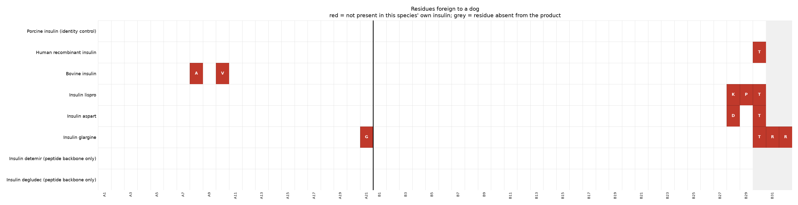
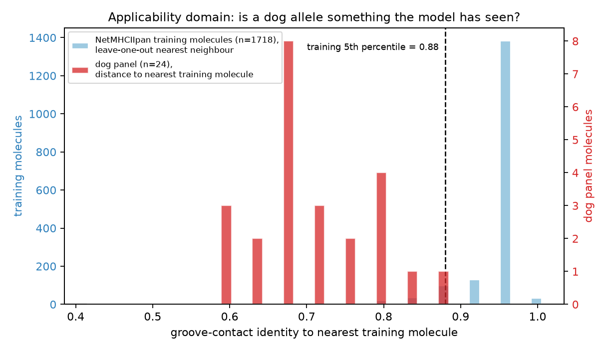
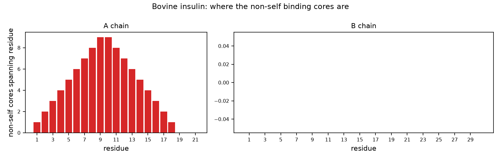

# MHC-II immunogenicity workflow — Dog (Canis lupus familiaris)

*Generated by `vetimmuno`. Backend: `illustrative-pocket-surrogate`. Every number below is labelled **RIGOROUS**, **MEASURED** or **⚠️ ILLUSTRATIVE**.*

## 1. What is actually foreign to this animal

**RIGOROUS** — mature A/B chains taken from the UniProt records' own chain features; comparison is positional (insulin chains are colinear across mammals).

Recipient self-antigen: **dog insulin** (UniProt P01321 (INS_CANLF))

| product | foreign residues | positions | non-self 9-mer cores | fraction of all cores |
|---|---|---|---|---|
| Porcine insulin (identity control) | 0 | — | 0 | 0.00 |
| Human recombinant insulin | 1 | B30A>T | 1 | 0.03 |
| Bovine insulin | 2 | A8T>A, A10I>V | 10 | 0.29 |
| Insulin lispro | 3 | B28P>K, B29K>P, B30A>T | 3 | 0.09 |
| Insulin aspart | 2 | B28P>D, B30A>T | 3 | 0.09 |
| Insulin glargine | 4 | A21N>G, B30A>T, B31->R, B32->R | 4 | 0.11 |
| Insulin detemir (peptide backbone only) | 0 | — | 0 | 0.00 |
| Insulin degludec (peptide backbone only) | 0 | — | 0 | 0.00 |

A *non-self core* is a 9-mer register in the administered insulin that does not occur anywhere in this animal's own insulin. Cores the animal already carries are removed by central tolerance and are dropped here — that filter is set arithmetic, and it is exactly as reliable for a cat as for a human.

## 2. The MHC-II panel that exists for this species

**MEASURED**

| locus | records considered | rejected | molecules kept | unique grooves | curated nomenclature | source |
|---|---|---|---|---|---|---|
| DRB | 192 | 3 | 24 | 24 | yes | IPD-MHC DLA-DRB1 |
| DQA | 38 | 0 | 6 | 6 | yes | IPD-MHC DLA-DQA1 |
| DQB | 101 | 0 | 6 | 6 | yes | IPD-MHC DLA-DQB1 |

> There is no allele-**frequency** database for either DLA or FLA, and IEDB's population-coverage tool is human-only. A panel here is a diversity sample of known sequences — it cannot be turned into a "% of the population covered" number the way an HLA panel can.

## 3. Is a pan-specific predictor even allowed to score these molecules?

**MEASURED**

NetMHCIIpan-4.3 is trained on human HLA-DR/DQ/DP, mouse H-2 and bovine BoLA-DRB3. We measured how far each dog molecule sits from that training space, in the same representation the model uses (groove-contact residues), and calibrated the scale against the training set's own leave-one-out nearest-neighbour distribution.

| locus | training molecules (unique grooves) | training NN identity: median | training NN identity: 5th pct | dog panel: median | dog panel: range | out-of-domain | marginal |
|---|---|---|---|---|---|---|---|
| DQA | 90 | 0.950 | 0.900 | 0.750 | 0.700 – 0.750 | 0/6 | 6/6 |
| DQB | 449 | 0.960 | 0.870 | 0.730 | 0.565 – 0.800 | 1/6 | 5/6 |
| DRB | 1718 | 0.960 | 0.880 | 0.680 | 0.600 – 0.880 | 18/24 | 5/24 |

Each locus is compared against its own training pool, so the rows are not on a common scale and are not pooled. "Training NN identity" is the leave-one-out nearest-neighbour identity *within* the training set — the calibration curve everything else is read against.

**The dog panel sits below the training set's own 5th percentile (0.72 vs 0.88).** 19/36 molecules are frank extrapolation and 1/36 are close enough to training molecules that predictions are defensible as directional. Stratify the output by this column rather than treating the panel as uniform.

## 4. Binding predictions

**⚠️ ILLUSTRATIVE** — produced by the untrained pocket-complementarity surrogate, which exists so this pipeline can run without a licensed NetMHCIIpan install. **These numbers rank peptides plausibly and predict nothing.** No risk statement in this report is derived from them. Install NetMHCIIpan-4.3 and re-run with `--backend netmhciipan` to make section 4 evidential.

It also reads only the four anchor positions, so cores differing solely at a non-anchor residue come out with the same score. Identical scores in the table below are that blindness, not a finding.

| products carrying this core | chain | core | position | foreign residues in core | strongest molecule | %rank (background) | class |
|---|---|---|---|---|---|---|---|
| 1 product(s): Bovine insulin | A | VEQCCASVC | A3-A11 | A8T>A, A10I>V | DLA-DRB1*064:02 | 0.43 | strong |
| 1 product(s): Bovine insulin | A | VCSLYQLEN | A10-A18 | A10I>V | DLA-DRB1*040:01 | 0.555 | strong |
| 1 product(s): Bovine insulin | A | IVEQCCASV | A2-A10 | A8T>A, A10I>V | DLA-DRB1*085:01 | 1.51 | strong |
| 1 product(s): Bovine insulin | A | CASVCSLYQ | A7-A15 | A8T>A, A10I>V | DLA-DRB1*023:02 | 2.565 | weak |
| 1 product(s): Insulin glargine | A | LYQLENYCG | A13-A21 | A21N>G | DLA-DRB1*023:02 | 3.98 | weak |
| 1 product(s): Insulin glargine | B | FFYTPKTRR | B24-B32 | B30A>T, B31->R, B32->R | DLA-DRB1*042:02 | 12.45 | none |
| 1 product(s): Bovine insulin | A | CCASVCSLY | A6-A14 | A8T>A, A10I>V | DLA-DRB1*048:03 | 16.05 | none |
| 1 product(s): Bovine insulin | A | ASVCSLYQL | A8-A16 | A8T>A, A10I>V | DLA-DRB1*123:01 | 23.01 | none |
| 1 product(s): Insulin glargine | B | GFFYTPKTR | B23-B31 | B30A>T, B31->R | DLA-DRB1*044:01 | 27.635 | none |
| 1 product(s): Insulin lispro | B | GERGFFYTK | B20-B28 | B28P>K | DLA-DRB1*006:01 (+1 identical-groove) | 28.9 | none |
| 1 product(s): Bovine insulin | A | GIVEQCCAS | A1-A9 | A8T>A | DLA-DRB1*006:01 (+1 identical-groove) | 30.235 | none |
| 1 product(s): Insulin aspart | B | GERGFFYTD | B20-B28 | B28P>D | DLA-DRB1*006:01 (+1 identical-groove) | 31.62 | none |
| 1 product(s): Bovine insulin | A | SVCSLYQLE | A9-A17 | A10I>V | DLA-DRB1*053:01 | 42.86 | none |
| 1 product(s): Bovine insulin | A | EQCCASVCS | A4-A12 | A8T>A, A10I>V | DLA-DRB1*023:02 | 51.37 | none |
| 1 product(s): Bovine insulin | A | QCCASVCSL | A5-A13 | A8T>A, A10I>V | DLA-DRB1*064:02 | 66.68 | none |

%rank is computed against a per-molecule background distribution of 20 000 random peptides, because NetMHCIIpan emits no %Rank for custom molecules. Lower is stronger; the MHC-II convention is strong ≤ 2, weak ≤ 10.

## 5. Validation harness

**MEASURED** — 16 of 16 checks passed.

| id | check | status | observed | expected |
|---|---|---|---|---|
| KAT-1.1 | human insulin vs dog self | PASS | 1 differences ['B30A>T'] | 1 differences ['B30A>T'] |
| KAT-1.2 | human insulin vs cat self | PASS | 4 differences ['A8A>T', 'A10V>I', 'A18H>N', 'B30A>T'] | 4 differences ['A8A>T', 'A10V>I', 'A18H>N', 'B30A>T'] |
| KAT-1.3 | pig insulin vs dog self | PASS | 0 differences [] | 0 differences [] |
| KAT-1.4 | bovine insulin vs cat self | PASS | 1 differences ['A18H>N'] | 1 differences ['A18H>N'] |
| KAT-1.5 | bovine insulin vs dog self | PASS | 2 differences ['A8T>A', 'A10I>V'] | 2 differences ['A8T>A', 'A10I>V'] |
| KAT-2 | negative control: dog insulin in a dog | PASS | 0 non-self cores | 0 non-self cores |
| KAT-3 | identity control: pig insulin in a dog | PASS | 0 non-self cores | 0 non-self cores |
| KAT-4 | non-self core set equals the set of cores spanning a difference | PASS | exact match for all products | 0 mismatches |
| KAT-5 | positive control: composition-matched scramble | PASS | 1.000 of cores non-self (mean of 20 seeds) | >= 0.90 |
| KAT-6 | tolerance filter precision (single-residue probe) | PASS | cores flagged at B[22] | cores flagged at B[22] only |
| KAT-9 | panel integrity separates real alleles from decoys | PASS | worst panel member 0.878 (DLA-DQB1*005:02 [DQB]) vs best decoy 0.438 (shuffle of DLA-DRB1*040:01); margin +0.440 | margin > 0 |
| KAT-10 | applicability-domain guard-rail fires | PASS | 19/36 molecules out-of-domain; median NN identity 0.720 vs training 5th percentile 0.880 | a warning is emitted whenever the panel sits outside the training space |
| KAT-7 | background %rank calibration | PASS | 5.26% of held-out background peptides at rank <= 5 | 5.00% +/- 0.6 |
| KAT-12 | scoring determinism | PASS | identical on repeat | bit-identical |
| KAT-8 | binding-register stability under window shift | PASS | 0.793 of windows keep their top register | >= 0.60 |
| KAT-11 | surrogate direction: hydrophobic P1 preferred (HLA-DRB1*01:01) | PASS | hydrophobic mean 0.175 vs charged mean -0.296 | hydrophobic > charged |

No check here tests *immunogenicity prediction accuracy* — there is no dog or cat benchmark to test it against, which is the honest headline of this whole exercise. What is tested is that the sequence layer reproduces independently known facts, that the tolerance filter fires exactly where it should, that positive and negative controls behave, that the rank calibration is uniform, and that the out-of-domain guard-rail fires instead of quietly passing an extrapolation through.

## 6. Reading this for a real programme

**The dog is the easy case, and the reason is the sequence, not the model.**

Canine insulin differs from human insulin at a single residue, B30 Thr->Ala,
at the very C-terminus of the B chain. Porcine insulin is identical to canine
insulin outright — which is why porcine insulin is the licensed canine
product, and why this workflow's identity control is a real drug rather than a
thought experiment.

Practical consequences:

* **A species-matched (porcine or recombinant canine) product has no T-cell
  epitope story to tell.** Zero foreign residues means zero non-self cores;
  there is nothing for an MHC-II screen to find. Immunogenicity risk for such
  a product lives entirely in aggregation, process impurities (HCP, leached
  ligands, protamine in PZI-type formulations) and PTMs — the same failure
  modes as any well-matched biologic, and the place analytical effort should
  go.
* **A human-sequence product in a dog is a one-residue problem, at a chain
  terminus.** Only the single 9-mer register spanning B30 can carry the novel
  residue, and a C-terminal residue is the weakest possible position: it can
  only occupy P9 or fall into the flanking region. This is a focused,
  cheap question, not a screening campaign.
* **Analogues move more mass than the species gap does.** Glargine's B31-B32
  Arg-Arg extension adds genuinely novel C-terminal registers; the acylated
  analogues (detemir, degludec) add a chemical modification this workflow
  deliberately does not model. If you want a real risk ranking for a canine
  programme, rank by *analogue* chemistry first and by species gap second.

On the prediction layer: the DLA-DRB1 panel is real and curated, but most of
it still sits outside NetMHCIIpan's training space (section 3). Treat binding
output as directional hypothesis generation for RUO reporting, and put the
weight of any regulatory argument on the sequence-level analysis in section 1,
which does not depend on a model at all.

### Figures

*Residues of each product that are foreign to this species*

*Distance from the predictor's training space*

*Non-self core landscape for Bovine insulin*
