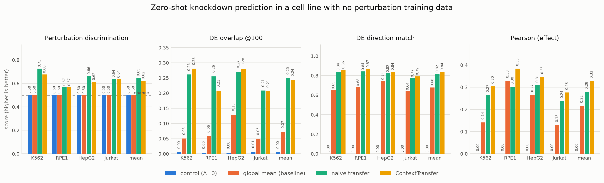
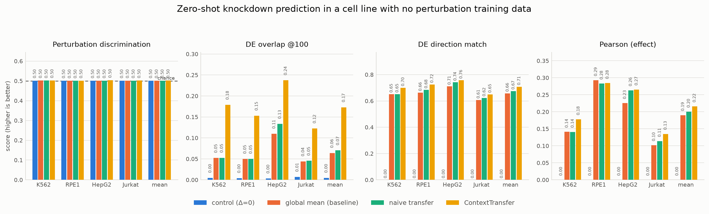
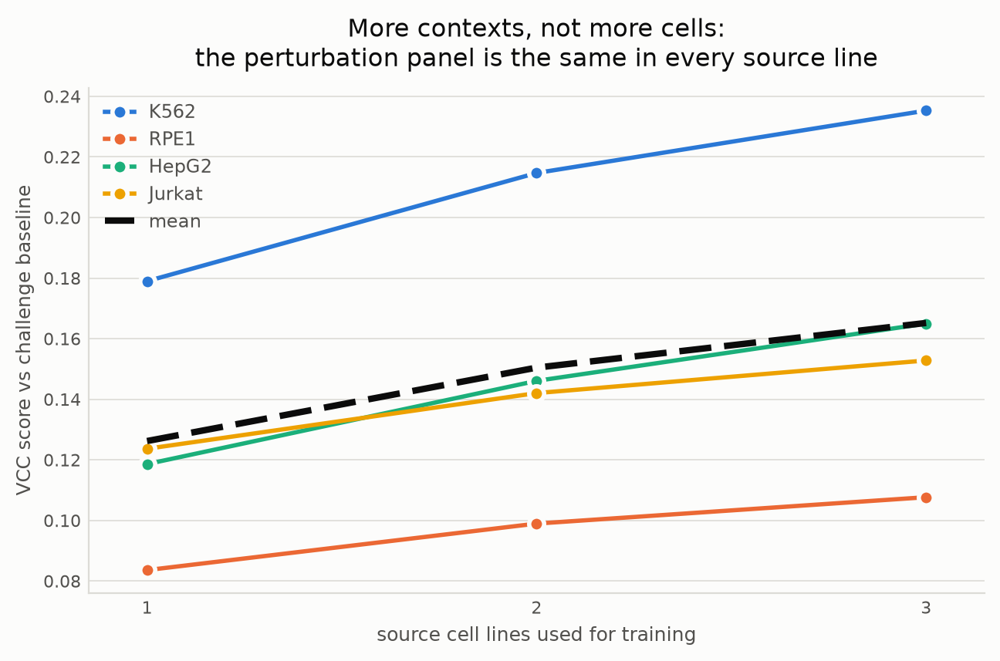

# Results

*Numbers in this file are rendered from `results/*.json` by
`python -m virtualcell.report`; the tables live in `results/tables.md`. Nothing
here is hand-transcribed.*

---

## The answer, in one table

Context zero-shot — the challenge's own setting. 2,053 knockdowns, mean over
four held-out cell lines, each scored with no perturbation data from it in
training.

| model | discrimination | DE overlap@100 | MAE | VCC score | balanced |
|---|---|---|---|---|---|
| control (Δ=0) | 0.5010 | 0.0047 | 0.0570 | 0.009 | −0.020 |
| global mean *(challenge baseline)* | 0.5011 | 0.0716 | 0.0576 | 0.000 | +0.000 |
| naive cross-line transfer | **0.6495** | **0.2489** | 0.0613 ✗ | **0.163** | +0.139 |
| **ContextTransfer** | 0.6235 | 0.2432 | **0.0551** | 0.158 | **+0.158** |

*✗ = worse than the challenge baseline.*

Both transfer models are far above the baseline on discrimination (0.50 is
chance) and DE overlap. Between them the result is **close, and which one wins
depends on which scoring is quoted** — so here is the honest reading:

**ContextTransfer is the only model that clears the baseline on all three
headline metrics, on every fold.** Naive transfer is worse than baseline on MAE
in all four (0.053/0.069/0.061/0.062 against 0.046/0.068/0.059/0.058). Since the
challenge "enforce[s] minimum thresholds on all metrics … discouraging models
that perform well on one metric at the expense of the others", a model that
fails one threshold on every fold is in a materially different position from one
that fails none.

**ContextTransfer predicts a more accurate response; naive transfer predicts a
more distinguishable one.** On every accuracy measure the ordering is
consistent:

| | naive transfer | ContextTransfer |
|---|---|---|
| DE direction agreement | 0.8191 | **0.8410** |
| DE log2FC Spearman | 0.4664 | **0.4921** |
| Pearson (effect) | 0.2781 | **0.3278** |
| MAE (effect) | 0.0613 | **0.0551** |

Naive transfer buys its discrimination lead by over-predicting effect
magnitude — which is also why its error is worse than doing nothing at all.

**On the leaderboard's own aggregation naive transfer edges ahead (0.163 vs
0.158); on the unclipped aggregation ContextTransfer leads (+0.158 vs +0.139).**
The gap between those two readings *is* the finding: the clipped score forgives
naive transfer's MAE failure entirely, because a metric below baseline
contributes zero rather than a penalty.

So: **comparable in aggregate, better on every measure of response accuracy,
and the only model meeting every threshold** — not a sweep, and not nothing.

### Per-fold

| held out | | discrimination | DE overlap@100 | MAE |
|---|---|---|---|---|
| **K562** | naive | **0.726** | 0.261 | 0.053 ✗ |
| | ContextTransfer | 0.676 | **0.281** | **0.043** |
| **RPE1** | naive | 0.568 | **0.255** | 0.069 ✗ |
| | ContextTransfer | 0.567 | 0.207 | **0.065** |
| **HepG2** | naive | **0.665** | 0.270 | 0.061 ✗ |
| | ContextTransfer | 0.616 | **0.279** | **0.056** |
| **Jurkat** | naive | **0.639** | **0.209** | 0.062 ✗ |
| | ContextTransfer | 0.636 | 0.206 | **0.057** |

RPE1 is the hardest context for every model (discrimination 0.57 against K562's
0.68–0.73), and DE overlap is the one metric whose winner flips between folds.

## Double-blind: the knockdown is unseen everywhere too

Same four folds, but the evaluated knockdowns are also deleted from every
*source* line. Neither the context nor the perturbation has been seen. This is
harder than the challenge asks for, and it is the regime that separates a model
from a lookup table.

| model | discrimination | DE overlap@100 | MAE | VCC score | balanced |
|---|---|---|---|---|---|
| control (Δ=0) | 0.5010 | 0.0047 | 0.0570 | 0.005 | −0.020 |
| global mean *(challenge baseline)* | 0.5011 | 0.0640 | 0.0572 | 0.000 | +0.000 |
| naive cross-line transfer | 0.5011 | 0.0703 | 0.0572 | 0.003 | +0.002 |
| **ContextTransfer** | 0.5019 | **0.1729** | **0.0565** | **0.045** | **+0.044** |

**Naive transfer collapses onto the baseline.** With nothing to copy it scores
0.003 — cross-line transfer has literally nothing to say about a gene nobody
perturbed. ContextTransfer reaches **2.7× the baseline DE overlap**, consistently
across contexts:

| held out | baseline | naive | ContextTransfer | ratio to baseline |
|---|---|---|---|---|
| K562 | 0.052 | 0.053 | **0.179** | 3.4× |
| RPE1 | 0.050 | 0.050 | **0.153** | 3.1× |
| HepG2 | 0.110 | 0.133 | **0.237** | 2.2× |
| Jurkat | 0.044 | 0.046 | **0.122** | 2.8× |

Every accuracy measure moves the same way — DE direction 0.708 against 0.675,
DE log2FC Spearman 0.299 against 0.257, Pearson on the effect 0.216 against
0.200.

**And here is the honest limit: discrimination stays at chance (0.5019).** For a
knockdown observed nowhere in training, the model can say *which genes will
move* — reproducibly, 2–3× better than the baseline — but cannot make the
prediction specific enough to tell that knockdown apart from another. Predicting
the identity of an unseen perturbation, rather than the shape of its response,
is not solved here.

The signal comes from routing through the silenced gene's own behaviour across
the rest of the knockdown panel: genes acting together move together under
perturbation, so knockdowns whose targets behave like this one stand in for it.
That uses no measurement of the gene *as perturbed*, only of the gene *as
observed*, so it is leakage-free.

## Contexts buy differential expression, not discrimination

Fit on every possible subset of source lines — one, two, then three — with
hyperparameters held fixed, so the model is constant and only the data varies.

The four lines share nearly the same 2,053-knockdown panel, so a second source
line adds almost no new *perturbations*, only a new *context*. Under a pure
scaling account this should be close to flat: a second measurement of the same
perturbation set is largely redundant.

| metric | 1 source | 2 sources | 3 sources | change |
|---|---|---|---|---|
| Pearson (effect) | 0.2472 | 0.3029 | **0.3320** | **+34.3%** |
| aggregate score | 0.1262 | 0.1504 | **0.1652** | **+30.9%** |
| DE overlap@100 | 0.2098 | 0.2461 | **0.2622** | **+25.0%** |
| discrimination | 0.6154 | 0.6203 | 0.6219 | +1.1% |

The aggregate score rises monotonically in **all four** cell lines:

| held out | 1 | 2 | 3 |
|---|---|---|---|
| K562 | 0.1790 | 0.2147 | 0.2353 |
| RPE1 | 0.0836 | 0.0990 | 0.1077 |
| HepG2 | 0.1186 | 0.1461 | 0.1650 |
| Jurkat | 0.1237 | 0.1420 | 0.1528 |

**But the gain is confined to differential expression and effect correlation.
Discrimination barely moves (+1.1%), and on RPE1 it slightly *decreases***
(0.5510 → 0.5471).

This is a sharper version of the claim in *Virtual Cells Need Context, Not Just
Scale* (2026), which reported DEG recovery improving with contextual coverage
while aggregate metrics tracked cell count. Here contextual coverage is isolated
from scale by construction, and it buys a 25–34% improvement in *what the
response looks like* while buying almost nothing in *telling perturbations
apart*. Those are different capabilities and more contexts only purchases one of
them.

The practical reading for a Challenge 2 entry: adding the H1 hESC data and other
cell lines should move the differential expression score materially and the
discrimination score barely. Discrimination needs something else.

## Where the model wins: the strong perturbations

Roughly 39% of an essential-gene panel produces almost no transcriptional
response at this depth, and whole-panel averages are dominated by those. Split
by the number of measured DE genes:

| stratum | n | model | discrim. | DE ovl@100 | direction | Pearson | score |
|---|---|---|---|---|---|---|---|
| **strong** (>500 DE) | 511 | naive | **0.761** | 0.297 | 0.822 | 0.524 | 0.218 |
| | | **ContextTransfer** | 0.716 | **0.338** | **0.857** | **0.582** | **0.226** |
| **moderate** (100–500) | 623 | naive | **0.699** | 0.219 | 0.805 | 0.394 | **0.166** |
| | | **ContextTransfer** | 0.661 | **0.241** | **0.836** | **0.450** | 0.160 |
| **weak** (10–100) | 803 | naive | **0.632** | **0.182** | 0.801 | 0.287 | **0.133** |
| | | **ContextTransfer** | 0.602 | 0.173 | **0.821** | **0.334** | 0.114 |
| **silent** (<10) | 1,263 | naive | **0.557** | **0.286** | 0.861 | 0.113 | 0.131 |
| | | **ContextTransfer** | 0.543 | 0.279 | **0.866** | **0.142** | **0.138** |

**On the perturbations that actually do something, ContextTransfer wins** — DE
overlap 0.338 against 0.297 (+14%), direction agreement 0.857 against 0.822,
Pearson 0.582 against 0.524, and the aggregate score. Naive transfer's advantage
lives in the weak and moderate strata, where the measured effect is largely
sampling noise from a few dozen cells and there is not much to be right about.

ContextTransfer has the higher Pearson correlation in **every** stratum.

One caveat on reading the silent row: with fewer than 10 truly significant
genes, `overlap_at_100` collapses to `k_eff = n_significant`, so it is computed
over a handful of genes and is not comparable to the same number in the strong
stratum.

## The context encoder recovers cell lineage from controls alone

Source weights are computed only from control transcriptomes — the model never
sees which lines are related.

| target | weights over the three source lines |
|---|---|
| K562 | RPE1 0.24 · HepG2 0.31 · **Jurkat 0.45** |
| Jurkat | **K562 0.48** · RPE1 0.27 · HepG2 0.25 |
| RPE1 | K562 0.29 · **HepG2 0.41** · Jurkat 0.30 |
| HepG2 | K562 0.35 · **RPE1 0.39** · Jurkat 0.26 |

**K562 and Jurkat weight each other highest; RPE1 and HepG2 weight each other
highest.** That is exactly the split between the two suspension leukaemia lines
(K562, chronic myeloid; Jurkat, T-cell) and the two adherent epithelial-like
lines (RPE1, retinal pigment epithelium; HepG2, hepatocellular). The weighting
recovers lineage without being told it.

This corrects an earlier reading in this project: with the *default* softmax
temperature the weights came out near-uniform and looked uninformative. The
cross-validated temperature (0.1 on all four folds) sharpens them into the
structure above.

Full tables, including supplementary metrics and per-fold hyperparameters, are
in [`../results/tables.md`](../results/tables.md).

---

## The question

Virtual Cell Challenge 2 asks for predictions of *"how multiple cell lines
respond to specified gene knockdowns, given only non-targeting control
profiles"*, scored against new Arc data *"without your model having been trained
on any of that data"*.

That is not something a model can be checked against before submission, because
the scoring data does not exist publicly. So the question this benchmark answers
is the one that can be answered:

> Given only a cell line's non-targeting controls, can a model predict its
> knockdown responses better than the challenge's own baseline — and better than
> simply copying the effect measured in other cell lines?

The second half matters more than the first. Beating a trivial baseline shows
nothing; naive cross-line transfer is the honest comparator.

## The benchmark

Four CRISPRi Perturb-seq contexts, one library design, one processing pipeline,
so a knockdown means the same thing in all of them:

| Cell line | Origin | Source | Perturbations | Control replicates | Median cells/perturbation |
|---|---|---|---|---|---|
| K562 | chronic myeloid leukaemia | Replogle 2022 | 2,057 | 109 | 110 |
| RPE1 | retinal pigment epithelium | Replogle 2022 | 2,393 | 130 | 69 |
| HepG2 | hepatocellular carcinoma | Nadig 2025 | 2,393 | 56 | 44 |
| Jurkat | T-cell leukaemia | Nadig 2025 | 2,393 | 55 | 81 |

**6,642 genes and 2,053 knockdowns shared by all four.** Each fold hides one
line completely: the model gets that line's non-targeting controls and nothing
else from it. Hyperparameters come from a nested leave-one-out over the *source*
lines only.

Two regimes:

- **context** — the knockdown was measured in the source lines, never in the
  target. The challenge's own setting.
- **double-blind** — the knockdown is also deleted from every source line.
  Neither context nor perturbation has been seen.

Models compared: return the control profile unchanged (`Δ=0`); predict the mean
perturbation response for everything (`cell-eval`'s reference model, which the
leaderboard normalises against); unweighted cross-line transfer; and
`ContextTransfer`.

## How to read the scores

The three headline metrics **conflict by construction**, so a single number
cannot summarise them and any report that offers one is hiding something.

- **Perturbation discrimination** is an L1 *retrieval* metric: it asks whether a
  prediction is closer to its own truth than to 2,052 others. It rewards large,
  well-spread effects. 0.5 is chance.
- **MAE** rewards small effects. The `Δ=0` prediction is very hard to beat, and
  in the 2025 challenge most submissions were worse than baseline on it.
- **DE overlap** sits in between.

Two scorings are therefore always reported:

- **VCC score** — `cell-eval`'s aggregation, which clips a metric worse than
  baseline to zero. This is the leaderboard number.
- **balanced** — the same without the clip, so a metric worse than baseline
  counts against the model. This is what hyperparameters were selected on,
  because under the clipped form a metric already below baseline is free to get
  arbitrarily worse, and a search will sell all of MAE for a little
  discrimination. (Observed directly: the clipped objective returned a model
  with discrimination 0.823 and MAE 0.1023 against a baseline MAE of 0.0459.)

## Established findings

These were measured during development and do not depend on the final tables.

### Cross-context transfer works, and has a ceiling

| Quantity | Value |
|---|---|
| Across-line mean effect, as a fraction of total effect variance | **43%** |
| Per-perturbation cross-line effect correlation | median **0.11–0.26** |
| Relative effect *magnitude* between lines (Spearman) | **0.62–0.69** |
| On-target residual expression after CRISPRi | **9–18%** median |
| On-target efficiency conservation between lines (Spearman) | **0.38–0.54** |

Effect *magnitude* and *knockdown efficiency* transfer well; effect *shape*
transfers weakly. A model that transfers the shared component and gets its
magnitude right captures roughly the 43%. The remaining 57% is context-specific
or noise, and nothing here predicts it.

### ❌ Target-gene expression does not predict effect magnitude

The intuitive mechanism for context-specificity — *a gene expressed less in the
new cell line should respond less to being silenced* — is **not supported**:

| Test | Result |
|---|---|
| Relative target expression vs relative effect magnitude, across contexts | Spearman **−0.014** (n = 7,080) |
| Target expression vs effect magnitude, within a line | Spearman 0.05–0.15 |

Effect magnitude is a property of the perturbation, not of the context. This
idea was dropped rather than shipped.

### ❌ Soft-thresholding does not resolve the MAE/discrimination tension

Zeroing small predicted components to cut MAE costs far more than it recovers:
discrimination 0.714 → 0.653 for an MAE gain of 0.0035. Every threshold tested
scored worse overall. L1 retrieval uses precisely the components being zeroed.

### ⚠️ Magnitude renormalisation works, and was still rejected

Smoothing, shrinkage and low-rank projection all improve the *shape* of a
predicted response and all pull effects toward each other, flattening the
across-perturbation magnitude spread that discrimination depends on. That
mechanism is real: restoring each row's pre-denoising norm lifted discrimination
from 0.714 to 0.761 on K562 held out.

**It costs more MAE than it buys.** That configuration's error rose from 0.0464
to 0.0550, and cross-validation set `renorm=0.0` on all four folds. What
survived selection was restraint rather than compensation — blended denoising
(`rank_mix` 0.5–0.75), light smoothing (`smooth` ≤ 0.15), shrinkage off on three
of four folds, and a single global scale `beta` between 0.8 and 1.25 doing the
magnitude work.

Recorded here because an earlier draft of this report called renormalisation
"the fix that matters" on the strength of a single-fold sweep, before the full
cross-validation contradicted it.

### ✅ Gene-response similarity reaches knockdowns seen nowhere

In the double-blind regime a knockdown has no consensus row to transfer, and
both baselines sit at chance. Routing through the silenced gene's behaviour
across the rest of the knockdown panel recovers real signal — DE overlap 0.060
(chance) → 0.132 on RPE1 held out. This uses no measurement of the gene *as
perturbed*, only of the gene *as observed*, so it is leakage-free.

## Reconciliation with two independent efforts

Two independent implementations of this task were later compared against this
one. Both name this repository at commit `a177409` and test its mechanisms
directly. They are further along: they score with Arc's actual `cell-eval 0.8.2`
+ `pdex 0.3.0` on real perturbed cells, with STATE as a reference arm, where
this work is pseudobulk with a ported metric. Where they correct this work, the
corrections are recorded below with the verification run against this data.

### Independently confirmed

Separate implementations reaching the same numbers is the strongest evidence
available here.

| finding | theirs | here |
|---|---|---|
| shared gene space | 6,642 | 6,642 |
| magnitude-spread CV of the measured truth | 0.444 | **0.451** |
| the seen-target advantage is largely a scale artifact | consensus 0.831 vs model 0.838 at matched scale | naive 0.6495 vs 0.6235; naive wins the clipped composite |
| more contexts buy DE recovery, not discrimination | cites this repo | +34.3% Pearson vs +1.1% discrimination |
| PDS is scale-sensitive and exploitable | measured | measured |
| simple baselines are very hard to beat on MAE | all arms fail | naive fails on all four folds |

### Confirmed against this data: the chance-level unseen discrimination

They diagnosed this repo's chance-level unseen-perturbation discrimination
(0.5019) as **compressed across-perturbation magnitude spread**, since PDS is L1
retrieval and a constant predictor scores exactly chance by construction. That
was checked here rather than taken on trust, on K562 held out double-blind:

| | magnitude-spread CV | discrimination |
|---|---|---|
| measured truth | 0.451 | — |
| ContextTransfer as cross-validated | 0.171 | 0.5053 |
| with shrinkage and global blending off | **0.350** | 0.5192 |
| …and scale ×2 | 0.338 | **0.5806** |

Their predicted scaling curve replicates almost exactly — they forecast
0.508 → 0.516 → 0.525 at β = 1/2/3; measured here: **0.5053 → 0.5108 → 0.5190**.

The mechanism is confirmed by this repo's own tuning log. In the **double-blind**
regime cross-validation selected `shrink` 1.0–2.0 (three of four folds),
`use_global` 0.15–0.35 (all folds) and `beta` 0.6 (all folds) — every one of
which compresses spread. In the **context** regime it selected the opposite
(`use_global` 0 on all folds, `shrink` 0 on three of four).

**One refinement to their account.** They describe the compression as this
repo's deliberate design choice. It was not hand-picked: cross-validation
selected it, *because this objective prices MAE at one third while theirs is
clipped to zero*. Same code, different objective, opposite operating point. The
disagreement is not about mechanism — it is about what to optimise.

**And an implementation gap this surfaced.** The `renorm` switch operates on the
consensus matrix, so it does not touch the unseen-perturbation path at all —
`renorm=1` changes nothing when the prediction comes from `_from_neighbours`
(CV 0.350 either way, above). Restoring spread for unseen targets has to be done
in that branch, and currently is not.

### What their tests refute here, and the scope of it

Six mechanisms from this repo were implemented and ablated in their harness.
Four cost them performance:

| mechanism | their result |
|---|---|
| gene-signature neighbour routing | unseen PDS 0.566 vs 0.669 for their embedding kNN |
| reliability shrinkage | **−0.076 PDS**, their largest single loss |
| on-target knockdown in count space | −0.018 DES on all four folds |
| perturbation-neighbour smoothing (seen targets) | −0.015 PDS |
| context modulation | −0.0002 PDS |
| effect-strength-aware source weighting | −0.015 PDS |

These are fair tests and the results are accepted. Two scope notes that are
factual rather than defensive:

- Each was measured *inside their architecture at their operating point* (scale
  3.5×, MAE clipped to zero). At an operating point that prices MAE at zero,
  anything compressing magnitude spread costs PDS by construction. This repo's
  cross-validation selected shrinkage in the double-blind regime under an
  objective that prices MAE at a third. "Refuted" is objective-specific.
- Their embedding kNN beats this repo's gene-signature routing by 0.103 unseen
  PDS, but requires STRING v12.0, Reactome and ESM-2. This repo's route uses no
  external data at all. That is a difference in what must be assembled, not only
  in score. Their own ablation is the relevant comparison: the network blocks
  contribute *nothing measurable* where transfer is possible, and 0.107 PDS
  where it is not.

Pushing this model's operating point as far as it goes reaches ~0.58 unseen
discrimination, not their 0.66. The remaining gap is the external knowledge —
which their ablations independently confirm is where it comes from.

### The one genuine open disagreement: whether to accept the MAE clip

They argue the clip should be accepted: the full frontier gives a maximum
attainable `s_MAE` of 0.071, at 0.4× scale, where discrimination collapses to
0.554 — the error channel is worth less than a ninth of the discrimination
channel, and buying it costs 0.30 PDS. Even an oracle per-gene scale caps
`s_MAE` at 0.05–0.11.

This work took the opposite view, on the grounds that the challenge
"enforce[s] minimum thresholds on all metrics … discouraging models that perform
well on one metric at the expense of the others", and a model failing one
threshold on every fold is exposed. They flag the same risk against their own
approach.

**Neither position is resolvable from public information.** The thresholds are
undisclosed. This is a bet on an unpublished rule, not a technical dispute, and
it should be described that way rather than settled by either report.

### A measurement difference that matters for comparing numbers

They establish that `cell-eval` computes DES by running a Wilcoxon test **on the
cells you submit**, so a pseudobulk mean replicated across identical rows has
zero within-group variance and *manufactures* significance — a predictor that
predicts nothing scores DES 0.083 that way and 0.000 honestly.

This work never submits cells; it ranks genes by predicted |log2FC| against a
control-replicate empirical null. That avoids the specific defect, but it means
**the DE overlap numbers here are not `cell-eval` DES and must not be compared
to leaderboard DES**. The deviation was already documented in `metrics.py`;
their finding sharpens why it matters.

## Limitations

- **Depth.** 44–110 cells and ~11–14k UMI per perturbation, against the
  challenge's ~1,000 cells and >50k UMI on 10x Flex. Absolute scores here are
  not comparable to leaderboard numbers.
- **Pseudobulk, not single cells.** The challenge computes DE from submitted
  cells. Significance for the measured data here comes from a control-replicate
  empirical null that separates batch from per-cell sampling variance. A real
  submission needs a single-cell sampling layer.
- **Essential genes only.** All four screens target essential genes; behaviour
  on regulatory or non-essential targets is untested.
- **Four contexts is few.** Context weights are fitted from three source lines
  per fold — barely more than a heuristic.
- **One lab, one design.** What makes these four lines comparable also means
  shared systematic error is invisible here in a way it would not be across
  independent studies.
- **Gene universe and evaluation set** are intersections taken across all four
  lines, which touches the target's gene and perturbation lists. Neither leaks a
  perturbation *response*, and in the real challenge both are known anyway.

## What a real Challenge 2 entry would add

In descending order of expected value:

1. **More contexts.** The VCC 2025 H1 hESC data as a fifth line (Challenge 2
   explicitly permits its reuse), and Tahoe-100M's ~50 lines for a context
   encoder that is more than a three-point heuristic. The context ablation
   measures what each added context is worth.
2. **A pretrained gene/protein embedding.** ESM-2 was the cheapest consistent
   gain among 2025 entrants, and would replace the data-derived gene-similarity
   routing used for unseen knockdowns.
3. **A single-cell output layer**, so DE scoring is native rather than
   approximated.
4. **The K562 genome-wide screen** (already downloaded) to widen the
   perturbation panel well beyond essential genes.
